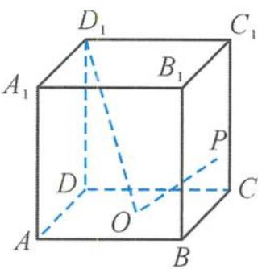
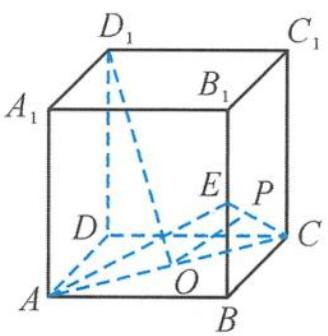
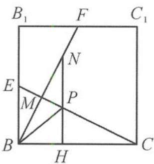
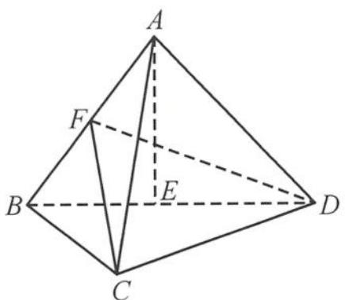
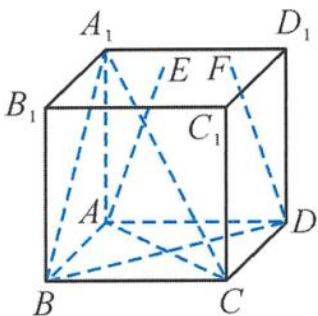
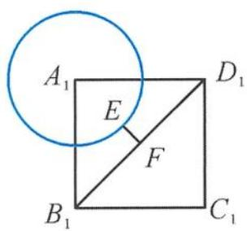
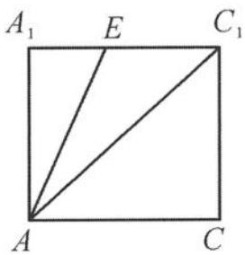

> [!faq]- 《浙大优辅《高中数学新体系 立体几何的秘密》》例题解析
>
> > [!success]- **【答案】** D
>
> > [!note]- **【分析】**
> > 本题未单列分析。
>
> > [!note]- **【解析】**
> > 
> > 图5.2-28
> > 
> > (a)
> > 
> > 图5.2-29
> > (b)
> > 解答 如图 5.2-29(a), 取 $BB_{1}$ 的中点 E, 易证明 $D_{1}O \perp$ 平面 ACE.
> > 因为 $D_{1}O \perp OP$ ，所以点 P 在过点 O 与 $D_{1}O$ 垂直的平面 ACE 内。又点 P 在侧面 $BB_{1}C_{1}C$ 内，因此点 P 在两个平面的交线 CE 上。
> > 过点 $P$ 作 $PH \perp BC$ 于点 $H$ , 则 $PH \perp$ 平面 $ABCD$ . 问题转化为在 $BB_{1}C_{1}C$ 内, 在线段 $CE$ 上求点 $P$ , 使得 $PH + PB$ 最小.
> > 如图 5.2-29(b)，取 $B_{1}C_{1}$ 的中点 F，易证明 $BF \perp CE$ 。在线段 BF 上取点 N，使得 BM = MN，则点 B, N 关于 CE 对称，所以
> > $$
> > P H + P B = P H + P N \geqslant H N = B N \sin \angle N B H = B N \sin \angle B F B _ {1} = \frac {4}{\sqrt {5}} \times \frac {2}{\sqrt {5}} = \frac {8}{5}.
> > $$
> > 故选A.
> > 引申1 已知三棱锥 $A-BCD$ 的所有棱长都为 2, E 为 BD 的中点, 空间中的动点 P 满足 $PA \perp PE, PC \perp AB$ , 则动点 P 的轨迹长度是 ( ).
> > A. $\frac{11}{16}\pi$ B. $\frac{\sqrt{11}}{2}\pi$ C. $\frac{\sqrt{3}}{8}\pi$ D. $\sqrt{3}\pi$
> > 解答 如图 5.2-30, 取 AB 的中点 F, 连接 FC, FD, 则 $AB \perp FC, AB \perp FD$ , 且 $FC \cap FD = F$ , 所以 $AB \perp$ 平面 FCD, 即动点 P 在平面 FCD 内. 因为 $PA \perp PE$ , 所以动点 P 在以 AE 为直径的球面上运动. 设球心为 O, 则球 O 的半径
> > $$
> > R = \frac {\sqrt {3}}{2}.
> > $$
> > 
> > 图5.2-30
> > 
> > 图5.2-31
> > 因此点 $P$ 的轨迹是球 $O$ 被平面 $FCD$ 所截的小圆. 设小圆的半径为 $r$ , 过点 $O$ 作 $FD$ 的垂线, 垂足为 $M$ , 如图5.2-31, 得 $OM \parallel AB$ , 则 $OM \perp$ 平面 $FCD$ , 即 $OM$ 为球心 $O$ 到平面 $FCD$ 的距离, 且
> > $$
> > O M = \frac {1}{4} A F = \frac {1}{4}.
> > $$
> > 从而
> > $$
> > r = \sqrt {R ^ {2} - O M ^ {2}} = \frac {\sqrt {1 1}}{4}.
> > $$
> > 所以点 P 的轨迹长度为 $2\pi r = \frac{\sqrt{11}}{2}\pi$ ，故选 B.
> > 引申 2 （多选）如图 5.2-32, 已知正方体 $ABCD-A_{1}B_{1}C_{1}D_{1}$ 的棱长为 2, 点 E, F 在平面
> > $A_{1}B_{1}C_{1}D_{1}$ 内. 若 $\left|AE\right|=\sqrt{5}, AC\perp DF$ ，则下列命题中正确的有( ).
> > A. 点 E 的轨迹在一个圆上
> > B. 点 F 的轨迹是一个圆
> > C. $\left|EF\right|$ 的最小值为 $\sqrt{2}-1$ D. AE 与平面 $A_{1}BD$ 所成角的正弦值的最大值为 $\frac{2\sqrt{15}+\sqrt{30}}{15}$
> > 
> > 图5.2-32
> > 解答 对于选项 A: 因为 $\left|AE\right|=\sqrt{AA_{1}^{2}+A_{1}E^{2}}=\sqrt{5}$ ，即 $\sqrt{2^{2}+A_{1}E^{2}}=\sqrt{5}$ ,
> > 所以
> > $$
> > \mid A _ {1} E \mid = 1.
> > $$
> > 又点 E 在平面 $A_{1}B_{1}C_{1}D_{1}$ 内，故点 E 在以 $A_{1}$ 为圆心、1 为半径的圆上（图 5.2-33(a)）。故 A 正确。
> > 
> > (a)
> > 
> > (b)
> > 图5.2-33
> > 对于选项 B: 在正方体 $ABCD-A_{1}B_{1}C_{1}D_{1}$ 中, $AC \perp BD$ , 又 $AC \perp DF$ , 且 $BD \cap DF = D$ ,
> > 所以 $AC \perp$ 平面 DBF, 所以点 F 在 $B_{1}D_{1}$ 上, 即点 F 的轨迹为线段 $B_{1}D_{1}$ . 故 B 错误.
> > 对于选项 C: 在平面 $A_{1}B_{1}C_{1}D_{1}$ 内, 点 $A_{1}$ 到直线 $B_{1}D_{1}$ 的距离 $d=\sqrt{2}$ , 当点 E, F 落在 $A_{1}C_{1}$ 上时 (图 5.2-33(a)), $\left|EF\right|_{\min}=\sqrt{2}-1$ . 故 C 正确.
> > 对于选项D:转化为求AE与平面 $A_{1}BD$ 的法向量 $AC_{1}$ 所成角的最小值.因为AE在以 $AA_{1}$ 为轴的圆锥曲面上运动,所以AE与平面 $A_{1}BD$ 的法向量 $AC_{1}$ 所成的最小角为 $\angle EAC_{1}$ ,如图5.2-33(b),故 $(\sin\alpha)_{\max}=\cos\angle EAC_{1}=\frac{\sqrt{2}+2}{\sqrt{15}}=\frac{2\sqrt{15}+\sqrt{30}}{15}$ .故D正确.
