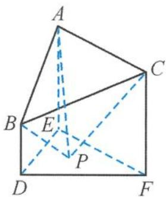
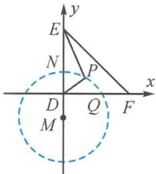
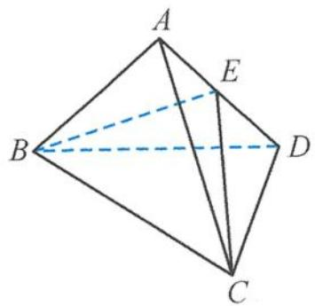

> [!faq]- 《浙大优辅《高中数学新体系 立体几何的秘密》》例题解析
>
> > [!success]- **【答案】** C
>
> > [!note]- **【分析】**
> > 本题未单列分析。
>
> > [!note]- **【解析】**
> > 
> > 图5.2-34
> > 解答 连接 $PD, PE$ , 由题意易知 $\angle APE, \angle BPD$ 分别为 $AP, BP$ 与底面 $DEF$ 所成的角, 故
> > $$
> > \tan \angle A P E = \tan \angle B P D,
> > $$
> > 可得
> > $$
> > P E = 2 P D.
> > $$
> > 分别以 $DF, DE$ 为坐标轴建立平面直角坐标系, 如图5.2-35所示. 设 $P(x, y)$ , 而 $F(3,0), E(0,3)$ , 可得
> > 
> > 图5.2-35
> > $$
> > x ^ {2} + (y + 1) ^ {2} = 4.
> > $$
> > 点 P 在以 $M(0, -1)$ 为圆心，半径 r = 2 的圆弧上运动（点 P 在 $\triangle DEF$ 内且包括边界）. $\odot M$ 与坐标轴的正半轴交于点 $N(0,1)$ , $Q(\sqrt{3},0)$ , 连接 PF, 显然
> > $$
> > Q F \leqslant P F \leqslant N F.
> > $$
> > 又 $QF = 3 - \sqrt{3}, NF = \sqrt{10}$ , 而 $\tan \theta = \frac{3}{PF}$ , 故
> > $$
> > \frac {3 \sqrt {1 0}}{1 0} \leqslant \tan \theta \leqslant \frac {3 + \sqrt {3}}{2}.
> > $$
> > 引申 在四面体 $ABCD$ 中, 已知 $AD \perp BC$ , $AD = 6$ , $BC = 2$ , 且 $\frac{AB}{BD} = \frac{AC}{CD} = 2$ , 则 $V_{\text{四面体}ABCD}$ 的最大值为 ( ).
> > A. 6
> > B. $2\sqrt{11}$ C. $2\sqrt{15}$ D. 8
> > 解答 如图 5.2-36, 过点 B 作 BE 垂直 AD 于点 E, 则 AD ⊥ 平面 BCE, 所以
> > $$
> > V = \frac {1}{3} A D \cdot S _ {\triangle B C E} = 2 S _ {\triangle B C E}.
> > $$
> > 因为 $\frac{AB}{BD} = \frac{AC}{CD} = 2$ ，所以点 $B, C$ 在阿波罗尼斯圆①上， $|BE| = |CE|$ ，从而
> > $$
> > \mid B E \mid_ {\max} = r = 4,
> > $$
> > 
> > 图5.2-36
> > 所以
> > $$
> > V _ {\max} = 2 \sqrt {1 5}.
> > $$
> >
> > 故选 **C**.
