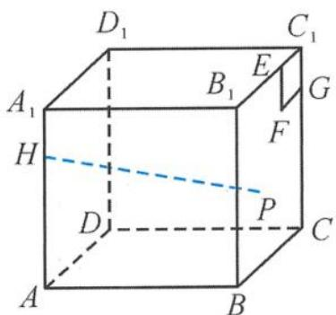
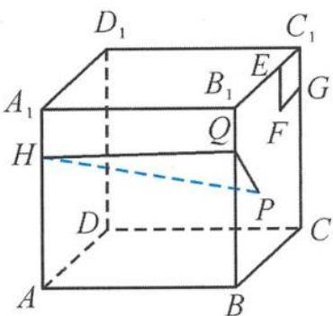
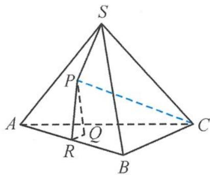
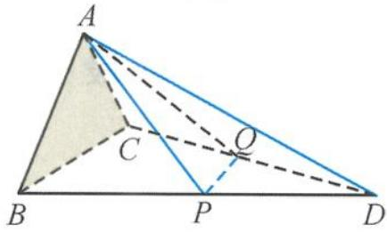
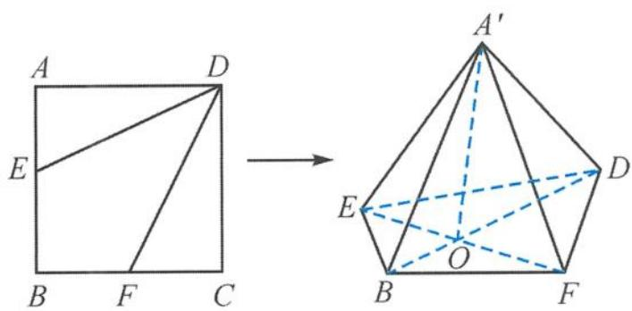
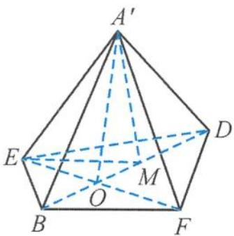
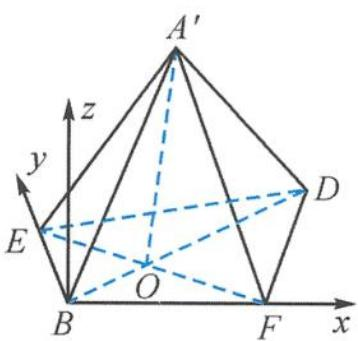
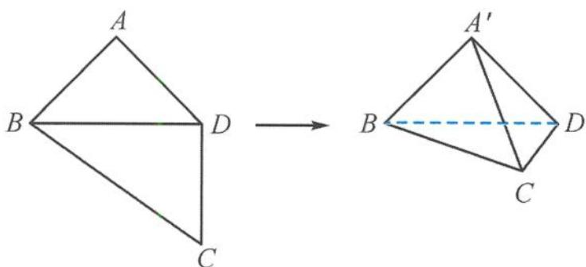

> [!faq]- 《浙大优辅《高中数学新体系 立体几何的秘密》》例题解析
>
> > [!success]- **【答案】** ABD
>
> > [!note]- **【分析】**
> > 本题未单列分析。
>
> > [!note]- **【解析】**
> > 
> > 图5.2-37
> > 解答 依题意知, 点 P 到点 F 的距离与到直线 $CC_{1}$ 的距离相等, 所以点 P 的轨迹是以 F 为焦点、 $CC_{1}$ 为准线的抛物线. 如图 5.2-38, 作 $HQ \perp BB_{1}$ 于点 Q, 则当 PQ 最小时, $HP^{2}$ 最小. 再由解析几何知识可得
> > $$
> > P Q _ {\mathrm{min}} = \sqrt {6},
> > $$
> > 
> > 图5.2-38
> > 所以 $HP^{2}$ 的最小值为 22, 即
> > $$
> > H P _ {\mathrm{min}} = \sqrt {2 2}.
> > $$
> > 引申 在棱长为 2 的正四面体 S-ABC 中, 已知动点 P 在侧面 SAB 内, $PQ \perp$ 底面 ABC, 垂足为 Q. 若 $PS = \frac{3\sqrt{2}}{4}PQ$ , 求 PC 长度的最小值.
> > 解答 如图 5.2-39, 过点 P 作 $PR \perp AB$ 于点 R, 则 $QR \perp AB$ , 所以 $\angle PRQ$ 为侧面 SAB 与底面 ABC 所成的角, 即
> > $$
> > \cos \angle P R Q = \frac {1}{3}, P Q = P R \cdot \sin \angle P R Q = P R \cdot \frac {2 \sqrt {2}}{3},
> > $$
> > 
> > 图5.2-39
> > 所以
> > $$
> > P S = \frac {3 \sqrt {2}}{4} P Q = \frac {3 \sqrt {2}}{4} \cdot P R \cdot \frac {2 \sqrt {2}}{3} = P R.
> > $$
> > 故点 $P$ 在以 $S$ 为焦点、 $AB$ 为准线的抛物线上。取 $AB$ 的中点 $D, SD$ 的中点 $E$ ，设 $\triangle SAB$ 的重心为 $G$ ，则 $CG = \frac{2\sqrt{6}}{3}$ ，且 $CP = \sqrt{CG^2 + GP^2}$ ，故
> > $$
> > G P _ {\mathrm{min}} = G E = \sqrt {3} \cdot \left(\frac {2}{3} - \frac {1}{2}\right) = \frac {\sqrt {3}}{6},
> > $$
> > 所以
> > $$
> > C P _ {\mathrm{min}} = \frac {\sqrt {1 1}}{2}.
> > $$
> > ## 5.3 图形的翻折、旋转问题剖析
> > 将平面图形按照一定规则进行翻折后形成空间图形,再对空间图形的位置、数量关系进行论证与计算的问题称为翻折问题. 翻折问题是立体几何动态问题中的一类重要题型,但这类问题比较抽象,而且对空间想象能力的要求比较高,所以很多同学对这类问题常常是“望题兴叹”,晕头转向,无从入手.本专题对常见的类型与方法进行梳理.
> > ## 5.3.1 翻折、旋转问题中的基本量
> > $$
> > \triangle A B C
> > $$
> > $$
> > \triangle B C D
> > $$
> > $$
> > \angle B A C = 6 0 ^ {\circ}, \angle B C D =
> > $$
> > $90^{\circ}, AB = AC, CD = 2BC$ , 点 P, Q 分别在边 BD, CD 上, 沿直线 PQ 将 $\triangle PQD$ 翻折, 使点 D 与点 A 重合.
> > (Ⅰ) 证明: $AD \perp PQ$ .
> > 
> > 图5.3-1
> > (II) 求直线 $AP$ 与平面 $ABC$ 所成角的正弦值.
> > 证明 (I) 取 $AD$ 的中点为 $M$ , 连接 $PM, QM$ , 沿直线 $PQ$ 将 $\triangle PQD$ 翻折, 使点 $D$ 与点 $A$ 重合, 则
> > $$
> > P A = P D, Q A = Q D.
> > $$
> > 从而得 $AD \perp PM, AD \perp QM$ , 且 $PM \cap QM = M, AD \perp$ 平面 $PMN$ , 得
> > $$
> > A D \perp P Q.
> > $$
> > (II) 因为 $\triangle ABC$ 与 $\triangle BCD$ 所在的平面互相垂直, 而 $CD \perp BC$ , 所以 $CD \perp$ 平面 $ABC$ . 以点 $C$ 为坐标原点、 $CB$ 为 $x$ 轴、 $CD$ 为 $y$ 轴、过点 $C$ 垂直于平面 $BCD$ 的直线为 $z$ 轴, 建立空间直角坐标系. 设 $BC = 2, CD = 4$ , 得
> > $$
> > A (1, 0, \sqrt {3}), D (0, 4, 0).
> > $$
> > 设 $P(t,4 - 2t,0),0 < t < 2$ ，由于 $PA = PD$ ，所以
> > $$
> > (t - 1) ^ {2} + (4 - 2 t) ^ {2} + 3 = t ^ {2} + (2 t) ^ {2} + 0,
> > $$
> > 得 $t = \frac{10}{9}$ ，所以
> > $$
> > \overrightarrow {P A} = \left(- \frac {1}{9}, - \frac {1 6}{9}, \sqrt {3}\right).
> > $$
> > 因为 $CD \perp$ 平面 $ABC$ , 所以
> > $$
> > \overrightarrow {C D} = (0, 4, 0)
> > $$
> > 为平面 $ABC$ 的法向量, 故直线 $AP$ 与平面 $ABC$ 所成角的正弦值等于 $\overrightarrow{PA}$ 与 $\overrightarrow{CD}$ 夹角余弦值的绝对值, 即
> > $$
> > \mid \cos \langle \overrightarrow {P A}, \overrightarrow {C D} \rangle \mid = \frac {8 \sqrt {5}}{2 5}.
> > $$
> > 点评 解翻折与旋转问题的关键就在于动中寻静.
> > - **①**：作出翻折前、后的两幅图.
> > - **②**：找出翻折中的不变量和不变位置关系. 像例 1, 就是抓住不变量 $PA = PD$ , $QA = QD$ , 在解答过程中常常要经历“平面 $\longrightarrow$ 空间 $\longrightarrow$ 平面”的数学思维过程.
> > 引申 1 如图 5.3-2, 已知正方形 ABCD 的边长为 2, E, F 分别为 AB, BC 的中点, 将 $\triangle ADE, \triangle DCF$ 分别沿 DE, DF 折起, 使 A, C 两点重合于点 $A'$ , 连接 $A'B$ .
> > (I) 证明: $EF \perp$ 平面 $A^{\prime}BD$ .
> > 
> > (Ⅱ) 求 $A^{\prime}E$ 与平面 BEDF 所成角的余弦值.
> > 图5.3-2
> > 解答 （Ⅰ）因为 $A^{\prime}D \perp A^{\prime}E, A^{\prime}D \perp A^{\prime}F$ ，所以 $A^{\prime}D \perp$ 平面 $A^{\prime}EF$ .
> > 又 $EF \subset$ 平面 $A'EF$ ，所以 $A'D \perp EF$ 。
> > 由已知可得 $EF \perp BD$ ，所以 $EF \perp$ 平面 $A^{\prime}BD$ .
> > (II) 解法一 如图 5.3-3, 在 $\triangle A'BD$ 内过点 $A'$ 作 $A'M \perp BD$ 于点 $M$ . 由 (I) 知平面 $A'BD \perp$ 平面 $BEDF$ , 平面 $A'BD \cap$ 平面 $BEDF = BD$ , 则 $A'M \perp$ 平面 $BEDF$ , 所以 $\angle A'EM$ 即为 $A'E$ 与平面 $BEDF$ 所成的角.
> > 设 EF 与 BD 交于点 O，连接 $A'O$ ，则
> > $$
> > A ^ {\prime} O = B O = \frac {\sqrt {2}}{2}, D O = \frac {3 \sqrt {2}}{2}.
> > $$
> > 又 $A^{\prime}D \perp$ 平面 $A^{\prime}EF, A^{\prime}O \subset$ 平面 $A^{\prime}EF, A^{\prime}D \perp A^{\prime}O$ , 在 Rt△ $A^{\prime}DM$ 中,
> > $$
> > A ^ {\prime} M = \frac {A ^ {\prime} O \cdot A ^ {\prime} D}{O D} = \frac {2}{3}, E M = \frac {\sqrt {5}}{3},
> > $$
> > 所以
> > $$
> > \cos \angle A ^ {\prime} E M = \frac {E M}{A ^ {\prime} E} = \frac {\sqrt {5}}{3}.
> > $$
> > 故 $A^{\prime}E$ 与平面 BEDF 所成角的余弦值为 $\frac{\sqrt{5}}{3}$ .
> > 
> > 图5.3-3
> > 
> > 图5.3-4
> > 解法二 以点 $B$ 为坐标原点, 建立如图5.3-4所示的空间直角坐标系, 则有 $B(0,0,0), E(0,1,0), F(1,0,0), D(2,2,0)$ .
> > 设 $A^{\prime}(x,y,z)$ ，则
> > $$
> > \left\{ \begin{array}{l} A ^ {\prime} E ^ {2} = x ^ {2} + (y - 1) ^ {2} + z ^ {2} = 1, \\ A ^ {\prime} F ^ {2} = (x - 1) ^ {2} + y ^ {2} + z ^ {2} = 1, \\ A ^ {\prime} D ^ {2} = (x - 2) ^ {2} + (y - 2) ^ {2} + z ^ {2} = 4, \end{array} \right.
> > $$
> > 解得 $A'\left(\frac{2}{3},\frac{2}{3},\frac{2}{3}\right)$ . 于是
> > $$
> > \overrightarrow {A ^ {\prime} E} = \left(- \frac {2}{3}, \frac {1}{3}, \frac {2}{3}\right).
> > $$
> > 又平面 BEDF 的一个法向量为 $\boldsymbol{n} = (0, 0, 1)$ ，设直线 AP 与平面 ABC 所成的角为 $\theta$ ，则
> > $$
> > \sin \theta = | \cos \langle \overrightarrow {A ^ {\prime} E}, n \rangle | = \frac {| \overrightarrow {A ^ {\prime} E} \cdot n |}{| \overrightarrow {A ^ {\prime} E} |} = \frac {2}{3}.
> > $$
> > 因此 $A^{\prime}E$ 与平面 BEDF 所成角的余弦值为 $\frac{\sqrt{5}}{3}$ .
> > 引申 2 （多选）如图 5.3-5, 在四边形 ABCD 中, 已知 AB = AD = CD = 1, $BD = \sqrt{2}$ , BD ⊥ CD. 将四边形 ABCD 沿对角线 BD 折成四面体 A'BCD, 使 $\angle A'DC = \frac{\pi}{2}$ , 则下列结论正确的是( ).
> > A. $A^{\prime}B \perp CD$ B. $\angle BA^{\prime}C = \frac{\pi}{2}$ C. 二面角 $A^{\prime}-BC-D$ 的平面角的正切值是 $\sqrt{2}$ D. 异面直线 $A^{\prime}C$ 与 BD 所成角的大小为 $\frac{\pi}{3}$
> > 
> > 图5.3-5
> > 解答 (1) $\left\{ \begin{array}{l} CD \perp BD, \\ CD \perp A'D, \\ A'D \cap BD = D \end{array} \right. \Rightarrow CD \perp$ 平面 $A'BD \Rightarrow CD \perp A'B$ , 所以 $A$ 正确.
> > (2) $\left\{\begin{aligned}A^{\prime}B\perp A^{\prime}D,\\ A^{\prime}B\perp CD,\\ A^{\prime}D\cap CD=D\end{aligned}\right.\Rightarrow A^{\prime}B\perp$ 平面 $A^{\prime}CD\Rightarrow A^{\prime}B\perp A^{\prime}C$ ，所以B正确.
> > (3) 由(1)知, 平面 $A^{\prime}BD \perp$ 平面 $BCD$ , 取 $BD$ 的中点 $O$ , 则 $A^{\prime}O \perp$ 平面 $BCD$ , 过点 $O$ 作 $BC$ 的垂线, 垂足为 $E$ , 则 $A^{\prime}E \perp BC$ , 所以 $\angle A^{\prime}EO$ 为二面角 $A^{\prime}-BC-D$ 的平面角. 易得二面角 $A^{\prime}-BC-D$ 的平面角的正切值是 $\sqrt{3}$ , 所以 C 错误.
> > (4) 因为 $A^{\prime}C = \sqrt{2}$ ，所以
> > $$
> > \overrightarrow {A ^ {\prime} C} \cdot \overrightarrow {B D} = \frac {| \overrightarrow {A ^ {\prime} D} | ^ {2} + | \overrightarrow {C B} | ^ {2} - | \overrightarrow {A ^ {\prime} B} | ^ {2} - | \overrightarrow {C D} | ^ {2}}{2} = 1.
> > $$
> > 从而
> > $$
> > \cos \langle \overrightarrow {A ^ {\prime} C}, \overrightarrow {B D} \rangle = \frac {1}{2},
> > $$
> > 得异面直线 $A^{\prime}C$ 与 $BD$ 所成角的大小为 $\frac{\pi}{3}$ , 所以 D 正确.
> > 故选 ABD.
> > ## 5.3.2 翻折、旋转问题中的轨迹
