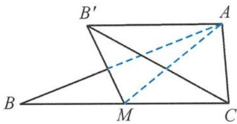
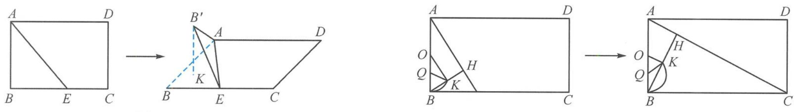
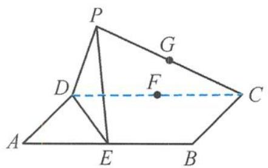
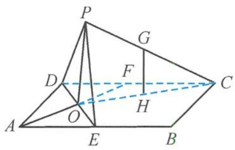
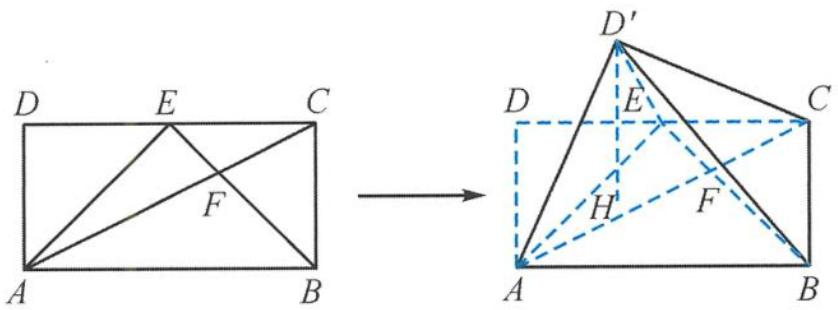
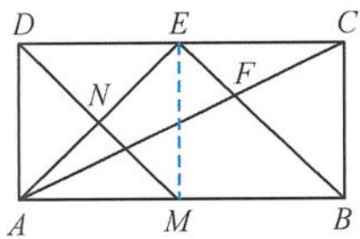

> [!faq]- 《浙大优辅《高中数学新体系 立体几何的秘密》》例题解析
>
> > [!success]- **【答案】** A
>
> > [!note]- **【分析】**
> > 本题未单列分析。
>
> > [!note]- **【解析】**
> > 
> > 解答 因为 M 是 BC 的中点, 所以 $B'$ , C 到直线 AM 的距离相等. 又二面角 $P-AM-B'$ 与二面角 P-AM-C 的平面角相等, 因此点 $B'$ , C 到平面 AMP 的距离相等. 从而 $V_{B'-AMP} = V_{C-AMP}$ , 即
> > 图5.3-6
> > $$
> > V _ {A - B ^ {\prime} M P} = V _ {A - P M C}.
> > $$
> > 而这两个三棱锥的高一样,所以这两个三棱锥的底面积相等,即
> > $$
> > S _ {\triangle B ^ {\prime} M P} = S _ {\triangle P M C},
> > $$
> > 所以
> > $$
> > B ^ {\prime} P = C P.
> > $$
> > 所以 P 为 $B^{\prime}C$ 的中点, 直线 AP 经过 $\triangle AB^{\prime}C$ 的重心. 故选 A.
> > 引申 1 如图 5.3-7, 在矩形 $ABCD$ 中, 已知 $AB = 1$ , $BC = \sqrt{3}$ , $E$ 为线段 $BC$ 上的动点. 现将 $\triangle ABE$ 沿 $AE$ 折起得到 $\triangle AB'E$ , 使二面角 $B' - AE - D$ 的平面角为 $120^\circ$ . 记点 $B'$ 在平面 $ABC$ 上的投影为点 $K$ , 当点 $E$ 从点 $B$ 运动到点 $C$ 时, 点 $K$ 所形成轨迹的长度为 \_\_\_\_.
> > 
> > 图5.3-7
> > 图5.3-8
> > 解答 如图 5.3-8(a), 作 $BH \perp AE$ 于点 $H$ , 翻折后 $B'H \perp AE$ , 所以 $\angle B'HB = 60^\circ$ , 则 $K$ 为 $BH$ 的中点. 设 $O$ 为 $AB$ 的中点, $Q$ 为 $OB$ 的中点, 则点 $H$ 的轨迹是以 $O$ 为圆心、 $AB$ 为直径的圆弧, 点 $K$ 的轨迹是以 $Q$ 为圆心、 $OB$ 为直径的圆弧. 当点 $E$ 从点 $B$ 移动到点 $C$ 时 (图 5.3-8(b)),
> > $$
> > \angle B Q K = \frac {2 \pi}{3},
> > $$
> > 所以点 $K$ 所形成轨迹的长度
> > $$
> > l = \alpha \cdot R = \frac {2 \pi}{3} \times \frac {1}{4} = \frac {\pi}{6}.
> > $$
> > 故答案为 $\frac{\pi}{6}$ .
> > 引申 2 如图 5.3-9, 已知矩形 $ABCD, AB = 4, BC = 2, E, F$ 分别为边 $AB, CD$ 的中点. 沿直线 $DE$ 将 $\triangle ADE$ 翻折成 $\triangle PDE$ , 在点 $P$ 从点 $A$ 翻转至点 $F$ 的过程中, $CP$ 的中点 $G$ 的轨迹长度为 \_\_\_\_.
> > 
> > 图5.3-9
> > 
> > 图5.3-10
> > 解答 如图 5.3-10, 连接 AF, 交 DE 于点 O, 易证 DE ⊥ 平面 APO, 所以点 P 的轨迹是平面 APO 内的半圆. 连接 OC, 设 OC 的中点为 H, 则
> > $$
> > G H = \frac {1}{2} O P = \frac {\sqrt {2}}{2}.
> > $$
> > 所以 CP 的中点 G 的轨迹是以 GH 为半径的半圆. 故点 G 的轨迹长度为 $\frac{\sqrt{2}\pi}{2}$ .
> > 引申 3 如图 5.3-11, 在矩形 $ABCD$ 中, 已知 $AB = 2AD = 4$ , $E$ 为 $CD$ 的中点, $AC$ , $BE$ 交于点 $F$ . 将 $\triangle ADE$ 沿着 $AE$ 向上翻折, 使点 $D$ 到点 $D'$ . 若点 $D'$ 在平面 $ABCD$ 上的投影 $H$ 落在梯形 $ABCE$ 的内部及边界上, 则 $FH$ 的取值范围是 \_\_\_\_.
> > 
> > 图5.3-11
> > 
> > 图5.3-12
> > 解答 如图 5.3-12, 取 AB 的中点 M, 连接 EM. 已知四边形 ADEM 与四边形 MBCE 是全等的正方形, 连接 DM, 交 AE 于点 N, 易证 AE ⊥ 平面 DMN. 所以点 D' 在平面 ABCD 上的投影 H 落在线段 MN 上.
> > 因为 $BE \parallel MN, EN \perp MN$ , 所以
> > $$
> > F H _ {\mathrm{min}} = E N = \sqrt {2},
> > $$
> > $$
> > F H _ {\max} = F N = \frac {\sqrt {2 6}}{3}.
> > $$
> > 故 FH 的取值范围是 $\left[\sqrt{2}, \frac{\sqrt{26}}{3}\right]$ .
> > ## 5.3.3 翻折、旋转问题中的最值
> > 解决平面翻折问题的关键在于弄清翻折前后的变与不变的关系,经过翻折后哪些位置关系、量发生了变化,哪些是没有变化的,而这取决于学生对翻折前后图形的认识,这就体现了空间想象能力.
