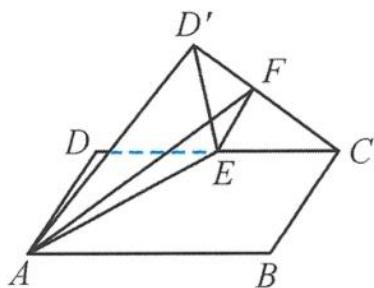
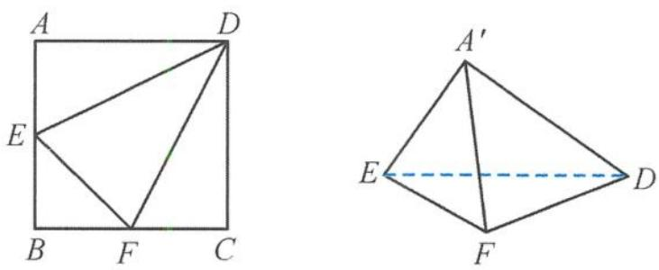
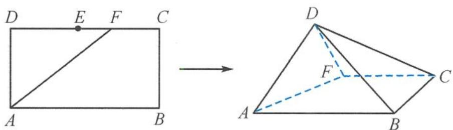
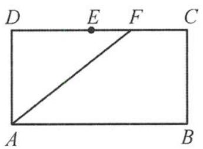
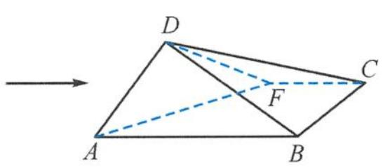
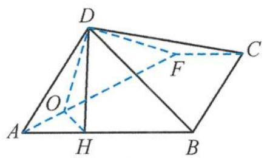
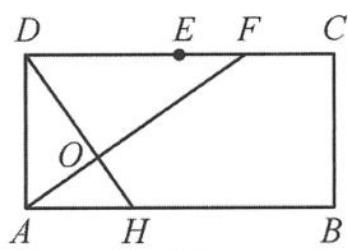

> [!faq]- 《浙大优辅《高中数学新体系 立体几何的秘密》》例题解析
>
> > [!success]- **【答案】** C
>
> > [!note]- **【分析】**
> > 本题未单列分析。
>
> > [!note]- **【解析】**
> > 
> > 图5.3-13
> > 解答 由题意,设点 F 到平面 $AED'$ 的距离为 d, 由 F 为线段 $CD'$ 的中点, 可得点 C 到平面 $AED'$ 的距离为 2d.
> > 取 AB 的中点 G，连接 CG，易得 $CG \parallel AE, CG \parallel$ 平面 $AED'$ . 故点 C 到平面 $AED'$ 的距离即为直线 CG 到平面 $AED'$ 的距离. 易得直线 CG 到平面 $AED'$ 距离小于等于直线 CG 到直线 AE 的距离.
> > 在矩形 $ABCD$ 中, 设 $AB = 2t$ , 直线 $CG$ 到直线 $AE$ 的距离为 $h$ , 可得
> > $$
> > A E = \sqrt {1 + t ^ {2}},
> > $$
> > 又 $AE\cdot h = AG\cdot AD$ ，故
> > $$
> > h = \frac {t}{\sqrt {1 + t ^ {2}}}.
> > $$
> > 由三棱锥 $F - AED'$ 体积的最大值为 $\frac{\sqrt{5}}{15}$ , 可得
> > $$
> > \left(V _ {F - A E D ^ {\prime}}\right) _ {\max} = \frac {1}{3} \times \left(\frac {1}{2} \times 1 \times t\right) \times \frac {t}{2 \sqrt {1 + t ^ {2}}} = \frac {\sqrt {5}}{1 5},
> > $$
> > 可得 t = 2. 故答案为 4.
> > 引申 1 如图 5.3-14, 已知正方形 ABCD 的边长为 4, E, F 分别是 AB, BC 的中点, 将 △ADE, △EBF, △FCD 分别沿 DE, EF, FD 折起, 使得 A, B, C 三点重合于点 A'. 若点 G 及四面体 A'DEF 的四个顶点都在同一个球面上, 则以 △FDE 为底面的三棱锥 G-DEF 的高 h 的最大值为( ).
> > A. $\sqrt{6} +\frac{2}{3}$ B. $\sqrt{6} +\frac{4}{3}$ C. $2\sqrt{6} -\frac{4}{3}$ D. $2\sqrt{6} -\frac{2}{3}$
> > 
> > 图5.3-14
> > 解答 设外接球的球心为 O, 球的半径为 R, 折叠后
> > $$
> > A ^ {\prime} D \perp A ^ {\prime} E, A ^ {\prime} E \perp A ^ {\prime} F, A ^ {\prime} F \perp A ^ {\prime} D,
> > $$
> > 所以
> > $$
> > (2 R) ^ {2} = A ^ {\prime} D ^ {2} + A ^ {\prime} E ^ {2} + A ^ {\prime} F ^ {2} = 2 4,
> > $$
> > 解得 $R = \sqrt{6}$ . 在 $\triangle FDE$ 中，
> > $$
> > \cos \angle D E F = \frac {1}{\sqrt {1 0}}, \sin \angle D E F = \frac {3}{\sqrt {1 0}}.
> > $$
> > 设 $\triangle FDE$ 的外接圆的圆心为 $O'$ ，半径 $r = \frac{5\sqrt{2}}{3}$ ，
> > $$
> > h _ {\mathrm{max}} = R + | O _ {\text {外接圆心}} O _ {\text {球心}} | = \sqrt {6} + \frac {2}{3}.
> > $$
> > 故选 A.
> > 引申 2 如图 5.3-15, 在矩形 ABCD 中, 已知 AB = 2, AD = 1, E 为 CD 的中点, F 为线段 CE (端点除外) 上的动点. 现将 $\triangle DAF$ 沿 AF 折起, 使得平面 ABD ⊥ 平面 ABC. 设直线 FD 与平面 ABCF 所成的角为 $\theta$ , 则 $\sin \theta$ 的最大值为().
> > 
> > 图5.3-15
> > A. $\frac{1}{3}$ B. $\frac{\sqrt{2}}{4}$ C. $\frac{1}{2}$ D. $\frac{2}{3}$
> > 解答 在矩形ABCD中,过点D作AF的垂线,交AF于点O,交AB于点M.设CF=x(0<x<1),AM=t,由△ADM∽△ADF,得
> > $$
> > \frac {A M}{A D} = \frac {A D}{D F},
> > $$
> > 即有
> > $$
> > t = \frac {1}{2 - x}.
> > $$
> > 由 $0 < x < 1$ ，得
> > $$
> > \frac {1}{2} <   t <   1.
> > $$
> > 在翻折后的几何体中, 因为 $AF \perp OD$ , $AF \perp OM$ , 所以 $AF \perp$ 平面 $ODM$ , 从而平面 $ODM \perp$ 平面 $ABC$ . 又平面 $ABD \perp$ 平面 $ABC$ , 则 $DM \perp$ 平面 $ABC$ . 连接 $MF$ , 则 $\angle MFD$ 是直线 $FD$ 与平面 $ABCF$ 所成的角, 即 $\angle MFD = \theta$ .
> > 因为
> > $$
> > D M = \sqrt {1 - t ^ {2}}, D F = 2 - x = \frac {1}{t},
> > $$
> > 所以
> > $$
> > \sin \theta = \frac {D M}{D F} = t \sqrt {1 - t ^ {2}} = \sqrt {t ^ {2} (1 - t ^ {2})} \leqslant \frac {t ^ {2} + (1 - t ^ {2})}{2} = \frac {1}{2},
> > $$
> > 当且仅当 $t^2 = \frac{1}{2}$ 时， $\sin \theta$ 取到最大值，其最大值为 $\frac{1}{2}$ . 故选 C.
> > 引申 3 如图 5.3-16, 在长方形 $ABCD$ 中, 已知 $AB = 2$ , $BC = 1$ , $E$ 为 $DC$ 的中点, $F$ 为线段 $EC$ (端点除外)上的动点. 现将 $\triangle AFD$ 沿 $AF$ 折起, 使平面 $ABD \perp$ 平面 $ABC$ , 则二面角 $D-AF-B$ 的平面角余弦值的取值范围是 \_\_\_\_.
> > 
> > 
> > 图5.3-16
> > 
> > (a)
> > 
> > (b)
> > 图5.3-17
> > 解答 如图 5.3-17(a), 设翻折后点 D 在平面 ABCF 内的射影为 H, 作 $OH \perp AF$ , 垂足为 O, 则 $\angle DOH$ 为二面角 D-AF-B 的平面角, 故
> > $$
> > \cos \angle D O H = \frac {O H}{O D}.
> > $$
> > 如图 5.3-17(b), 由于在翻折前, 点 D, O, H 共线, 且 DH ⊥ AF, 则 AH² = OH · DH,
> > $AD^{2}=OD\cdot DH$ ，所以
> > $$
> > \frac {O H}{O D} = \frac {A H ^ {2}}{A D ^ {2}}.
> > $$
> > 设 $DF = t\in (1,2)$ ，由于 $\frac{AH}{AD} = \frac{AD}{DF}$ ，从而
> > $$
> > A H = \frac {A D ^ {2}}{D F} = \frac {1}{t},
> > $$
> > 所以
> > $$
> > \cos \angle D O H = \frac {O H}{O D} = \frac {1}{t ^ {2}} \in \left(\frac {1}{4}, 1\right).
> > $$
> > 由此可知,二面角 D-AF-B 的平面角余弦值的取值范围是 $\left(\frac{1}{4},1\right)$ . 故答案为 $\left(\frac{1}{4},1\right)$ .
