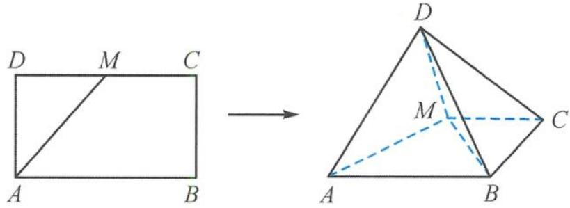
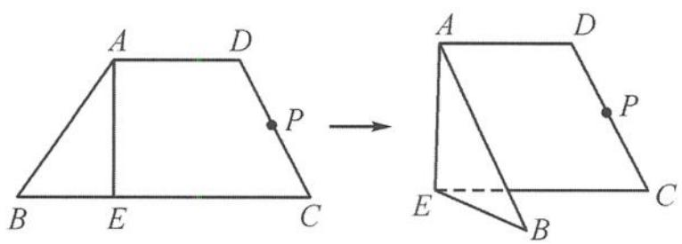
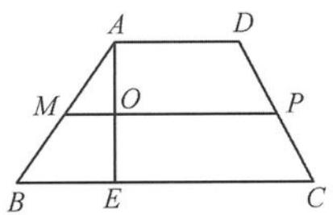
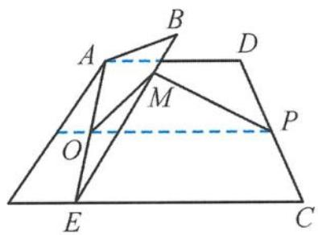
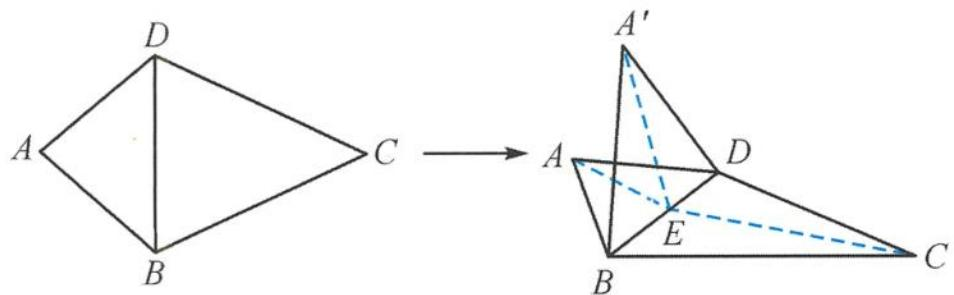
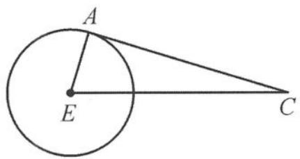

> [!faq]- 《浙大优辅《高中数学新体系 立体几何的秘密》》例题解析
>
> > [!success]- **【答案】** 详见解析
>
> > [!note]- **【分析】**
> > 本题未单列分析。
>
> > [!note]- **【解析】**
> > 
> > 图5.3-18
> > 线 BC 与平面 ADM 所成的角为 $\alpha$ ，则 $\sin \alpha$ 的取值范围是 \_\_\_\_.
> > 解答 在长方形 ABCD 中, 取 AB 的中点 N, 连接 MN, DN, 其中 DN 交 AM 于点 O, 则 AM ⊥ 平面 DON, 得到平面 ADM ⊥ 平面 DON 且 MN ∥ BC. 过点 N 作 DO 的垂线, 垂足为 P, 则 ∠PMN 即为角 α,
> > $$
> > \sin \alpha = \frac {P N}{M N}.
> > $$
> > 因为
> > $$
> > P N = \frac {\sqrt {2}}{2} \sin \theta , M N = 1,
> > $$
> > 所以
> > $$
> > \sin \alpha = \frac {\sqrt {2}}{2} \sin \theta , \theta \in \left[ \frac {\pi}{3}, \frac {\pi}{2} \right],
> > $$
> > 可得
> > $$
> > \sin \alpha \in \left[ \frac {\sqrt {6}}{4}, \frac {\sqrt {2}}{2} \right].
> > $$
> > 引申1 如图5.3-19, 在等腰梯形ABCD中, 已知 $AD \parallel BC$ , $AB = AD = DC = 2$ , $BC = 4$ , $E$ 是BC上一点, 且 $BE = 1$ , $P$ 为DC的中点. 沿AE将梯形折成大小为θ的二面角B-AE-C. 若△ABE内(包含边界)存在一点Q, 使得 $PQ \perp$ 平面 ABE, 则 $\cos \theta$ 的取值范围是 \_\_\_\_.
> > 
> > 图5.3-19
> > 解答 如图 5.3-20(a), 在等腰梯形 ABCD 中, 取 AB 的中点 M, 连接 PM, 交 AE 于点 O, 则 $PM \perp AE$ .
> > 
> > (a)
> > 
> > 图5.3-20
> > (b)
> > 如图 5.3-20(b), 在翻折过程中, $AE \perp$ 平面 OPM, 从而平面 $ABE \perp$ 平面 OPM, 因此点 $P$ 在平面 $ABE$ 内的射影 $Q$ 必在 OM 上. 当 $\theta$ 取最小值时, 有 $OM \perp PM$ ,
> > $$
> > (\cos \theta) _ {\max} = \frac {O M}{O P} = \frac {1}{5}.
> > $$
> > 当 $\theta = \frac{\pi}{2}$ 时，
> > $$
> > (\cos \theta) _ {\min} = 0.
> > $$
> > 故 $\cos\theta$ 的取值范围是 $\left[0,\frac{1}{5}\right]$ .
> > 引申 2 如图 5.3-21, 在平面四边形 $ABCD$ 中, 已知 $AD = AB = \sqrt{2}, CD = CB = \sqrt{5}$ , 且 $AD \perp AB$ . 现将 $\triangle ABD$ 沿对角线 $BD$ 翻折成 $\triangle A'BD$ , 则在 $\triangle A'BD$ 翻折到平面 $BCD$ 的过程中, 直线 $A'C$ 与平面 $BCD$ 所成最大角的正切值为 \_\_\_\_.
> > 
> > 图5.3-21
> > 
> > 图5.3-22
> > 解答 由题意知,点 A 运动的轨迹是以 E 为圆心、EA 为半径的圆(图 5.3-22),当点 A 运动到与圆相切时,所成的角最大,所以
> > $$
> > \tan \angle A ^ {\prime} C B = \frac {\sqrt {3}}{3}.
> > $$
