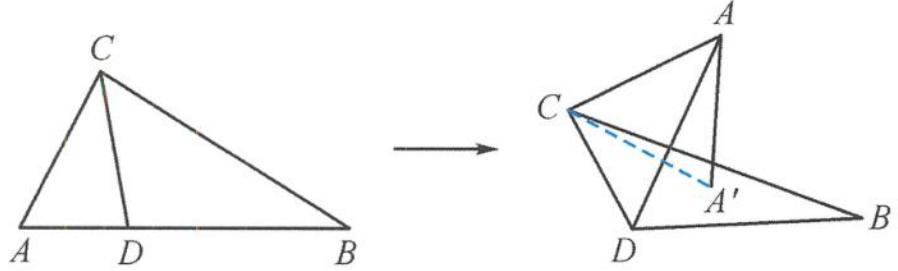
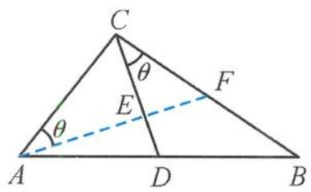

> [!faq]- 《浙大优辅《高中数学新体系 立体几何的秘密》》例题解析
>
> > [!success]- **【答案】** 详见解析
>
> > [!note]- **【分析】**
> > 本题未单列分析。
>
> > [!note]- **【解析】**
> > 
> > 图5.3-23
> > 
> > 图5.3-24
> > 解答 如图 5.3-24, 在 $\triangle ABC$ 中, 过点 $A$ 作 $AE \perp CD$ , 垂足为 $E$ . 延长 $AE$ , 交 $CD$ 于点 $F$ . 则翻折后 $CD \perp$ 平面 $AEF$ , 故点 $A$ 在平面 $BCD$ 内的射影 $A'$ 落在线段 $EF$ 上.
> > 设 $\angle CAE = \theta$ ，则 $0 < \theta < 60^{\circ}$ 又 $A^{\prime}C = \frac{\sqrt{7}}{3}$ ，则
> > $$
> > C E <   \frac {\sqrt {7}}{3} <   C F.
> > $$
> > 因为
> > $$
> > C E = C A \sin \theta = \sin \theta , C F = \frac {C E}{\cos \theta} = \tan \theta ,
> > $$
> > 所以
> > $$
> > \sin \theta <   \frac {\sqrt {7}}{3} <   \tan \theta ,
> > $$
> > 得 $\tan \theta \in \left(\frac{\sqrt{7}}{3}, \frac{\sqrt{14}}{2}\right)$ . 又 $0 < \theta < 60^{\circ}$ , 因此
> > $$
> > \tan \theta \in \left(\frac {\sqrt {7}}{3}, \sqrt {3}\right).
> > $$
> > 在 $\triangle ADE$ 中，
> > $$
> > t = A D = \frac {A E}{\cos (6 0 ^ {\circ} - \theta)} = \frac {\cos \theta}{\cos (6 0 ^ {\circ} - \theta)} = \frac {2}{1 + \sqrt {3} \tan \theta} \in \left(\frac {1}{2}, \frac {\sqrt {2 1} - 3}{2}\right).
> > $$
> > 故答案为 $\left(\frac{1}{2},\frac{\sqrt{21}-3}{2}\right)$ .
