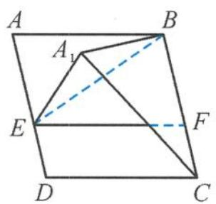
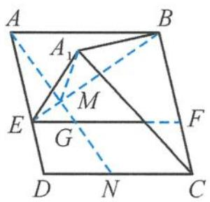

> [!faq]- 《浙大优辅《高中数学新体系 立体几何的秘密》》例题解析
>
> > [!success]- **【答案】** D
>
> > [!note]- **【分析】**
> > 本题未单列分析。
>
> > [!note]- **【解析】**
> > 
> > 图5.3-25
> > 
> > 图5.3-26
> > 解答 如图 5.3-26, 过点 A 作 BE 的垂线, 分别交 BE, EF, CD 于点 M, G, N, 则 BE ⊥ 平面 $A_{1}MN$ . 所以点 $A_{1}$ 在平面 BCDE 上的射影在线段 GN 上, 且 $\angle A_{1}MN$ 为二面角 $A_{1}-BE-C$ 的平面角, 所以
> > $$
> > \angle A _ {1} M N = \theta .
> > $$
> > 因为 BC // AD, 所以
> > $$
> > \angle A _ {1} E D = \beta .
> > $$
> > 因为 $EA = EA_{1}$ , 所以 $\angle A_{1}AE = \frac{\beta}{2}$ . 又 $MA = MA_{1}$ , 所以 $\angle A_{1}AM = \frac{\theta}{2}$ . 因为 $AM$ 是 $AA_{1}$ 在平面 $ABCD$ 上的射影, 所以由最小角定理得 $\frac{\theta}{2} < \frac{\beta}{2}$ , 即
> > $$
> > \theta <   \beta .
> > $$
> > 再由最大角定理得
> > $$
> > \alpha <   \theta .
> > $$
> >
> > 故选 **D**.
