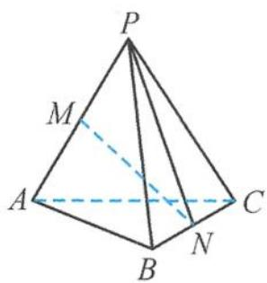
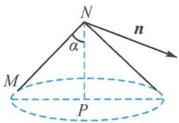
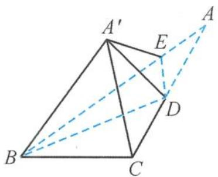
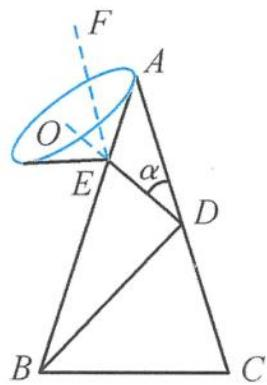
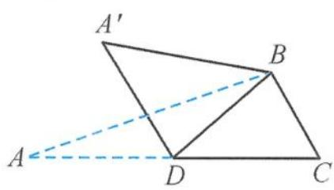
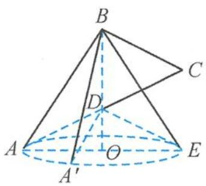

> [!faq]- 《浙大优辅《高中数学新体系 立体几何的秘密》》例题解析
>
> > [!success]- **【答案】** B
>
> > [!note]- **【分析】**
> > 本题未单列分析。
>
> > [!note]- **【解析】**
> > 
> > 解答 三棱锥 $P - ABC$ 的各条棱长均为 $1, N$ 是棱 $BC$ 的中点, 可得 $|PN|$ $= \frac{\sqrt{3}}{2}$ . 设直线 $PN$ 与 $MN$ 所成的角为 $\alpha$ , 则
> > 图5.3-27
> > $$
> > \sin \alpha = \frac {\sqrt {3}}{3}, \cos \alpha = \frac {\sqrt {6}}{3}.
> > $$
> > 因为三棱锥 P-ABC 为正三棱锥, 所以点 C 到平面 PAB 的距离为 $\sqrt{1 - \left(\frac{2}{3} \times \frac{\sqrt{3}}{2}\right)^2} = \frac{\sqrt{6}}{3}$ .
> > 由 N 是棱 BC 的中点可得, 点 N 到平面 PAB 的距离为 $\frac{\sqrt{6}}{6}$ . 设直线 PN 与平面 PAB 所成的角为 $\beta$ , 则
> > $$
> > \sin \beta = \frac {\sqrt {2}}{3}, \cos \beta = \frac {\sqrt {7}}{3}.
> > $$
> > 设平面 PAB 的法向量为 n, n 与直线 PN 的夹角为 $\theta$ , 则
> > $$
> > \sin \theta = \cos \beta = \frac {\sqrt {7}}{3}, \cos \theta = \sin \beta = \frac {\sqrt {2}}{3}.
> > $$
> > 
> > 将 $\triangle PMN$ 绕 $PN$ 所在的直线旋转一周, 因为 $PN$ 与平面 $PAB$ 所成的角为定值, $\angle PNM$ 为定值, 所以 $MN$ 旋转形成的轨迹为一个圆锥的侧面 (图5.3-28), 直线 $MN$ 与平面 $PAB$ 所成角的余弦值的取值范围是 $[\sin (\theta - \alpha)$ ,
> > 图5.3-28
> > $\sin (\alpha + \theta)]$ ，即
> > $$
> > \left[ \frac {\sqrt {4 2} - \sqrt {6}}{9}, \frac {\sqrt {4 2} + \sqrt {6}}{9} \right].
> > $$
> > 引申1 如图5.3-29, 在 $\triangle ABC$ 中, 已知 $\angle A = 36^{\circ}, AD = DB = BC$ , $E$ 为线段 $AB$ 上一点. 将 $\triangle ADE$ 绕 $DE$ 翻折, 若在翻折过程中存在某个位置, 使得 $AE \perp CD$ , 记 $\theta$ 为 $\angle ADE$ 的最小值, 则 $\theta$ 的所在区间是 ( ). A. $(15^{\circ}, 20^{\circ}]$ B. $(20^{\circ}, 25^{\circ}]$ C. $(25^{\circ}, 30^{\circ}]$ D. $(30^{\circ}, 35^{\circ}]$
> > 
> > 图5.3-29
> > 解答 如图 5.3-30, 过点 E 作 $EF \parallel CD$ . 设 $\angle ADE = \alpha$ , 在翻折过程中, AE 与 CD 所成的最大角为
> > $$
> > (\alpha + 3 6 ^ {\circ}) + \alpha = 2 \alpha + 3 6 ^ {\circ}.
> > $$
> > 
> > 因为要存在某个位置,使得 $AE \perp CD$ , 所以 $2\alpha + 36^{\circ} \geqslant 90^{\circ}$ , 即
> > $$
> > \alpha \geqslant 2 7 ^ {\circ},
> > $$
> > 所以
> > 图5.3-30
> > $$
> > \theta = 2 7 ^ {\circ}.
> > $$
> > 故选 C.
> > 引申2 如图5.3-31, 在 $\triangle ABC$ 中, 已知 $AB \perp BC$ , $\angle ACB = 60^{\circ}$ , $D$ 为 $AC$ 的中点. 在 $\triangle ABD$ 沿 $BD$ 翻折的过程中, 直线 $AB$ 与直线 $BC$ 所成的最大角、最小角分别记为 $\alpha_{1}, \beta_{1}$ , 直线 $AD$ 与直线 $BC$ 所成的最大角、最小角分别记为 $\alpha_{2}, \beta_{2}$ , 则有 ( ).
> > A. $\alpha_{1} < \alpha_{2}, \beta_{1} \leqslant \beta_{2}$ B. $\alpha_{1} \geqslant \alpha_{2}, \beta_{1} > \beta_{2}$ C. $\alpha_{1} \geqslant \alpha_{2}, \beta_{1} \leqslant \beta_{2}$ D. $\alpha_{1} < \alpha_{2}, \beta_{1} > \beta_{2}$
> > 
> > 图5.3-31
> > 解答 如图 5.3-32, 由题意可将 $\triangle ABD$ 绕 $BD$ 旋转一周, 可以看成形成了以 $BD$ 所在直线为轴、 $AB$ 为母线的圆锥, 直线 $AB$ 与直线 $BC$ 所成的角, 即为母线 $AB$ 与直线 $BC$ 所成的角, 所以
> > $$
> > \alpha_ {1} = 9 0 ^ {\circ}, \beta_ {1} = 3 0 ^ {\circ}.
> > $$
> > 
> > 图5.3-32
> > 将 $\triangle ABD$ 绕 $BD$ 旋转一周, 还可以看成形成了以 $BD$ 所在直线为轴、 $AD$ 为母线的圆锥, 直线 $AD$ 与直线 $BC$ 所成的角, 即为母线 $AD$ 与直线 $BC$ 所成的角.
> > 在翻折过程中,存在某个位置使得 $A^{\prime}D$ 在圆锥底面内的投影与 $BC$ 垂直,从而 $A^{\prime}D$ 与 $BC$ 垂直.当点 $A^{\prime}$ 与点 $E$ 重合时, $DE \parallel BC$ ,此时 $A^{\prime}D$ 与 $BC$ 成 $0^{\circ}$ 角,所以
> > $$
> > \alpha_ {2} = 9 0 ^ {\circ}, \beta_ {2} = 0 ^ {\circ}.
> > $$
> >
> > 故选 **B**.
