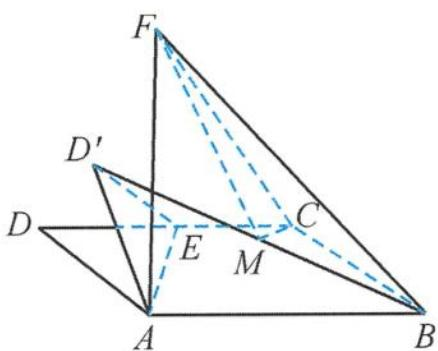
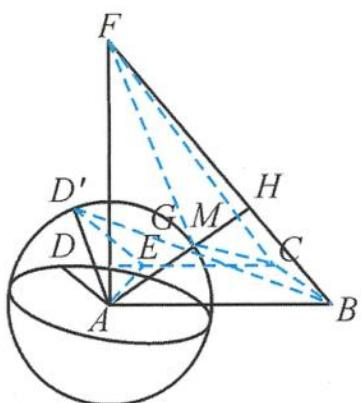

> [!faq]- 《浙大优辅《高中数学新体系 立体几何的秘密》》例题解析
>
> > [!success]- **【答案】** 详见解析
>
> > [!note]- **【分析】**
> > 本题未单列分析。
>
> > [!note]- **【解析】**
> > 
> > 解答 因为 $AF \perp$ 平面 $ABCD$ , 所以 $AF \perp BC$ . 又因为 $AB \perp BC$ , $AB \cap AF = A$ , 所以 $BC \perp$ 平面 $ABF, BC \perp BF$ ,
> > 图5.3-33
> > $$
> > B F = \sqrt {3 ^ {2} + (\sqrt {3}) ^ {2}} = 2 \sqrt {3}.
> > $$
> > 所以
> > $$
> > S _ {\triangle B C F} = \frac {1}{2} \times B C \times B F = \frac {1}{2} \times 1 \times 2 \sqrt {3} = \sqrt {3}.
> > $$
> > 求棱锥 M-BCF 体积的最小值即求点 M 到平面 BCF 的距离的最小值.
> > 因为 M 是 $BD'$ 的中点, 所以点 M 到平面 BCF 的距离是点 $D'$ 到平面 BCF 距离的一半. 因为 $AD' = 1$ , 随着点 E 在线段 DC 上移动, 点 $D'$ 的运动轨迹为以 A 为球心、1 为半径的球面的一部分(图 5.3-34).
> > 因为 $BC \perp$ 平面 $ABF$ , 所以平面 $BCF \perp$ 平面 $ABF$ , 并且交于 $BF$ . 过点 $A$ 作 $AH \perp BF$ , 即 $AH \perp$ 平面 $BCF$ .
> > 
> > 图5.3-34
> > 当 $D'$ 为 $AH$ 与球面的交点 $G$ 时, 点 $D'$ 到平面 $BCF$ 的距离最小. 此时, 点 $E$ 在线段 $DC$ 上.
> > 由 $AB \cdot AF = BF \cdot AH$ , 可得 $AH = \frac{3}{2}$ , 此时 $GH = \frac{3}{2} - 1 = \frac{1}{2}$ , 即点 $D'$ 到平面 $BCF$ 的距离的最小值是 $\frac{1}{2}$ , 那么点 $M$ 到平面 $BCF$ 距离的最小值是 $\frac{1}{4}$ . 所以三棱锥 $M-BCF$ 体积的最小值是 $\frac{1}{3} \times \sqrt{3} \times \frac{1}{4} = \frac{\sqrt{3}}{12}$ .
> > 故答案为 $\frac{\sqrt{3}}{12}$ .
