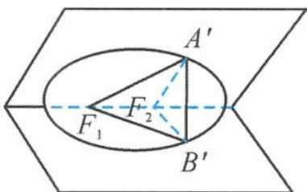
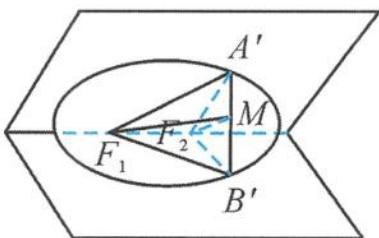
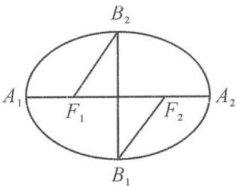

> [!faq]- 《浙大优辅《高中数学新体系 立体几何的秘密》》例题解析
>
> > [!success]- **【答案】** D
>
> > [!note]- **【分析】**
> > 本题未单列分析。
>
> > [!note]- **【解析】**
> > 
> > 解答 由椭圆的通径①得
> > $$
> > \mid A F _ {2} \mid = \frac {b ^ {2}}{a},
> > $$
> > 由椭圆的定义得
> > $$
> > \mid A F _ {1} \mid = 2 a - \frac {b ^ {2}}{a}.
> > $$
> > 
> > 易知 $\angle A^{\prime}F_{2}B^{\prime}$ 为二面角的平面角，所以 $\angle A^{\prime}F_{2}B^{\prime} = \alpha$ 。如图5.3-38，取 $A^{\prime}B^{\prime}$ 的中点 $M$ ，连接 $F_{1}M, F_{2}M$ ，则
> > 图5.3-38
> > $$
> > \begin{array}{l} \frac {1 - \cos \alpha}{1 - \cos \beta} = \frac {\sin^ {2} \frac {\alpha}{2}}{\sin^ {2} \frac {\beta}{2}} = \frac {\left(\frac {A ^ {\prime} M}{A ^ {\prime} F _ {2}}\right) ^ {2}}{\left(\frac {A ^ {\prime} M}{A ^ {\prime} F _ {1}}\right) ^ {2}} = \left(\frac {A ^ {\prime} F _ {1}}{A ^ {\prime} F _ {2}}\right) ^ {2} = \left[ \frac {2 a - \frac {b ^ {2}}{a}}{\frac {b ^ {2}}{a}} \right] ^ {2} \\ = \left(\frac {2 a ^ {2} - b ^ {2}}{b ^ {2}}\right) ^ {2} = \left(\frac {a ^ {2} + c ^ {2}}{a ^ {2} - c ^ {2}}\right) ^ {2} = \left(\frac {e ^ {2} + 1}{e ^ {2} - 1}\right) ^ {2}. \end{array}
> > $$
> > 引申 如图 5.3-39, 已知椭圆的长轴端点为 $A_{1}, A_{2}$ , 短轴端点为 $B_{1}, B_{2}$ , 焦点为 $F_{1}, F_{2}$ , 长半轴长为 2, 短半轴长为 $\sqrt{3}$ . 将左边半个椭圆沿短轴进行翻折, 在翻折过程中, 以下说法错误的是( ).
> > A. $B_{2}F_{1}$ 与短轴 $B_{1}B_{2}$ 所成的角为 $\frac{\pi}{6}$ B. $B_{2}F_{1}$ 与直线 $A_{2}F_{2}$ 所成角的取值范围是 $\left[\frac{\pi}{3}, \frac{\pi}{2}\right]$ C. $A_{2}F_{1}$ 与平面 $A_{2}B_{1}B_{2}$ 所成角的最大值为 $\frac{\pi}{6}$ D. 存在某个位置，使得 $B_{2}F_{1}$ 与 $B_{1}F_{2}$ 垂直提示：答案选 D.
> > 
> > 图5.3-39
> > ## 思考题
