<!-- source-part:1 pages:1-181 -->

# 立体几何的秘密

LITI JIHE DE MIMI

苏立标（特级教师） 编著

深度学习“立几”的基本量问题

触及本源，化解“立几”学习的痛点

让“立几”问题不再淹没在茫茫的运算之中

突破“立几”学习的两大重要技巧：转化与借用

从“破”与“立”入手，重构知识，重现其独有的脉络感

教辅资料站

电子教辅 试卷练习

知识总结 备课资源

—— 扫码关注获取更多学习资料 ——

# 立体几何的秘密

苏立标 编著

## 图书在版编目(CIP)数据

立体几何的秘密 / 苏立标编著. — 杭州 : 浙江大

学出版社，2021.5(2021.12重印)

ISBN 978-7-308-21265-6

I. ①立… II. ①苏… III. ①立体几何课—高中—教学参考资料 IV. ①G634.633

中国版本图书馆 CIP 数据核字(2021)第 065783 号

## 立体几何的秘密

苏立标 编著

策划 陈海权(QQ:1010892859)

责任编辑 闫亮

责任校对 陈海权

封面设计 林智广告

出版发行 浙江大学出版社
(杭州市天目山路148号 邮政编码310007)
(网址:http://www.zjupress.com)

排版 杭州朝曦图文设计有限公司

印刷 杭州高腾印务有限公司

开 本 $889\mathrm{mm}\times 1194\mathrm{mm}$ 1/16

印 张 11.25

字 数 370 千

版印次 2021年5月第1版 2021年12月第4次印刷

书号 ISBN 978-7-308-21265-6

定 价 36.00 元

版权所有 翻印必究 印装差错 负责调换

浙江大学出版社市场运营中心联系方式:0571-88925591;http://zjdxcbs.tmall.com

## 落霞与孤鹜齐飞 秋水共长天一色

——“立几”印象,只为欣赏空间图形的魅力

“前不见古人,后不见来者,念天地之悠悠,独怆然而涕下。”这是唐代文学家陈子昂对时间与空间的认识。时间的模型是一条两端无限延伸的直线,诗人处在原点,天与地各为两个平面,悠悠地、无限地延展着……几何就是在这样的空间中缓缓地拉开了序幕,这里的诗人、时间、天与地构成了点、线、面,而点、线、面则是构成空间几何图形的基本元素。立体几何是研究现实世界中物体的形状、大小与位置关系的数学学科,是认识空间图形,培养和发展空间想象能力、推理论证能力、运用图形语言进行交流能力以及几何直观能力的一门学科。

初识“立几”, 惊鸿一瞥. 大到浩瀚星空, 小到微观粒子, 都是立体几何所研究的范畴.

正如李尚志老师所描绘的:“锥顶柱身立海天,高低大小也浑然;平行垂直皆风景,有角有棱足壮观。”该诗生动、形象地描述了立体几何研究的对象是空间几何体.就像是海边一张建筑照片似的,建筑顶部是锥体,底部是柱体,墙的边缘、屋顶的边缘形成多面体的棱和角,棱与棱之间有的平行,有的垂直,这些既是大自然的风景,也是立体几何研究的主角.诗中还体现了一个生活哲理:壮丽的风景不能只要大的不要小的,只要高的不要低的,有大也有小,有高也有矮,有平行也要有垂直,多姿多彩,浑然一体,才是风景,才有壮观.从这个角度来看立体几何问题,其研究范围包罗万象,丰富多彩,无处不在,无时不有.可以说,立体几何的问题就是“顶天立地”的问题.

再识“立几”,惊叹于其无比严密的推理过程.竟把推理玩弄于股掌之间而游刃有余.曾经有一道大学生竞赛题目:

一个正三棱锥与一个正四棱锥,它们的所有棱长都相等,把这个正三棱锥的一个侧面重合在正四棱锥的一个侧面上,这个组合体的面有几个?

给出的参考答案是 7 个面. 其实, 如图所示, 当正三棱锥 $P - BCE$ 的一个侧面与正四棱锥 $P - ABCD$ 的一个侧面重合时, 得到的是一个三棱柱, 共 5 个面, 因为正四棱锥 $P - ABCD$ 的两个侧面所成的角与正三棱锥 $P - BCE$ 的两个侧面所成的角正好互补, 所以 $P, E, C, D$ 四点共面, 因此这个组合体共有 5 个面.

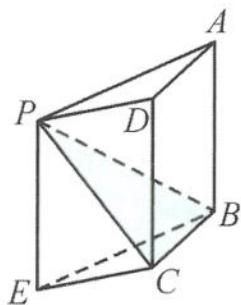

在学习立体几何的过程中,我们需要具备几何直观想象能力,几何直观想象是揭示现代数学本质的有力工具,是认识几何图形的基础.借助于几何直观、几何解释,启迪思路,这可以帮助我们理解和接受立体几何抽象的内容.但如果只有直观想象而没有严密推理的数学是非常可怕的.

正如章建跃博士所说：“如果说数学运算是数学的童子功，那么数学推理则是数学的命根子。”推理是立体几何问题解答的重要思维载体，在推理过程中渗透公理化思想，养成言必有据的理性思维精神。所以立体几何问题解答的推理过程要步步有据，条条有理，一步一骤总关“理”。从这个角度来看，立体几何是最讲“道理”的数学学科，是推理的天堂。在这里，大有“不懂推理者请勿入内”之范。

回眸“立几”时,大有蓦然回首之感. 立体几何是代数与几何的完美结合. 古人云: “风马牛不相及.”但空间、平面与向量却集一体, 而且是“举杯邀明月, 对影成三人”的和谐景象. 事实上, 很多同学在学习立体几何问题时, 有很多的无奈和苦衷, 很多时候是错把几何问题当作代数来学, 让美妙的几何问题淹没在茫茫的运算之中. 从这个角度来看, 重振立体几何的“几何雄风”迫在眉睫, 这是本书成册的一个美好的初衷, 也是探索立体几何秘密的重要通道.

本书从立体几何学科的特点出发,重点讨论立体几何的基本量问题的深度学习,从学生学习立体几何的困惑点切入,重点突破立体几何学习中的转化与借用两大技巧,以弥补空间想象能力的不足.试图从“破”与“立”入手,对知识进行脱胎换骨式的重构,打通知识内在的“任督二脉”,盘活知识,使之变成鲜活的知识,使之变得更加丰满,重现其独有的脉络感.对方法进行深度架构,使得方法呈现立体骨感,凸显其系统性,达到一种境界:信手拈来,谈笑间樯橹灰飞烟灭.对于知识方法不求面面俱到,但求点点独到,触及问题的本源,化解立体几何学习的痛点.

让我们走进立体几何,欣赏立体几何的秘密!

因时间仓促,不足之处在所难免.读者对本书有什么修改意见和建议,欢迎加入“冲刺满分·秘密系列”图书交流 QQ 群(群号码:821526438),就书中的内容进行研讨!

如果你喜欢这种写作风格,欢迎阅读我写的另外一本书《圆锥曲线的秘密》.

苏立标(特级教师)

第一章 立体几何问题中的基本量
——又见炊烟袅袅升起 …… 1
1.1 基本量——表面积与体积 …… 2
1.2 基本量——两大位置关系 …… 8
1.2.1 平行关系 …… 8
1.2.2 垂直关系 …… 12
1.3 基本量——三大空间角 …… 14
1.3.1 线线角 …… 14
1.3.2 线面角 …… 19
1.3.3 二面角 …… 27
思考题 …… 37
第二章 立体几何问题中的转化
——山不转水转 …… 41
2.1 转化为法向量 …… 42
2.2 转化为平面 …… 47
2.2.1 截面 …… 47
2.2.2 展开 …… 48
2.2.3 投影 …… 52
2.3 转化为几何体 …… 57
2.3.1 补成正方体 …… 57
2.3.2 补成长方体 …… 58
2.3.3 补成正四面体 …… 61
2.3.4 补成直三棱柱 …… 62
思考题 …… 63

## 目录

第三章 立体几何问题中的借用
——春风又绿江南岸 …… 65
3.1 借用符号…… 66
3.2 借用图形…… 66
3.2.1 正方体或长方体 …… 66
3.2.2 正四面体 …… 69
3.2.3 球 …… 69
3.2.4 圆锥 …… 70
3.3 借用运算…… 74
3.3.1 向量三项和的平方公式 …… 74
3.3.2 向量的对角线定理 …… 75
3.4 借用结论…… 81
3.4.1 三余弦定理 …… 81
3.4.2 三正弦定理 …… 83
3.4.3 最大角与最小角定理 …… 84
思考题 …… 96
第四章 立体几何问题中的向量
——小荷才露尖尖角 …… 99
4.1 空间向量的线性运算 …… 100
4.2 空间向量的数量积 …… 102
4.3 空间向量的综合问题 …… 107
思考题 …… 112
第五章 立体几何问题中的探究
——天光云影共徘徊 …… 114
5.1 以数学文化为情境的空间图形问题赏析 …… 115
5.1.1 与世界文化遗产有关 …… 115

5.1.2 与中国古代文化遗产有关 …… 116
5.1.3 与现代文化有关 …… 124
5.2 活跃在动态空间图形中的轨迹问题综述 …… 125
5.2.1 判断动点轨迹类型的方法 …… 125
5.2.2 求动点轨迹的几何量(长度、周长、面积与体积等) …… 131
5.2.3 求动点轨迹与最值 …… 134
5.3 图形的翻折、旋转问题剖析 …… 142
5.3.1 翻折、旋转问题中的基本量 …… 142
5.3.2 翻折、旋转问题中的轨迹 …… 145
5.3.3 翻折、旋转问题中的最值 …… 147
5.3.4 与其他知识的交汇问题 …… 156
思考题 …… 157
思考题解答 …… 160
后记——你若盛开清风自来 …… 172

## 微信公众号 教辅资料站

# 第一章

# 立体几何问题中的基本量 —— 又见炊烟袅袅升起

我们从一则案例说起. 古代有一次作画比赛, 画题是《深山藏古寺》, 许多考生都按题意作了画. 有的画的是崇山峻岭, 在松柏深处有座寺庙; 有的画的是山峦之间只露出寺庙一角; 有的只在山峦之间画出一幅高高飘着的幡. 可是这些画都没有被考官选中. 另有一名考生所作的画面上只有起伏的山峦, 密密的松林, 唯独没有寺庙, 也没有任何寺庙的标志, 只有一个和尚正从山脚沿着一条小道挑水上山. 最后, 这幅画被评为第一名.

你知道创作这幅画用了什么样的手法吗?推理:如果有和尚挑水上山,那么山里就有庙……

这也从某种意义上道出了推理的重要性,推理是打开立体几何大门的一把钥匙,推理是立体几何课程学习的基本技能.欧几里得公理体系把几何与逻辑结合起来,几何就与演绎推理从此结下了不解之缘,几何学成为训练逻辑推理的天然素材.研究立体几何问题,我们就从关键问题,即从立体几何的基本量开始,立体几何中的基本量是构成立体几何问题的核心内容,是立体几何中最璀璨的篇章,也是高考、学考、竞赛重点考查的内容,深刻理解概念与原理是高考等考试成功的必要条件.

## 1.1 基本量——表面积与体积

求几何体的体积要充分利用多面体的截面和旋转体的轴截面, 将空间问题转化为平面问题, 把不规则的几何体化为规则的几何体.

<table><tr><td>几何体</td><td>侧面展开图</td><td>侧面积公式</td></tr><tr><td>圆柱</td><td>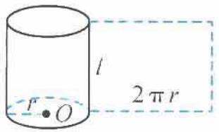</td><td> $S_{圆柱侧} = 2\pi rl$ </td></tr><tr><td>圆锥</td><td>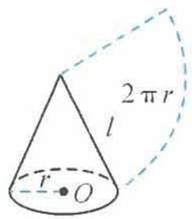</td><td> $S_{圆锥侧} = \pi rl$ </td></tr><tr><td>圆台</td><td>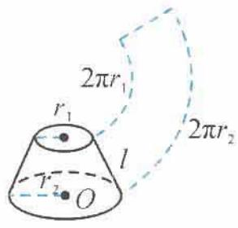</td><td> $S_{圆台侧} = \pi (r_1 + r_2)l$ </td></tr></table>

注：求棱柱、棱锥、棱台的表面积需要先求各个面的面积（不外乎三角形面积，平行四边形面积）.

<table><tr><td>几何体</td><td>表面积</td><td>体积</td></tr><tr><td>棱柱、圆柱</td><td> $S_{\text{表}} = S_{\text{侧}} + 2S_{\text{底}}$ </td><td> $V = Sh$ </td></tr><tr><td>棱锥、圆锥</td><td> $S_{\text{表}} = S_{\text{侧}} + S_{\text{底}}$ </td><td> $V = \frac{1}{3}Sh$ </td></tr><tr><td>棱台、圆台</td><td> $S_{\text{表}} = S_{\text{侧}} + S_{\text{上}} + S_{\text{下}}$ </td><td> $V = \frac{1}{3}(S_{\text{上}} + S_{\text{下}} + \sqrt{S_{\text{上}} \cdot S_{\text{下}}})h$ </td></tr><tr><td>球</td><td> $S = 4\pi R^{2}$ </td><td> $V = \frac{4}{3}\pi R^{3}$ </td></tr></table>

例 1 已知三棱柱 $ABC-A_{1}B_{1}C_{1}$ 的侧棱与底面垂直, 底面是边长为 $\sqrt{3}$ 的正三角形, 设 P 为底面 $A_{1}B_{1}C_{1}$ 的中心, 若 PA 与平面 ABC 所成角的大小为 $\frac{\pi}{3}$ , 则三棱柱 $ABC-A_{1}B_{1}C_{1}$ 的体积为 ( ). A. $\frac{3}{4}$ B. $\frac{9}{4}$ C. $\frac{1}{4}$ D. $\frac{9}{2}$

解答 如图 1.1-1, 设点 Q 为底面 ABC 的中心, 连接 PQ, 则 $PQ \perp$ 平面 ABC. 所以 $\angle PAQ$ 为 PA 与平面 ABC 所成的角, 即

$$
\angle P A Q = \frac {\pi}{3}.
$$

又 $AQ = 1$ ，所以

$$
P Q = \sqrt {3}.
$$

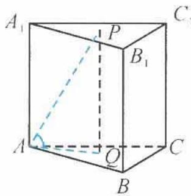

从而

图1.1-1

$$
V _ {A B C - A _ {1} B _ {1} C _ {1}} = S _ {\triangle A B C} \cdot P Q = \frac {\sqrt {3}}{4} \times (\sqrt {3}) ^ {2} \times \sqrt {3} = \frac {9}{4}.
$$

故选 B.

引申 在三棱锥 $P - ABC$ 中, 已知 $AB = BC = CA = AP = 3$ , $PB = 4$ , $PC = 5$ , 求三棱锥 $P - ABC$ 的体积.

解答 因为 AB = AC = AP = 3, 所以顶点 A 在平面 PBC 上的射影 O 为 $\triangle PBC$ 的外心. 而 $\triangle PBC$ 为直角三角形, 所以 O 为 Rt $\triangle PBC$ 的斜边 PC 的中点, 得

$$
A O = \frac {\sqrt {1 1}}{2}.
$$

从而

$$
V _ {P - A B C} = V _ {A - P B C} = \frac {1}{3} S _ {\triangle P B C} \cdot A O = \sqrt {1 1}.
$$

点评 例1就是最基本的体积计算问题,但更多的体积计算可能需要关注等底、等高,进行置换运算.另外,还要注意求几何体体积的一些重要的方法与技巧,如分割法、补形法、等体积法等的应用.

例 2 如图 1.1-2, 在三棱柱 $ABC-A_{1}B_{1}C_{1}$ 中, 侧棱 $AA_{1}=1, AA_{1}\perp$ 平面 $AB_{1}C_{1}$ , 底面 $\triangle ABC$ 是边长为 2 的正三角形, 求此三棱柱的体积.

解答 设此三棱柱的体积为 $V_{三棱柱}$ ，则

$$
V _ {\mathrm{三棱柱}} = 3 V _ {A - A _ {1} B _ {1} C _ {1}}.
$$

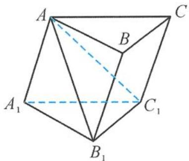
图1.1-2

因为

$$
\begin{array}{r l} V _ {A - A _ {1} B _ {1} C _ {1}} & = V _ {A _ {1} - A B _ {1} C _ {1}} = \frac {1}{3} A A _ {1} \cdot S _ {\triangle A B _ {1} C _ {1}} \\ & = \frac {1}{3} \times 1 \times \left(\frac {1}{2} \times 2 \times \sqrt {2}\right) = \frac {\sqrt {2}}{3}, \end{array}
$$

所以

$$
V _ {\mathrm{三棱柱}} = 3 V _ {A _ {1} - A B _ {1} C _ {1}} = \sqrt {2}.
$$

引申 如图 1.1-3, 在三棱柱 $A_{1}B_{1}C_{1}-ABC$ 中, 已知 $D, E, F$ 分别为 $AB$ , $AC, AA_{1}$ 的中点, 设三棱锥 $F-ADE$ 的体积为 $V_{1}$ , 三棱柱 $A_{1}B_{1}C_{1}-ABC$ 的体积为 $V_{2}$ , 则 $V_{1}: V_{2}=$ \_\_\_\_.

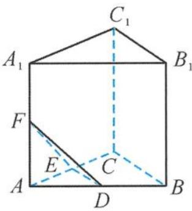
图1.1-3

解答 因为 D, E 分别是 AB, AC 的中点, 所以

$$
S _ {\triangle A D E}: S _ {\triangle A B C} = 1: 4.
$$

又 $F$ 是 $AA_{1}$ 的中点, 所以点 $A_{1}$ 到底面 $ABC$ 的距离为点 $F$ 到底面 $ABC$ 的距离的 2 倍, 即三棱柱 $A_{1}B_{1}C_{1}-ABC$ 的高是三棱锥 $F-ADE$ 高的 2 倍. 所以

$$
V _ {1}: V _ {2} = \frac {1}{2 4}.
$$

例 3 如图 1.1-4, 在多面体 ABCDE 中, 若 AE ⊥ 平面 ABC, BD // AE, 且 AC = AB = BC = BD = 2, AE = 1, 则多面体 ABCDE 的体积为 \_\_\_\_.

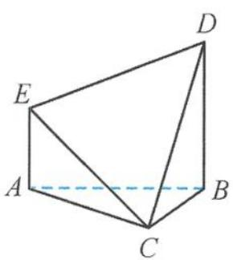
图1.1-4

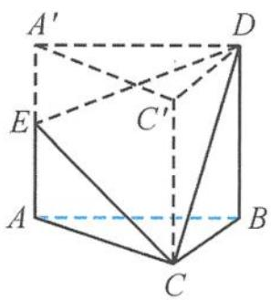
图1.1-5

解答 如图 1.1-5, 把多面体 ABCDE 补成直三棱柱 $ABC-A'C'D$ , 则

$$
V _ {\mathrm{三棱柱}} = V _ {C - A B D E} + V _ {D - C E A ^ {\prime} C ^ {\prime}},
$$

且

$V_{C-ABDE} = V_{D-CEA'C'}$ (等底等高).

易知

$$
V _ {\mathrm{多面体} A B C D E} = \frac {1}{2} V _ {\mathrm{三棱柱}} = \frac {1}{2} \times \frac {\sqrt {3}}{4} \times 2 ^ {2} \times 2 = \sqrt {3}.
$$

点评 “补”一下,则海阔天空。“割”与“补”是求空间几何体体积的重要方法,“割”与“补”把不规则的图形转化成规则图形(易于求体积的几何体),使问题得以解决.

例 4 如图 1.1-6, 在 $\triangle ABC$ 中, 已知 $\angle C = 90^{\circ}, PA \perp$ 平面 $ABC, AE \perp PB$ 于点 $E, AF \perp PC$ 于点 $F, AP = AB = 2, \angle EAF = \alpha$ . 当 $\alpha$ 变化时, 三棱锥 $P-AEF$ 体积的最大值是 ( ).

A. $\frac{\sqrt{2}}{2}$ B. $\frac{\sqrt{2}}{4}$ C. $\frac{\sqrt{2}}{6}$ D. $\frac{\sqrt{2}}{8}$

解答 在 Rt△PAB 中, 因为 PA = AB = 2, 所以

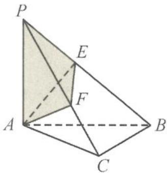
图1.1-6

$$
P B = 2 \sqrt {2}.
$$

因为 $AE \perp PB$ ，所以 $AE = \frac{1}{2} PB = \sqrt{2}$ ，所以

$$
P E = B E = \sqrt {2}.
$$

因为 $PA \perp$ 底面 $ABC$ , 得

$$
P A \perp B C, A C \perp B C, P A \cap A C = A,
$$

所以 BC ⊥ 平面 PAC, 可得

$$
A F \perp B C.
$$

因为 $AF \perp PC, BC \cap PC = C$ , 所以 $AF \perp$ 平面 $PBC$ . 又 $PB \subset$ 平面 $PBC$ , 所以 $AF \perp PB$ .

因为 $AE \perp PB$ 且 $AE \cap AF = A$ , 所以 $PB \perp$ 平面 $AEF$ , 三棱锥 $P-AEF$ 的高 $PE = \sqrt{2}$ 为定值.

因为 $AF \perp$ 平面 PBC, $EF \subset$ 平面 PBC, 所以

$$
A F \perp E F.
$$

在 Rt△AEF 中，

$$
A F = \sqrt {2} \cos \alpha , E F = \sqrt {2} \sin \alpha ,
$$

所以

$$
S _ {\triangle A E F} = \frac {1}{2} A F \cdot E F = \frac {1}{2} \times \sqrt {2} \sin \alpha \times \sqrt {2} \cos \alpha = \frac {1}{2} \sin 2 \alpha .
$$

当 $\sin 2\alpha = 1$ ，即 $\alpha = 45^{\circ}$ 时， $S_{\triangle AEF}$ 有最大值 $\frac{1}{2}$ .

此时,三棱锥 P-AEF 的体积的最大值为 $\frac{1}{3} \times \frac{1}{2} \times \sqrt{2} = \frac{\sqrt{2}}{6}$ . 故选 C.

引申 如图 1.1-7, 在 $\triangle ABC$ 中, $AB = BC = 2$ , $\angle ABC = 120^{\circ}$ . 若平面 $ABC$ 外的点 $P$ 和线段 $AC$ 上的点 $D$ , 满足 $PD = DA$ , $PB = BA$ , 则四面体 $PBCD$ 的体积的最大值是 \_\_\_\_.

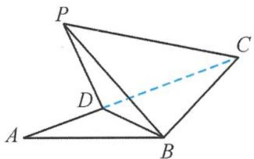
图1.1-7

解答 设 $CD = x (0 < x < 2\sqrt{3})$ ，点 $P$ 到平面 $ABC$ 的距离为 $h$ ，则

$$
A D = P D = 2 \sqrt {3} - x.
$$

所以

$$
\begin{array}{r l} V _ {P - B C D} & = \frac {1}{3} S _ {\triangle B C D} \cdot h \leqslant \frac {1}{3} S _ {\triangle B C D} \cdot P D = \frac {1}{3} \times \frac {1}{2} x (2 \sqrt {3} - x) = \frac {1}{6} x (2 \sqrt {3} - x) \\ & \leqslant \frac {1}{6} \left[ \frac {x + (2 \sqrt {3} - x)}{2} \right] ^ {2} = \frac {1}{2}. \end{array}
$$

当 $x = \sqrt{3}$ 且 $PD \perp$ 平面 ABC 时, 四面体 PBCD 的体积的最大值是 $\frac{1}{2}$ .

例 5 如图 1.1-8, 设正三棱柱 $ABC-A_{1}B_{1}C_{1}$ 的高为 4, 底面边长为 $4\sqrt{3}$ , D 是 $B_{1}C_{1}$ 的中点, P 是线段 $A_{1}D$ 上的动点, 过 BC 作截面 $\alpha \perp AP$ 于点 E, 则三棱锥 P-BCE 体积的最小值为 ( ).

A. 3
B. $2\sqrt{3}$ C. $4\sqrt{3}$ D. 12

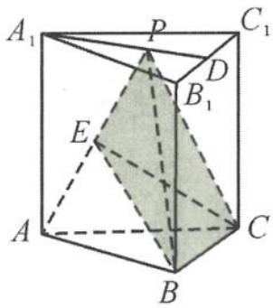
图1.1-8

解答 因为三棱锥 P-ABC 体积为定值, 即

$$
V _ {P - A B C} = \frac {1}{3} \times 4 \times \frac {\sqrt {3}}{4} \times (4 \sqrt {3}) ^ {2} = 1 6 \sqrt {3},
$$

所以问题转化为求三棱锥 E-ABC 体积的最大值. 而底面 $\triangle ABC$ 的面积是定值 $12\sqrt{3}$ , 故只需要求三棱锥 E-ABC 的高 h 的最大值.

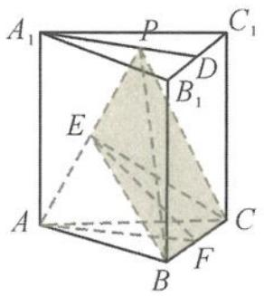
(a)

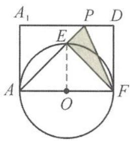
图1.1-9
(b)

如图 1.1-9(a), 取 BC 的中点 F, 得 $BC \perp$ 平面 AEF, 所以点 E 在平面 ABC 上射影落在 AF 上. 因为点 E 在以 AF 为直径的圆 O 上运动 (图 1.1-9(b)), 所以

$$
h _ {\mathrm{max}} = \frac {1}{2} A F = 3.
$$

从而

$$
(V _ {E - A B C}) _ {\max} = \frac {1}{3} \times 1 2 \sqrt {3} h _ {\max} = 1 2 \sqrt {3},
$$

故

$$
(V _ {P - B C E}) _ {\min} = V _ {P - A B C} - (V _ {E - A B C}) _ {\max} = 4 \sqrt {3}.
$$

因此选C.

点评 这是有关几何体体积的最值问题,关键在于转化,对于求高的最值要先确定动点的轨迹,再根据条件求体积的最值.

例 6 如图 1.1-10, 已知线段 AB 是圆的直径, 圆内的一条动弦 CD 与 AB 交于点 M, 且 MB = 2AM = 2, 现将半圆 ACB 沿直径 AB 翻折, 则三棱锥 C-ABD 体积的最大值是( ). A. $\frac{2}{3}$ B. $\frac{1}{3}$ C. 3 D. 1

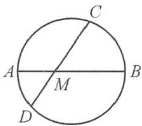
图1.1-10

解答 因为 $MB = 2AM = 2$ ，所以 $AB = 3$ ， $DM \cdot CM = AM \cdot BM = 2.$

设翻折后 $CM$ 与平面 $ABD$ 所成的角为 $\alpha$ , 则三棱锥 $C-ABD$ 的高为 $CM \sin \alpha$ , 所以

$$
\begin{array}{r l} V _ {C - A B D} & = \frac {1}{3} \left(\frac {1}{2} A B \cdot D M \cdot \sin \angle D M A\right) \cdot C M \sin \alpha \\ & = \frac {1}{6} A B \cdot D M \cdot C M \cdot \sin \angle D M A \cdot \sin \alpha \\ & = \sin \angle D M A \cdot \sin \alpha \leqslant 1, \end{array}
$$

当 $\angle DMA = \alpha = \frac{\pi}{2}$ 时, 取到最大值, 所以体积的最大值为 1. 故选 D.

例 7 如图 1.1-11, 在平面四边形 ABCD 中, 已知 AB = AD = 1, $BD = \sqrt{2}$ , $CD = \sqrt{3}$ , $BD \perp CD$ , 将其沿对角线 BD 折成四面体 $A' - BCD$ , 使平面 $A'BD \perp$ 平面 BCD, 则四面体 $A' - BCD$ 的外接球的球心到平面 $A'CD$ 的距离等于 \_\_\_\_.

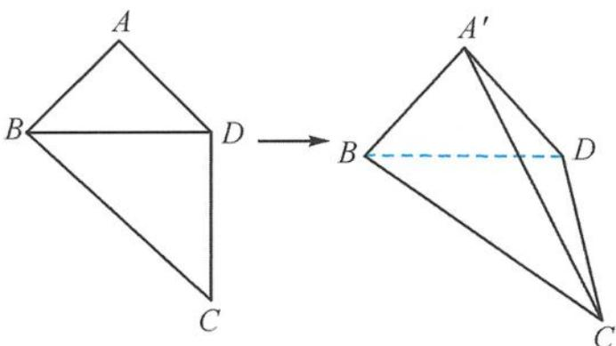
图1.1-11

解答 解题的关键在于确定球心的位置,可以利用外接球的球心的特点:到四面体 $A^{\prime}-BCD$ 的各个顶点的距离都相等.所以,先确定到底面 $Rt\triangle BCD$ 的三个顶点距离相等的点的位置,恰好在斜边 BC 的中点 O 处,且 $OB = OC = OD = \frac{\sqrt{5}}{2}$ .取 BD 的中点 M,则 $A^{\prime}M \perp BD$ .因为平面 $A^{\prime}BD \perp$ 平面 BCD,所以 $A^{\prime}M \perp$ 平面 BCD,得 $A^{\prime}M \perp MO$ .

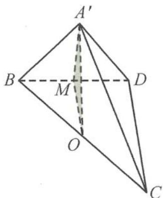
图1.1-12

如图 1.1-12, 在 Rt△A'MO 中,

$$
A ^ {\prime} O = \sqrt {A ^ {\prime} M ^ {2} + M O ^ {2}} = \frac {\sqrt {5}}{2},
$$

所以点 O 为球心. 点 O 到平面 $A^{\prime}CD$ 的距离 d 是点 B 到平面 $A^{\prime}CD$ 距离的一半, 而 $A^{\prime}B \perp$ 平面 $A^{\prime}CD$ , 所以

$$
d = \frac {1}{2} A B = \frac {1}{2}.
$$

点评 这是球的“接与切”问题,困难在于确定球心的位置,由平面到空间,先由三角形的外心确定到平面三个点的距离相等,再在空间中确定到另外一点的距离相等即可.

引申 1 在《九章算术》中, 将底面为长方形且有一条侧棱与底面垂直的四棱锥称之为阳马. 若四棱锥 P-ABCD 为阳马, 底面 ABCD 为矩形, $PA \perp$ 平面 ABCD, AB = 2, AD = 4, 二面角 P-BC-A 为 $60^{\circ}$ , 则四棱锥 P-ABCD 的外接球的表面积为 ( ).

A. $16\pi$ B. $20\pi$ C. $\frac{64}{3}\pi$ D. $32\pi$

解答 因为 $PA \perp$ 平面ABCD, 底面ABCD为矩形, 所以

$$
P A \perp B C, A B \perp B C.
$$

从而 $BC \perp$ 平面 $PAB$ , 所以

$$
B C \perp P B.
$$

故 $\angle PBA$ 即为二面角 $P - BC - A$ 的平面角，即 $\angle PBA = 60^{\circ}$ ，所以

$$
P A = A B \cdot \tan 6 0 ^ {\circ} = 2 \sqrt {3}.
$$

将该四棱锥补成一个长、宽、高分别为 $4,2,2\sqrt{3}$ 的长方体，如图1.1-13.该长方体外接球的半径为 $r$ ，则

$$
(2 r) ^ {2} = 4 ^ {2} + 2 ^ {2} + (2 \sqrt {3}) ^ {2},
$$

解得

$$
r = 2 \sqrt {2}.
$$

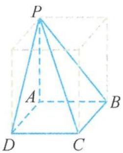

所以该球的表面积

图1.1-13

$$
S = 4 \pi r ^ {2} = 4 \pi \times (2 \sqrt {2}) ^ {2} = 3 2 \pi ,
$$

所以四棱锥 $P - ABCD$ 的外接球的表面积为 $32 \pi$ . 故选 D.

点评 求外接球的表面积和体积,关键是求出球的半径,求外接球半径的常见方法:①若三条棱两两垂直,则用 $4R^{2}=a^{2}+b^{2}+c^{2}(a,b,c$ 为三条棱的长);②若SA⊥平面ABC(SA=a),则 $4R^{2}=4r^{2}+a^{2}(r$ 为△ABC外接圆的半径);③转化为长方体的外接球;④特殊几何体可以直接找出球心和半径.

引申 2 一个棱长为 6 的正四面体纸盒内放一个正方体, 若正方体可以在纸盒内任意转动, 则正方体棱长的最大值为 \_\_\_\_.

解答 设正方体的棱长为 $a$ , 因为正方体可以在纸盒内任意转动, 所以正方体在正四面体的内切球内, 此时的球具有“双重身份”, 对正四面体来说是内切球, 对正方体来说是外接球.

而内切球的半径 $r = \frac{\sqrt{6}}{2}$ ，所以

$$
\sqrt {3} a _ {\max} = 2 r = \sqrt {6},
$$

解得

$$
a _ {\max} = \sqrt {2}.
$$

## 1.2 基本量——两大位置关系

在位置关系中,核心问题的解决涉及平行的传递与垂直的转换,善于转化是解决立体几何中的平行与垂直问题的关键所在.

## 1.2.1 平行关系

考虑“线线平行”时,可将其转化为“线面平行”或“面面平行”;考虑“线面平行”时,可将其转化为“线线平行”或“面面平行”;考虑“面面平行”时,可将其转化为“线线平行”或“线面平行”.平行关系是各种度量关系和计算公式的基础.

例 1 如图 1.2-1, 在三棱柱 $ABC - A_{1}B_{1}C_{1}$ 中, 已知 $M, N$ 分别为 $AC, B_{1}C_{1}$ 的中点, $E, F$ 分别为 $BC, B_{1}B$ 的中点, 则直线 $MN$ 与直线 $EF$ 、平面 $ABB_{1}A_{1}$ 的位置关系为 ( ).

A. 平行、平行
B. 异面、平行
C. 平行、相交
D. 异面、相交

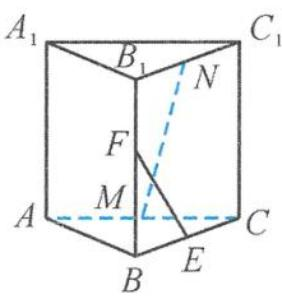
图1.2-1

解答 易判断直线 $MN$ 与直线 $EF$ 是异面直线, 连接 $ME, NE$ , 如图1.2-2.由三角形的中位线性质得 $ME \parallel AB, NE \parallel BB_{1}$ ,
得平面 $MNE \parallel$ 平面 $ABB_{1}A_{1}$ , 所以 $MN \parallel$ 平面 $ABB_{1}A_{1}$ .

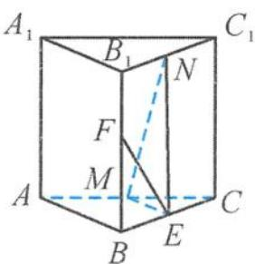
图1.2-2

故选 B.

引申 如图 1.2-3, 已知 $ABCD-A_{1}B_{1}C_{1}D_{1}$ 是正方体, E 为棱 $BB_{1}$ 上的动点 (不含端点), 平面 $A_{1}C_{1}E$ 与底面 ABCD 的交线为 l, 则 l 与 AC 的位置关系是 ( ).

A. 异面
B. 平行
C. 相交
D. 与 E 点位置有关

解答 由于 $A_{1}C_{1} \parallel$ 平面ABCD，平面 $A_{1}C_{1}E \cap$ 平面ABCD = l，根据“线面平行”的性质定理可知 $A_{1}C_{1} \parallel l.$

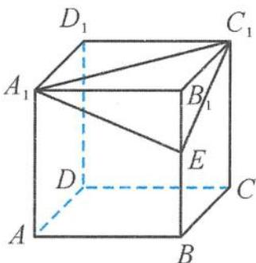
图1.2-3

由于 $A_{1}C_{1} \parallel AC$ ，所以

$$
l \parallel A C.
$$

故选 B.

点评 常见的线面平行的证明方法有:①通过“面面平行”得“线面平行”;②通过“线线平行”得“线面平行”,再证明“线线平行”中,经常用到中位线定理或平行四边形性质.另外,解决该引申问题的困难就在于确定平面 $A_{1}C_{1}E$ 与底面ABCD的交线 $l$ ,交线 $l$ 是“隐交线”,只知道有却不知道在哪里.我们可以画出交线,也可以不画出.正如贾岛的《寻隐者不遇》所描绘:“松下问童子,言师采药去;只在此山中,云深不知处.”诗的意境,简直是为“隐交线”而作的.

例 2 如图 1.2-4, 在棱长为 1 的正方体 $ABCD-A_{1}B_{1}C_{1}D_{1}$ 中, 已知 $AP = BQ = x (0 < x < 1)$ , 截面 $PQEF \parallel A_{1}D$ , 截面 $PQGH \parallel AD_{1}$ , 则截面 $PQEF$ 和截面 $PQGH$ 的面积之和为 \_\_\_\_.

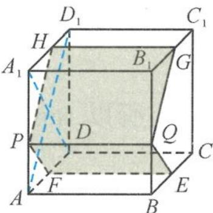
图1.2-4

解答 因为平面 $PQEF \parallel A_{1}D$ , 平面 $PQEF \cap$ 平面 $AA_{1}D_{1}D = PF$ , 所以 $PF \parallel A_{1}D$ . 同理可得

$$
P H \parallel A D _ {1}.
$$

因为 $AP \parallel BQ, AP = BQ$ , 所以 $APQB$ 是平行四边形, 所以 $PQ \parallel AB$ . 在正方体中, 因为 $AD_{1} \perp A_{1}D, AD_{1} \perp AB$ , 所以

$$
P H \perp P F, P H \perp P Q.
$$

截面 PQEF 和截面 PQGH 都是矩形, 且

$$
P Q = 1, P F = \sqrt {2} A P, P H = \sqrt {2} P A _ {1},
$$

所以截面 PQEF 和截面 PQGH 的面积之和是

$$
(\sqrt {2} A P + \sqrt {2} P A _ {1}) \cdot P Q = \sqrt {2}.
$$

故答案为 $\sqrt{2}$ .

例 3 如图 1.2-5, 在正方体 $ABCD-A_{1}B_{1}C_{1}D_{1}$ 中, 已知 E 是 AB 的中点, 点 F 在 $CC_{1}$ 上, 且 $CF = 2FC_{1}$ , 点 P 是侧面 $AA_{1}D_{1}D$ (包括边界) 上的动点, 且 $PB_{1} \parallel$ 平面 DEF, 则 $\tan\angle ABP$ 的取值范围是 \_\_\_\_.

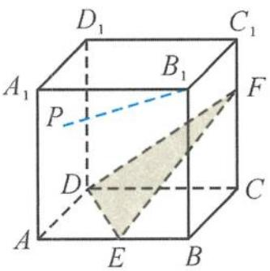
图1.2-5

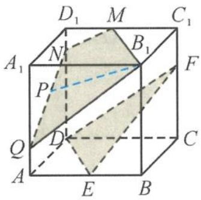
图1.2-6

解答 如图 1.2-6, 作出平面 $MNQB_{1} \parallel$ 平面 DEF, 则

$A_{1}Q=2AQ,DN=2D_{1}N,M$ 为 $D_{1}C_{1}$ 的中点.

因为 $PB_{1} \parallel$ 平面 $DEF$ , 所以点 $P$ 的轨迹是线段 $QN$ , 因此:

当点 P 运动到点 Q 处时, $\tan\angle ABP$ 取得最小值, 此时

$$
\tan \angle A B P = \frac {A Q}{A B} = \frac {1}{3};
$$

当点 P 运动到点 N 处时, $\tan\angle ABP$ 取得最大值, 此时

$$
\tan \angle A B P = \frac {A N}{A B} = \frac {\sqrt {1 3}}{3}.
$$

所以 $\tan\angle ABP$ 的取值范围是 $\left[\frac{1}{3},\frac{\sqrt{13}}{3}\right]$ .

例 4 已知 E, F 是四面体的棱 AB, CD 的中点, 过 EF 的平面与棱 AD, BC 分别相交于点 G, H, 则( ).
A. GH 平分 EF, $\frac{BH}{HC} = \frac{AG}{GD}$ B. EF 平分 GH, $\frac{BH}{HC} = \frac{GD}{AG}$ C. EF 平分 GH, $\frac{BH}{HC} = \frac{AG}{GD}$ D. GH 平分 EF, $\frac{BH}{HC} = \frac{GD}{AG}$

解答 如图 1.2-7, 设 AC, BD 的中点分别为 M, N, 则四边形 EMFN 为平行四边形, 且 AD // 平面 EMFN, BC // 平面 EMFN.

设 $GH \cap EF = O$ , 连接 $OK$ (K 为 $DH$ 的中点), 则 $OK \parallel DG$ . 由于 $K$ 为 $DH$ 的中点, 故 $O$ 为 $GH$ 的中点, 即 $EF$ 平分 $GH$ .

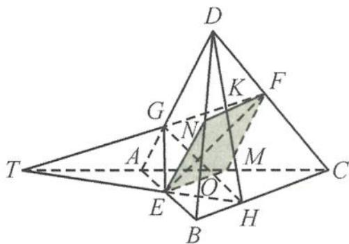

TEH 为 $\triangle ABC$ 的一条截线, 由梅涅劳斯定理可得 $\frac{BH}{HC} \cdot \frac{CT}{TA} \cdot \frac{AE}{EB}$ = 1, 故

图1.2-7

$$
\frac {B H}{H C} = \frac {T A}{C T};
$$

TGF 为 $\triangle ADC$ 的一条截线, 由梅涅劳斯定理可得 $\frac{DF}{FC} \cdot \frac{CT}{TA} \cdot \frac{AG}{GD} = 1$ , 故

$$
\frac {A G}{G D} = \frac {T A}{C T}.
$$

从而 $\frac{BH}{HC}=\frac{AG}{GD}.$

当截面 EHFG 为平行四边形时, 显然成立, 故选 C.

知识储备 梅涅劳斯定理: 若直线 l 不经过 $\triangle ABC$ 的顶点, 并且与 $\triangle ABC$ 的三条边 BC, CA, AB 或它们的延长线分别交于 P, Q, R, 如图 1.2-8, 则

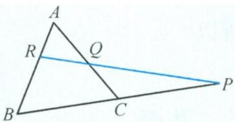
图1.2-8

$$
\frac {B P}{P C} \cdot \frac {C Q}{Q A} \cdot \frac {A R}{R B} = 1.
$$

简单应用 如图1.2-9, 在四面体ABCD中, 已知G是BC的中点, E, F满足 $\overrightarrow{AE} = \frac{1}{3} \overrightarrow{AB}, \overrightarrow{DF} = \frac{1}{3} \overrightarrow{DC}$ , 设平面EGF交AD于点H, 则 $\left|\frac{AH}{HD}\right| =$ \_\_\_\_.

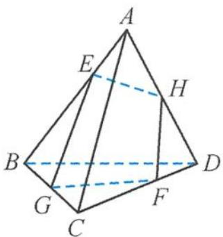
图1.2-9

解答 如图1.2-10, 延长 $BD$ , 与 $GF$ 的延长线交于点 $M$ ; 延长 $BD$ , 与 $EH$ 的延长线交于点 $N$ . 由平面的基本性质的基本事实3可得点 $M, N$ 重合.

GFM 为 $\triangle BCD$ 的一条截线,由梅涅劳斯定理可得

$$
\frac {B G}{G C} \cdot \frac {C F}{F D} \cdot \frac {D M}{M B} = 1,
$$

即为 $1 \cdot 2 \cdot \frac{DM}{MB} = 1$ ，即 $\frac{DM}{MB} = \frac{1}{2}$ ，

同理, EHM 为 $\triangle BAD$ 的一条截线, 由梅涅劳斯定理可得

$$
\frac {A E}{E B} \cdot \frac {B M}{M D} \cdot \frac {D H}{H A} = 1,
$$

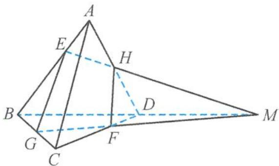
图1.2-10

即为 $\frac{1}{2} \cdot 2 \cdot \frac{DH}{HA} = 1$ ，可得 $\frac{DH}{HA} = 1$ .

故答案为 1.

## 1.2.2 垂直关系

垂直是众多空间位置关系的枢纽,是各种垂直关系与平行关系相互转化,也是空间角转化为平面角的重要支撑.

例 5 在正三棱锥 A-BCD 中, 已知点 P, Q, R 分别在棱 BC, BD, AB 上, $CP = \frac{1}{2}CB$ , $BQ = \frac{1}{4}BD$ , $AR = \frac{1}{2}AB$ . 证明: 平面 $RPQ \perp$ 平面 BCD.

证明 如图 1.2-11, 取 BD 的中点为 O, 连接 AO, OC, PQ, RQ, PR. 因为三棱锥 A-BCD 为正三棱锥, 所以

$$
A B = A D = A C, B C = C D = B D.
$$

因此 $AO \perp BD, CO \perp BD$ ，又因为 $CP = \frac{1}{2} CB, BQ = \frac{1}{4} BD, AR = \frac{1}{2} AB$ ，所以

图1.2-11

$$
R Q \parallel A O, P Q \parallel C O.
$$

从而

$$
B D \perp P Q, B D \perp Q R.
$$

又 $RQ \cap PQ = Q$ ，故 $BD \perp$ 平面 $PQR$ . 又 $BD \subset$ 平面 $BCD$ ，所以平面 $RPQ \perp$ 平面 $BCD$ .

例 6 如图 1.2-12, 在四棱锥 P-ABCD 中, 已知 PA = PB = AD = CD = $\frac{1}{2}BC = 2$ , AD // BC, AD ⊥ CD, E 是 PA 上的动点, 平面 PAB ⊥ 平面 ABCD. 证明: PB ⊥ CE.

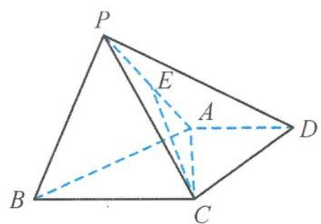
图1.2-12

解答 由已知可得,在直角梯形 ABCD 中, $AD = CD = \frac{1}{2}BC = 2$ ,
所以

$$
B C = 4, A C = \sqrt {A D ^ {2} + C D ^ {2}} = 2 \sqrt {2}, A B = \sqrt {C D ^ {2} + (B C - A D) ^ {2}} = 2 \sqrt {2},
$$

从而

$$
A B ^ {2} + A C ^ {2} = B C ^ {2}.
$$

故 $AC \perp AB$ .

又因为平面 $PAB \perp$ 平面 $ABCD$ , 平面 $PAB \cap$ 平面 $ABCD = AB$ , 所以 $AC \perp$ 平面 $PAB$ . 因为 $PB \subset$ 平面 $PAB$ , 所以

$$
A C \perp P B.
$$

又 $PA = PB = 2, AB = 2\sqrt{2}$ , 所以

$$
P A ^ {2} + P B ^ {2} = A B ^ {2},
$$

所以 $PB \perp PA$ .

因为 $PA \cap AC = A$ ，且 $PA \subset$ 平面 $PAC, AC \subset$ 平面 $PAC$ ，所以 $PB \perp$ 平面 $PAC$ . 又 $CE \subset$ 平面 $PAC$ ，所以

$$
P B \perp C E.
$$

点评 先通过数据计算得到位置关系(垂直),再通过“面面垂直”与“线面垂直”进行转化,从而使问题得到解决.有人总结到“信息藏在数据里,沿着垂面作垂线,垂线藏在垂面里.”

引申 如图 1.2-13, 在三棱柱 $ABC - A_{1}B_{1}C_{1}$ 中, 已知 $CC_{1} \perp$ 平面 $ABC, AB = 5, AC = 3$ , $BC = CC_{1} = 4, M$ 是 $CC_{1}$ 的中点.

(Ⅰ) 证明: $BC \perp AM$ .

(Ⅱ) 若 N 是 AB 上的点, 且 CN // 平面 $AB_{1}M$ , 求 BN 的长.

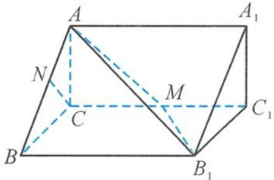

证明 （Ⅰ）因为 $CC_{1} \perp$ 平面 ABC，所以

$$
C C _ {1} \perp B C.
$$

图1.2-13

因为 $AB = 5, AC = 3, BC = 4$ ，所以 $AC^2 + BC^2 = AB^2$ ，即

$$
B C \perp A C.
$$

又 $AC \cap CC_{1} = C$ ，所以 $BC \perp$ 平面 $AA_{1}C_{1}C$ . 又 $AM \subset$ 平面 $AA_{1}C_{1}C$ ，所以

$$
B C \perp A M.
$$

(II) 如图 1.2-14, 过点 $N$ 作 $NE \parallel BB_{1}$ , 交 $AB_{1}$ 于点 $E$ , 连接 $ME$ . 因为 $BB_{1} \parallel CC_{1}$ , 所以 $NE \parallel CC_{1}$ , 即四边形 NEMC 为平面图形.

又 $CN \parallel$ 平面 $AB_{1}M, CN \subset$ 平面 NEMC，且平面 $NEMC \cap$ 平面 $AB_{1}M = ME$ ，所以

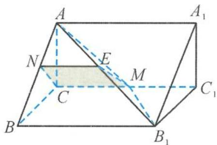
图1.2-14

$$
C N \parallel M E.
$$

所以四边形 NEMC 为平行四边形, NE = CM, 且 $NE \parallel CM$ . 又 M 为 $CC_{1}$ 的中点, 所以 $CM = \frac{1}{2}BB_{1}$ , 且 $CM \parallel BB_{1}$ , 所以 $NE = \frac{1}{2}BB_{1}$ , 且 $NE \parallel BB_{1}$ , 故

$$
B N = \frac {1}{2} A B = \frac {5}{2}.
$$

例 7 如图 1.2-15, 在四面体 ABCD 中, 已知 AB = CD = 2, AD = BD = 3, AC = BC = 4, 点 E, F, G, H 分别在棱 AD, BD, BC, AC 上. 若直线 AB, CD 都平行于平面 EFGH, 则四边形 EFGH 面积的最大值是 ( ).

A. $\frac{1}{2}$ B. $\frac{\sqrt{2}}{2}$ C. 1

D. 2

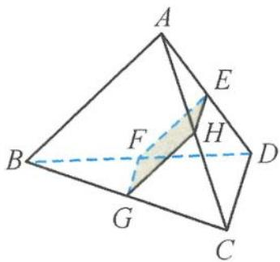
图1.2-15

解答 若 AB, CD 都平行于平面 EFGH, 则四边形 EFGH 为平行四边形. 取 AB 的中点 M, 因为 AD = BD = 3, AC = BC = 4, 所以 AB ⊥ DM, AB ⊥ CM, 故 AB ⊥ 平面 CDM.

因此 $AB \perp CD$ ，即四边形 EFGH 为矩形，所以

$$
S _ {\mathrm{四边形} E F G H} = E F \cdot F G.
$$

又 $EF + FG = 2$ ，由基本不等式得

$$
S _ {\max} = 1.
$$

故选 C.

## 1.3 基本量——三大空间角

三大空间角问题是立体几何中最活跃的内容之一,学习三大空间角要经历将“空间角”转化为“平面角”的过程.高考对三大空间角的考查同样是重点内容重点考查,绝不手软.

## 1.3.1 线线角

已知两条异面直线 a, b，经过空间中的任意一点 O 分别作直线 $a'$ ， $b'$ ，满足 $a' \parallel a$ ， $b' \parallel b$ ，我们把直线 $a'$ ， $b'$ 所成的锐角或直角叫作两条异面直线 a, b 所成的角或夹角。

例 1 如图 1.3-1, 在四棱锥 P-ABCD 中, 已知底面 ABCD 是矩形, AB = 3, AD = 2, $\triangle PAD$ 是以 $\angle A$ 为直角的等腰直角三角形. 若 $\angle PAB = 60^{\circ}$ , 则异面直线 PC 与 AD 所成角的余弦值是( ). A. $\frac{\sqrt{22}}{11}$ B. $-\frac{\sqrt{22}}{11}$ C. $\frac{2\sqrt{7}}{7}$ D. $\frac{2\sqrt{11}}{11}$

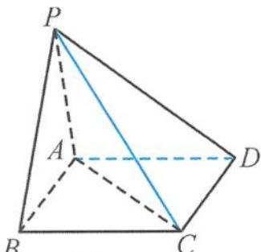

解答 因为 $AD \parallel BC$ ，所以 $\angle PCB$ 是异面直线 PC 与 AD 所成的角（或补角）。又 $PA \perp AD$ ，所以

$$
P A \perp B C.
$$

因为 $AB \perp BC, AB \cap PA = A, AB, PA \subset$ 平面 PAB，所以 $BC \perp$ 平面 PAB。又 $PB \subset$ 平面

面 $PAB$ ，所以

$$
P B \perp B C.
$$

由已知 $PA = AD = 2$ ，所以

$PB = \sqrt{PA^2 + AB^2 - 2PA\cdot AB\cos\angle PAB} = \sqrt{2^2 + 3^2 - 2\times 2\times 3\cos 60^\circ} = \sqrt{7}$ 从而

$$
\cos \angle P C B = \frac {B C}{P C} = \frac {2}{\sqrt {(\sqrt {7}) ^ {2} + 2 ^ {2}}} = \frac {2 \sqrt {1 1}}{1 1},
$$

所以异面直线 $PC$ 与 $AD$ 所成角的余弦值为 $\frac{2\sqrt{11}}{11}$ . 故选 D.

点评 平移法是求异面直线所成角的常用方法,其基本思路是通过平移直线,把异面直线的问题化归为共面直线问题来解决.具体步骤如下.

(1) 平移: 平移异面直线中的一条或两条, 作出异面直线所成的角或补角;

(2)认定:证明作出的角就是所求异面直线所成的角或补角;

(3) 计算: 求该角的值, 常利用解三角形;

(4) 取舍: 由于异面直线所成的角的取值范围是 $\left(0, \frac{\pi}{2}\right]$ , 当所作的角为钝角时, 应取它的补角作为两条异面直线所成的角.

例2 如图1.3-2,在正方体 $ABCD-A_{1}B_{1}C_{1}D_{1}$ 中,已知 $E,F$ 分别为棱 $C_{1}D_{1},A_{1}D_{1}$ 的中点,则异面直线 $DE$ 与 $AF$ 所成角的余弦值是(   )。
A. $\frac{4}{5}$ B. $\frac{3}{5}$ C. $\frac{3\sqrt{10}}{10}$ D. $\frac{\sqrt{10}}{10}$

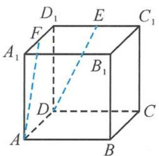
图1.3-2

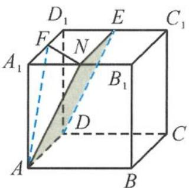
图1.3-3

解答 如图 1.3-3, 取 $A_{1}B_{1}$ 的中点 $N$ , 连接 $EN, FN, AN$ . 由于 $E, N$ 分别为 $C_{1}D_{1}, A_{1}B_{1}$ 的中点, 则

$$
E N \parallel A _ {1} D _ {1} \text {且} E N = A _ {1} D _ {1}.
$$

在正方体中， $AD \parallel A_{1}D_{1}$ 且 $AD = A_{1}D_{1}$ ，所以

$$
E N \parallel A D \text { 且 } E N = A D.
$$

所以四边形 ANED 为平行四边形, $AN \parallel DE$ , 则 $\angle FAN$ (或其补角) 为异面直线 $DE$ 与 $AF$ 所成的角. 设正方体的棱长为 2 , 则在 $\triangle ANF$ 中,

$$
N F = \frac {1}{2} D _ {1} B _ {1} = \sqrt {2}, A N = A F = \sqrt {4 + 1} = \sqrt {5},
$$

所以

$$
\cos \angle F A N = \frac {A F ^ {2} + A N ^ {2} - F N ^ {2}}{2 A F \cdot A N} = \frac {5 + 5 - 2}{2 \times \sqrt {5} \times \sqrt {5}} = \frac {4}{5}.
$$

故选A.

例 3 如图 1.3-4, 在四棱柱 $ABCD-A_{1}B_{1}C_{1}D_{1}$ 中, 已知底面 ABCD 是正方形, $AA_{1} \perp$ 平面 ABCD, 且 AB = BC = 2, $AA_{1} = 3$ , 经过顶点 A 作一个平面 $\alpha$ , 使得 $\alpha \parallel$ 平面 $CB_{1}D_{1}$ . 若 $\alpha \cap$ 平面 ABCD = $l_{1}, \alpha \cap$ 平面 $ABB_{1}A_{1} = l_{2}$ , 则异面直线 $l_{1}$ 与 $l_{2}$ 所成角的余弦值为 \_\_\_\_.

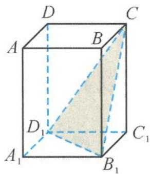

解答 设平面 $ABCD \cap$ 平面 $CB_{1}D_{1} = m$ ，因为 $\alpha \parallel$ 平面 $CB_{1}D_{1}$ ，且 $\alpha \cap$ 平面 $ABCD = l_{1}$ ，所以由“面面平行”的性质定理得

图1.3-4

$$
l _ {1} \parallel m.
$$

又因为平面 $ABCD \parallel$ 平面 $A_{1}B_{1}C_{1}D_{1}$ , 所以 $m \parallel B_{1}D_{1}$ , 由此得

$$
l _ {1} \mathbin {/ /} B _ {1} D _ {1}.
$$

另外, 设平面 $A_{1}B_{1}BA \cap$ 平面 $CB_{1}D_{1}=n$ , 因为 $\alpha \parallel$ 平面 $CB_{1}D_{1}$ , 所以由“面面平行”的性质定理得

$$
l _ {2} \parallel n.
$$

因为平面 $A_{1}B_{1}BA \parallel$ 平面 $C_{1}D_{1}DC$ ，所以 $n \parallel CD_{1}$ ，由此得

$$
l _ {2} / / C D _ {1}.
$$

由异面直线的定义得 $\angle CD_{1}B_{1}$ 为异面直线 $l_{1}$ 与 $l_{2}$ 所成的角或补角. 在 $\triangle CD_{1}B_{1}$ 中, 由余弦定理得

$$
\cos \angle C D _ {1} B _ {1} = \frac {\sqrt {2 6}}{1 3}.
$$

点评 利用“面面平行”的性质定理得到交线平行,但困难的地方就在于两平面的交线是只见交点不见交线.这是典型的“隐交线”问题,所以可以让“隐交线”显性化,把交线设出来,问题便迎刃而解.

引申 1 如图 1.3-5, 已知直四棱柱 $ABCD-A_{1}B_{1}C_{1}D_{1}$ 中的所有棱长都相等, $\angle BAD = 60^{\circ}, E$ 是棱 $AB$ 的中点, 设平面 $\alpha$ 经过直线 $A_{1}E$ . 若 $\alpha \cap$ 平面 $B_{1}BCC_{1} = l_{1}, \alpha \cap$ 平面 $C_{1}CDD_{1} = l_{2}$ , 且 $\alpha \perp$ 平面 $A_{1}ACC_{1}$ , 则异面直线 $l_{1}$ 与 $l_{2}$ 所成角的余弦值为 \_\_\_\_.

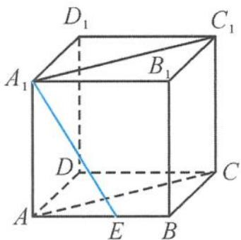
图1.3-5

解答 如图 1.3-6, 取 AD 的中点 F, 则 $EF \parallel BD$ . 而 $BD \perp$ 平面 $A_{1}ACC_{1}$ , 所以 $EF \perp$ 平面 $A_{1}ACC_{1}$ .

因此,平面 $A_{1}EF \perp$ 平面 $A_{1}ACC_{1}$ , 即平面 $A_{1}EF$ 为平面 $\alpha$ .

因为平面 $AA_{1}D_{1}D \parallel$ 平面 $BB_{1}C_{1}C$ , 平面 $\alpha \cap$ 平面 $AA_{1}D_{1}D = A_{1}F$ , 且平面 $\alpha \cap$ 平面 $BB_{1}C_{1}C = l_{1}$ , 所以由“面面平行”的性质定理得

$$
l _ {1} \mathbin {/ /} A _ {1} F.
$$

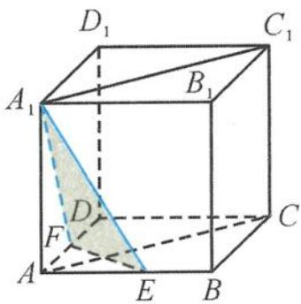

同理, 因为平面 $AA_{1}B_{1}B \parallel$ 平面 $DD_{1}C_{1}C$ , 平面 $\alpha \cap$ 平面 $CC_{1}D_{1}D = l_{2}$ ,
且平面 $\alpha\cap$ 平面 $AA_{1}B_{1}B=A_{1}E$ ，所以由“面面平行”的性质定理得

图1.3-6

$$
l _ {2} \parallel A _ {1} E.
$$

因此 $\angle EA_{1}F$ 为异面直线 $l_{1}$ 与 $l_{2}$ 所成的角或补角，在 $\triangle A_{1}EF$ 中，由余弦定理得

$$
\cos \angle E A _ {1} F = \frac {9}{1 0}.
$$

引申 2 设四面体 ABCD 的各条棱长都相等, E 为棱 AD 的中点, 过点 A 作与平面 BCE 平行的平面 $\alpha$ . 若平面 $\alpha$ 与平面 ABC、平面 ACD 的交线分别为 $l_{1}, l_{2}$ , 则 $l_{1}, l_{2}$ 所成角的余弦值为 ( ). A. $\frac{\sqrt{6}}{3}$ B. $\frac{\sqrt{3}}{3}$ C. $\frac{1}{3}$ D. $\frac{\sqrt{2}}{2}$

解答 把正四面体 ABCD 放在正方体中, 如图 1.3-7. 平面 $\alpha \parallel$ 平面 BCE, 且平面 $ABC \cap$ 平面 $\alpha = l_{1}$ , 平面 $ABC \cap$ 平面 BCE = BC, 由“面面平行”的性质定理得

$$
l _ {1} \parallel B C.
$$

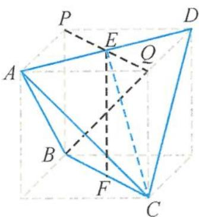

同理, 平面 $\alpha //$ 平面 $BCE$ , 且平面 $ACD \cap$ 平面 $\alpha = l_2$ , 平面 $ACD \cap$ 平面 $BCE = EC$ , 由“面面平行”的性质定理得

图1.3-7

$$
l _ {2} \parallel E C.
$$

所以 $\angle BCE$ 为 $l_{1}, l_{2}$ 所成的角或补角，在 $\triangle BCE$ 中，求得

$$
\cos \angle B C E = \frac {\sqrt {3}}{3}.
$$

故选 B.

例 4 如图 1.3-8, 在底面为正方形的四棱锥 P-ABCD 中, 侧面 PAD ⊥ 底面 ABCD, PA ⊥ AD, PA = AD, 则异面直线 PB 与 AC 所成的角为(   ). A. $30^{\circ}$ B. $45^{\circ}$ C. $60^{\circ}$ D. $90^{\circ}$

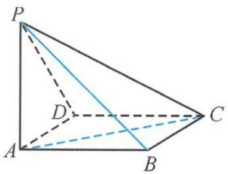
图1.3-8

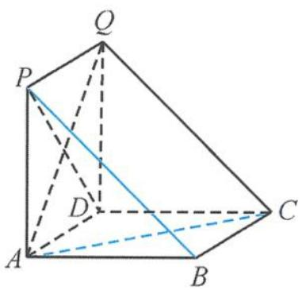
图1.3-9

解答 因为平面 $PAD \perp$ 底面 $ABCD$ , 且 $PA \perp AD$ , 所以 $PA \perp$ 底面 $ABCD$ , 从而得 $AP$ , $AB, AD$ 两两相互垂直. 将该四棱锥补成一个直三棱柱 $PAB-QDC$ , 如图 1.3-9, 则 $\angle ACQ$ 为异面直线 $PB$ 与 $AC$ 所成的角或补角, 易得 $\triangle ACQ$ 为正三角形, $\angle ACQ = 60^\circ$ .

故选 C.

例 5 如图 1.3-10, 已知四边形 ABCD 是矩形, 且有 $AB = \sqrt{2} BC$ , 沿 AC 将 $\triangle ADC$ 翻折成 $\triangle AD'C$ , 当二面角 $D'-AC-B$ 的大小为 $\frac{\pi}{3}$ 时, 异面直线 $D'C$ 与 AB 所成角的余弦值是 \_\_\_\_.

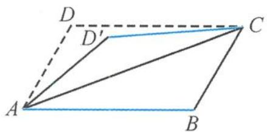
图1.3-10

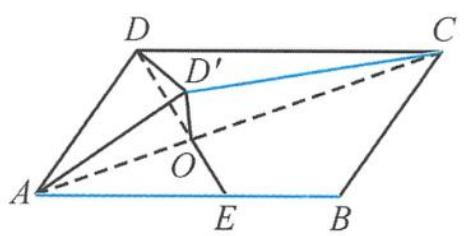

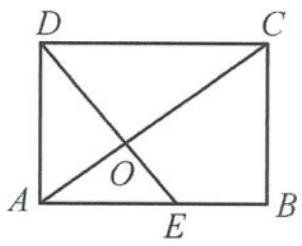
图1.3-11

解答 在矩形 ABCD 中, 设 $BC = \sqrt{2}$ , 则

$$
A B = 2.
$$

如图1.3-11, 过点 $D$ 作 $A C$ 的垂线 $D E$ , 垂足为 $O$ , 则 $\angle D^{\prime} O E$ 为二面角 $D^{\prime} - A C - B$ 的平面角, 即

$$
\angle D ^ {\prime} O E = \frac {\pi}{3}.
$$

在等腰三角形 $D^{\prime}OD$ 中, $DO = D^{\prime}O = \frac{2\sqrt{3}}{3}$ ,

$$
\angle D ^ {\prime} O D = \frac {2 \pi}{3}.
$$

由余弦定理得到

$$
D ^ {\prime} D = 2.
$$

所以 $\triangle D^{\prime}CD$ 为正三角形, 而 $\angle D^{\prime}CD$ 为异面直线 $D^{\prime}C$ 与 $AB$ 所成的角或补角, 故其余弦值为 $\frac{1}{2}$ .

## 1.3.2 线面角

线面角是指平面的斜线和它在平面上的射影所成的角,线面角是斜线与该平面内所有直线所成角中的最小角(这个性质下一章重点突破).

## (1) 定义法

例 6 如图 1.3-12, 在正方体 $ABCD-A_{1}B_{1}C_{1}D_{1}$ 中, 设 BD 与平面 $A_{1}BCD_{1}$ 所成的角为 $\alpha$ , 求 $\tan \alpha$ .

图1.3-12
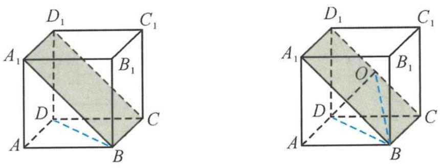
图1.3-13

解答 如图 1.3-13, 设 $D_{1}C$ 的中点为 O, 连接 OD, OB, 易证 $OD \perp$ 平面 $A_{1}BCD_{1}$ , 所以 $\angle DBO$ 为 BD 与平面 $A_{1}BCD_{1}$ 所成的角, 求得

$$
\tan \alpha = \frac {\sqrt {3}}{3}.
$$

例 7 如图 1.3-14, 已知三棱锥 P-ABC 的底面是边长为 3 的等边三角形, 侧棱 PA = 3, PB = 4, PC = 5, 设 M, N 分别为 PC, BC 的中点.

（Ⅰ）证明： $BC \perp$ 平面 $AMN$ .

(II) 求直线 $AP$ 与平面 $AMN$ 所成的角.

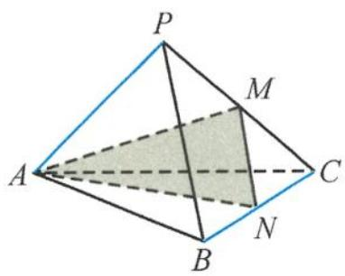
图1.3-14

解答 （Ⅰ）因为 BC = 3, PB = 4, PC = 5, 所以 $\triangle PBC$ 为直角三角形. 由勾股定理的逆定理可知 $PB \perp BC$ , 所以

$$
M N \perp B C.
$$

在等边三角形 $ABC$ 中, $N$ 为 $BC$ 的中点, 所以

$$
A N \perp B C.
$$

又 $MN \cap AN = N$ ，所以 $BC \perp$ 平面 AMN.

(II) 如图 1.3-15, 延长 NM 到点 Q, 使 NM = MQ, 连接 PQ, AQ, 于是四边形 PQNB 为平行四边形, 所以

$$
P Q \parallel B N.
$$

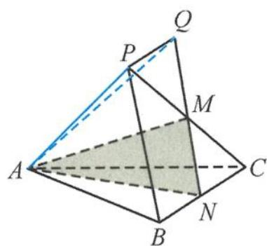

根据前一问的结论可知 $PQ \perp$ 平面 $AMN$ , 所以 $\angle PAQ$ 为直线 $AP$ 与平面 $AMN$ 所成的角.

图1.3-15

在直角三角形 $PAQ$ 中， $\sin \angle PAQ = \frac{PQ}{AP} = \frac{1}{2}$ ，所以

$$
\angle P A Q = 3 0 ^ {\circ}.
$$

例 8 如图 1.3-16, 在四棱柱 $ABCD-A_{1}B_{1}C_{1}D_{1}$ 中, 已知平面 $A_{1}B_{1}CD \perp$ 平面 $ABCD$ , 且四边形 $ABCD$ 和四边形 $A_{1}B_{1}CD$ 都是正方形, 则直线 $BD_{1}$ 与平面 $A_{1}B_{1}CD$ 所成角的正切值是 ( ).

A. $\frac{\sqrt{2}}{2}$ B. $\frac{\sqrt{3}}{2}$ C. $\sqrt{2}$ D. $\sqrt{3}$

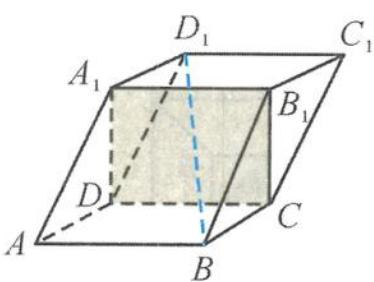
图1.3-16

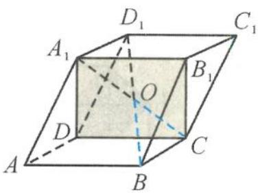
图1.3-17

解答 如图 1.3-17, 连接 $A_{1}C$ , 交 $BD_{1}$ 于点 O, 由对称性可知

$$
O C = \frac {1}{2} A _ {1} C.
$$

因为 ABCD 是正方形, 所以

$$
B C \perp C D.
$$

又因为平面 $A_{1}B_{1}CD \perp$ 平面ABCD，平面 $A_{1}B_{1}CD \cap$ 平面ABCD = CD，所以 $BC \perp$ 平面 $A_{1}B_{1}CD$ ，所以 $\angle BOC$ 即为直线 $BD_{1}$ 与平面 $A_{1}B_{1}CD$ 的夹角.不妨设 $AD = a$ ，则

$$
\tan \angle B O C = \frac {B C}{O C} = \sqrt {2}.
$$

故选C.

引申 1 如图 1.3-18, 已知菱形 ABCD 和矩形 ACEF 所在的平面相互垂直, $\angle DAB = 60^{\circ}$ , AC 和 BD 交于点 O, AB = AF, P 为线段 CE 上的任意一点, 直线 OP 与平面 FBD 所成的角为 $\alpha$ , 则 $\sin \alpha$ 的取值范围是

解答 因为 ABCD 为菱形, 所以

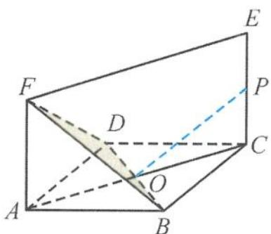
图1.3-18

$$
B D \perp A C.
$$

由于平面 ABCD 和平面 ACEF 相互垂直, 因此 BD ⊥ 平面 ACEF, 得平面 FBD ⊥ 平面 ACEF, 所以点 P 在平面 FBD 上的射影都在 OF 上, 故 $\angle FOP$ 为直线 OP 与平面 FBD 所成的角或补角.

如图 1.3-19, 当点 P 在点 Q 时, 所成的角为 $\frac{\pi}{2}$ , $\sin \alpha$ 取到最大值 1.

当点 $P$ 在点 $Q$ 的两边移动时, 线面角变小, 所以只要比较 $\angle EOF$ 与 $\angle AOF$ 的大小.

图1.3-19

又 $\angle AOF < \frac{\pi}{3}$ , 得 $\angle EOF = \pi - 2\angle AOF > \frac{\pi}{3}$ , 可求得 $\sin \angle AOF = \frac{2\sqrt{7}}{7}$ , 所以

$$
\sin \alpha \in \left[ \frac {2 \sqrt {7}}{7}, 1 \right].
$$

引申 2 如图 1.3-20, 已知正方形 $ABCD$ , $E$ 是边 $AB$ 的中点, 将 $\triangle ADE$ 沿 $DE$ 折起至 $A'DE$ , 若 $\triangle A'DC$ 为正三角形, 则 $ED$ 与平面 $A'DC$ 所成角的余弦值是 \_\_\_\_.

图1.3-20

图1.3-21

解答 如图 1.3-21, 取 CD 的中点 F, 连接 EF, $A'F$ . 因为 $\triangle A'DC$ 为正三角形, 所以 CD $\perp$ 平面 $A'EF$ , 所以

平面 $A^{\prime}CD \perp$ 平面 $A^{\prime}EF$ .

又 $A^{\prime}F^{2} + A^{\prime}E^{2} = EF^{2}$ ，得

$$
A ^ {\prime} F \perp A ^ {\prime} E.
$$

因此 $A^{\prime}E \perp$ 平面 $A^{\prime}CD$ ，所以 $\angle A^{\prime}DE$ 为 ED 与平面 $A^{\prime}DC$ 所成的角，其余弦值为 $\frac{2\sqrt{5}}{5}$ .

点评 本题考查“线面垂直”的判定定理和线面角的求法,考查线面角的定义,熟练掌握线面角的定义是解题的关键.波利亚在《怎样解题》中认为:“回到定义上来是一项重要的思维活动,并将这一重要思维活动列在解题表的显著位置加以阐述.”数学知识的根基是数学定义,定义揭示了数学概念的本质,界定了概念的范畴,在看似模糊的边缘判断是与非.定义本身蕴涵着方法,因此利用定义解题,往往使我们在解题艰难之处峰回路转.

例 9 如图 1.3-22, 已知四面体 ABCD 的所有棱长都相等, E, F 分别是棱 AC, AD 上的点, 满足 $\frac{AE}{AC} = \frac{DF}{DA} = \lambda \left( \lambda < \frac{1}{2} \right)$ . 若 EF 与平面 BCD 所成的角为 $\frac{\pi}{4}$ , 求 $\lambda$ 的值.

图1.3-22

解答 设四面体 ABCD 的所有棱长的棱长为 1, 因为 $\frac{AE}{AC} = \frac{DF}{DA} = \lambda \left( \lambda < \frac{1}{2} \right)$ , 所以

$$
A E = D F = \lambda .
$$

在 $AC$ 上取点 $G$ , 使得 $EF \parallel DG$ , 则 $\frac{AE}{AG} = \frac{AF}{AD}$ , 故

$$
A G = \frac {\lambda}{1 - \lambda}, C G = 1 - \frac {\lambda}{1 - \lambda} = \frac {1 - 2 \lambda}{1 - \lambda}.
$$

如图 1.3-23, 过点 A 作 $AO \perp$ 平面 BCD 于点 O, 连接 CO. 过点 G 作 $GH \perp CO$ 于点 H, 则 $GH \perp$ 平面 BCD, 所以 $\angle GDH$ 为 DG 与平面 BCD 所成的角, 即 $\angle GDH = \frac{\pi}{4}$ , 所以 $\triangle GDH$ 为等腰直角三角形.

因为 $AO = \frac{\sqrt{6}}{3}$ ，所以

$$
G H = \frac {\sqrt {6}}{3} \cdot \frac {1 - 2 \lambda}{1 - \lambda};
$$

在 $\triangle AGD$ 中, 由余弦定理得

图1.3-23

$$
G D ^ {2} = \frac {3 \lambda^ {2} - 3 \lambda + 1}{(1 - \lambda) ^ {2}}.
$$

在 $\triangle GDH$ 中， $GD^2 = 2GH^2$ ，即 $\frac{3\lambda^2 - 3\lambda + 1}{(1 - \lambda)^2} = 2\left(\frac{\sqrt{6}}{3} \cdot \frac{1 - 2\lambda}{1 - \lambda}\right)^2$ ，解得

$$
\lambda = \frac {7 - \sqrt {2 1}}{1 4}.
$$

例 10 如图 1.3-24, 已知四棱锥 P-ABCD, △PAD 是以 AD 为斜边的等腰直角三角形, BC // AD, CD ⊥ AD, PC = AD = 2DC = 2CB, E 为 PD 的中点. 求直线 CE 与平面 PBC 所成角的正弦值.

图1.3-24

图1.3-25

解答 如图 1.3-25, 设 PA 的中点为 F, 分别取 AD, BC 的中点 M, N, 连接 PM, 交 EF 于点 Q, 连接 NQ.

因为 E, F, N 分别是 PD, PA, BC 的中点, 所以 Q 为 EF 的中点.

在平行四边形 NCEQ 中, $NQ \parallel CE$ . 由 $\triangle PAD$ 为等腰直角三角形得

$$
P M \perp A D.
$$

由 $DC \perp AD, M$ 是 $AD$ 的中点得 $BM \perp AD$ , 所以 $AD \perp$ 平面 $PBM$ . 由 $BC \parallel AD$ 得 $BC \perp$ 平面 $PBM$ , 则

$$
\text {   平面   } P B C \perp \text {   平面   } P B M.
$$

过点 $Q$ 作 $PB$ 的垂线, 垂足为 $H$ , 连接 $NH$ . $NH$ 是 $NQ$ 在平面 $PBC$ 上的射影, 所以 $\angle QNH$ 是直线 $CE$ 与平面 $PBC$ 所成的角.

设 $CD = 1$ ，在 $\triangle PCD$ 中，由 $PC = 2, CD = 1, PD = \sqrt{2}$ 得

$$
C E = \sqrt {2}.
$$

在 $\triangle PBM$ 中，由 $PM = BM = 1, PB = \sqrt{3}$ 得

$$
Q H = \frac {1}{4}.
$$

在 Rt△NQH 中，

$$
\sin \angle Q N H = \frac {\sqrt {2}}{8},
$$

所以直线 CE 与平面 PBC 所成角的正弦值是 $\frac{\sqrt{2}}{8}$ .

## (2) 等体积法

例 11 如图 1.3-26, 在长方体 $ABCD-A_{1}B_{1}C_{1}D_{1}$ 中, 已知 $AA_{1}=\frac{1}{2}$ , AB=1, $AD=\sqrt{3}$ , 则直线 $AA_{1}$ 与平面 $A_{1}BD$ 所成的角为 \_\_\_\_.

解答 设点 A 到平面 $A_{1}BD$ 的距离为 h，在长方体 $ABCD-A_{1}B_{1}C_{1}D_{1}$ 中， $AA_{1}=\frac{1}{2},AB=1,AD=\sqrt{3}$ ，则

图1.3-26

$$
A _ {1} D = \frac {\sqrt {1 3}}{2}, B D = 2, A _ {1} B = \frac {\sqrt {5}}{2}.
$$

在 $\triangle A_{1}BD$ 中，由余弦定理得

$$
\cos \angle B A _ {1} D = \frac {1}{\sqrt {6 5}},
$$

所以

$$
\sin \angle B A _ {1} D = \frac {8}{\sqrt {6 5}},
$$

从而

$$
S _ {\triangle A _ {1} B D} = \frac {1}{2} \cdot \frac {\sqrt {5}}{2} \cdot \frac {\sqrt {1 3}}{2} \cdot \sin \angle B A _ {1} D = 1.
$$

因为 $V_{A_{1}-ABD} = V_{A-A_{1}BD}$ ，即

$$
\frac {1}{3} \cdot S _ {\triangle A B D} \cdot A A _ {1} = \frac {1}{3} \cdot S _ {\triangle A _ {1} B D} \cdot h,
$$

解得 $h = \frac{\sqrt{3}}{4}$ . 设直线 $AA_{1}$ 与平面 $A_{1}BD$ 所成的角为 $\theta$ , 则

$$
\sin \theta = \frac {h}{A A _ {1}} = \frac {\sqrt {3}}{2},
$$

所以 $\theta = 60^{\circ}$ . 故答案为 $60^{\circ}$ .

## 立……体……几……何……的……秘……密

引申 如图 1.3-27, 在边长为 4 的菱形 $ABCD$ 中, 已知 $AC \cap BD = O$ , $\angle ABC = 60^{\circ}$ . 将菱形 $ABCD$ 沿对角线 $AC$ 折起, 得到三棱锥 $D-ABC$ , 二面角 $D-AC-B$ 的大小为 $60^{\circ}$ , 则直线 $BC$ 与平面 $DAB$ 所成角的正弦值为 ( ).

图1.3-27

A. $\frac{3}{13}\sqrt{13}$ B. $\frac{\sqrt{2}}{3}$ C. $\frac{2}{13}\sqrt{13}$ D. $\frac{12}{13}\sqrt{13}$

解答 由题意 $\angle DOB$ 为二面角 $D - AC - B$ 的平面角, 所以 $\angle DOB = 60^{\circ}$ , 且 $AC \perp$ 平面 $DOB$ , $\triangle DOB$ 为等边三角形. 取 $OB$ 的中点 $H$ , 则有 $DH \perp$ 平面 $ABC$ , 且 $DH = 3$ .

因为 $V_{D-ABC} = V_{C-ABD}$ ，即 $\frac{1}{3} \cdot S_{\triangle ABC} \cdot DH = \frac{1}{3} \cdot S_{\triangle ABD} \cdot d$ （其中 d 为点 C 到平面 ABD 的距离），所以 $d = \frac{12}{13}\sqrt{13}$ ，即直线 BC 与平面 DAB 所成角的正弦值为 $\frac{3}{13}\sqrt{13}$ .

例 12 如图 1.3-28, 在四棱锥 P-ABCD 中, $\triangle PAB$ 是等边三角形, CB ⊥ 平面 PAB, AD // BC 且 PB = BC = 2AD = 2, F 为 PC 的中点.

(I) 证明: $DF \parallel$ 平面 $PAB$ .

(II) 求直线 $AB$ 与平面 $PDC$ 所成角的正弦值.

解答 (I) 如图 1.3-29, 设 $BP$ 的中点为 $E$ , 连接 $AE, EF$ . 因为 $AD \parallel BC$ 且 $2AD = BC, EF \parallel BC$ 且 $2EF = BC$ , 所以

图1.3-28

$$
A D \parallel E F \text { 且 } A D = E F.
$$

故四边形 ADFE 是平行四边形, 因此

$$
D F \parallel A E.
$$

又 $AE \subset$ 平面 $PAB, DF \not\subset$ 平面 $PAB$ , 故 $DF \parallel$ 平面 $PAB$ .

(II) 解法一 取 $BC$ 的中点 $G$ , 则 $DG \parallel AB, DG$ 与平面 $PDC$ 所成的角就是直线 $AB$ 与平面 $PDC$ 所成的角. 利用 $V_{P-CDG} = V_{G-PCD}$ , 即

图1.3-29

$$
\frac {1}{3} \times \sqrt {3} \times \frac {1 \times 2}{2} = \frac {1}{3} \times \left(\frac {1}{2} \times 2 \sqrt {2} \times \sqrt {3}\right) \times d _ {G \rightarrow P C D},
$$

解得

$$
d _ {G \rightarrow P C D} = \frac {\sqrt {2}}{2}.
$$

所以 DG 与平面 PDC 所成角的正弦值为 $\frac{\sqrt{2}}{4}$ ，即直线 AB 与平面 PDC 所成角的正弦值为 $\frac{\sqrt{2}}{4}$ .

解法二 （建系）如图 1.3-30 所示建立坐标系，则点 $E(0,0,0), A(\sqrt{3},0,0), B(0,1,0)$ ， $C(0,1,2), P(0,-1,0), D(\sqrt{3},0,1)$ ，于是

$$
\begin{array}{l} \overrightarrow {P C} = (0, 2, 2), \\ \overrightarrow {P D} = (\sqrt {3}, 1, 1), \\ \overrightarrow {A B} = (- \sqrt {3}, 1, 0). \end{array}
$$

设平面 PCD 的法向量 $\boldsymbol{n} = (x, y, z)$ ，则

$$
y + z = 0, \sqrt {3} x + y + z = 0,
$$

图1.3-30

可取

$$
\boldsymbol {n} = (0, 1, - 1).
$$

直线 $AB$ 与平面 $PDC$ 所成角的正弦值为

$$
\frac {| \overrightarrow {A B} \cdot \boldsymbol {n} |}{| \overrightarrow {A B} | | \boldsymbol {n} |} = \frac {1}{2 \sqrt {2}} = \frac {\sqrt {2}}{4}.
$$

解法三 (补形) 如图 1.3-31, 补全三棱柱 $PAB-HTC$ , 易证得平面 $PCD \perp$ 平面 $PBCH$ , 所以点 $G$ 到平面 $PCD$ 的距离就是点 $Q$ 到平面 $PCD$ 的距离, 其中 $Q$ 是 $HP$ 的中点, 易得

$$
Q K = \frac {\sqrt {2}}{2}.
$$

图1.3-31

直线 AB 与平面 PDC 所成角的正弦值为 $\frac{\frac{\sqrt{2}}{2}}{DG} = \frac{\sqrt{2}}{4}$ .

例 13 已知三棱锥 A-BCD, $\triangle ABD$ 和 $\triangle BCD$ 都是边长为 2 的等边三角形, 平面 ABD ⊥ 平面 BCD.

(Ⅰ) 证明: $AC \perp BD$ .

(II) 如图 1.3-32, 设 $G$ 为 $BD$ 的中点, $H$ 为 $\triangle ACD$ 内的动点 (包含边界), 且 $GH \parallel$ 平面 $ABC$ , 求直线 $GH$ 与平面 $ACD$ 所成角的正弦值的取值范围.

图1.3-32

解答 解法一 （Ⅰ）连接 AG, CG. 因为 $\triangle ABD$ 和 $\triangle BCD$ 都是等边三角形，所以 $\left\{\begin{aligned}AG\perp BD,\\ CG\perp BD,\\ AG\cap GC=G,\end{aligned}\right.$ 于是 $BD\perp$ 平面 ACG, AC ⊂ 平面 ACG, 故 AC ⊥ BD.

(II) 以 $G$ 为原点、 $GC$ 所在直线为 $x$ 轴、 $GD$ 所在直线为 $y$ 轴、 $GA$ 所在直线为 $z$ 轴建立空间直角坐标系, 如图 1.3-33.

取 $AD$ 的中点 $E, CD$ 的中点 $F$ , 连接 $GE, GF, EF$ , 则平面 $GEF \parallel$ 平面 $ABC$ , 所以 $H$ 在线段 $EF$ 上运动. 易知

$$
G (0, 0, 0), B (0, - 1, 0), C (\sqrt {3}, 0, 0), D (0, 1, 0), A (0, 0, \sqrt {3}),
$$

图1.3-33

$$
E \left(0, \frac {1}{2}, \frac {\sqrt {3}}{2}\right), F \left(\frac {\sqrt {3}}{2}, \frac {1}{2}, 0\right).
$$

设 $\overrightarrow{EH} = \lambda \overrightarrow{EF} (0\leqslant \lambda \leqslant 1)$ ，则

$$
\overrightarrow {G H} = \left(\frac {\sqrt {3}}{2} \lambda , \frac {1}{2}, \frac {\sqrt {3}}{2} - \frac {\sqrt {3}}{2} \lambda\right).
$$

设平面 ACD 的一个法向量 $\boldsymbol{n} = (x, y, z)$ ，则

$$
\left\{ \begin{array}{l} \overrightarrow {A C} \cdot \boldsymbol {n} = 0, \\ \overrightarrow {C D} \cdot \boldsymbol {n} = 0, \end{array} \right.
$$

即 $\left\{\begin{aligned}\sqrt{3}x-\sqrt{3}z&=0,\\ -\sqrt{3}x+y&=0,\end{aligned}\right.$ 所以法向量

$$
\pmb {n} = (1, \sqrt {3}, 1).
$$

设直线 $GH$ 与平面 $ACD$ 所成角的为 $\theta$ , 则

$$
\sin \theta = \frac {| \overrightarrow {G H} \cdot \boldsymbol {n} |}{| \overrightarrow {G H} | | \boldsymbol {n} |} = \frac {\sqrt {3}}{\sqrt {5} \cdot \sqrt {\frac {3}{2} \lambda^ {2} - \frac {3}{2} \lambda + 1}} \in \left[ \frac {\sqrt {1 5}}{5}, \frac {2 \sqrt {6}}{5} \right].
$$

所以直线 $GH$ 与平面 $ACD$ 所成角的正弦值的取值范围为 $\left[\frac{\sqrt{15}}{5}, \frac{2\sqrt{6}}{5}\right]$ .

解法二 （Ⅰ）因为

$$
\overrightarrow {A C} \cdot \overrightarrow {B D} = \frac {| \overrightarrow {A D} | ^ {2} + | \overrightarrow {B C} | ^ {2} - | \overrightarrow {A B} | ^ {2} - | \overrightarrow {C D} | ^ {2}}{2} = \frac {4 + 4 - 4 - 4}{2} = 0,
$$

所以 $AC \perp BD$ .

(II) 设直线 $GH$ 与平面 $ACD$ 所成的角为 $\theta$ , 由解法 1 知点 $H$ 在线段 $EF$ 上运动, 易得 $GH \in \left[\frac{\sqrt{10}}{4}, 1\right]$ . 设点 $G$ 到平面 $ACD$ 的距离为 $h$ , 由等体积法知 $V_{G-ACD} = V_{A-GCD}$ , 得到

$$
\frac {1}{3} h \left(\frac {1}{2} \sqrt {6} \cdot \frac {\sqrt {1 0}}{2}\right) = \frac {1}{3} \cdot \sqrt {3} \cdot \frac {\sqrt {3}}{2},
$$

所以 $h = \frac{3}{\sqrt{15}}$ ，因此

$$
\sin \theta = \frac {h}{| G H |} \in \left[ \frac {\sqrt {1 5}}{5}, \frac {2 \sqrt {6}}{5} \right].
$$

点评 解法一是通法,解法二换了一种思维,从向量与等体积法的角度对问题进行思考.

## 1.3.3 二面角

## (1) 定义法

利用二面角的平面角的定义,在二面角的棱上取一点(特殊点),过该点在两个半平面内作垂直于棱的射线,两射线所成的角就是二面角的平面角.这是一种求二面角的平面角的最基本方法,要注意用二面角的平面角定义的三个主要特征来找出平面角.

例 14 如图 1.3-34, 已知三棱台 $ABC-A_{1}B_{1}C_{1}$ 的下底面是正三角形, AB ⊥ BB₁, B₁C₁ ⊥ BB₁, 则二面角 A-BB₁-C 的大小是(). A. 30° B. 45° C. 60° D. 90°

图1.3-34

解答 根据棱台的几何性质可知

$$
A _ {1} B _ {1} \parallel A B, B _ {1} C _ {1} \parallel B C.
$$

因为 $B_{1}C_{1}\perp BB_{1}$ ，又因为 $BB_{1}\perp AB$ ，所以

$$
B B _ {1} \perp B C.
$$

故 $\angle ABC$ 即为二面角 $A - BB_{1} - C$ 的平面角. 因为 $\triangle ABC$ 为等边三角形, 所以

$$
\angle A B C = 6 0 ^ {\circ}.
$$

故选 C.

例 15 如图 1.3-35, 在矩形 ABCD 中, 已知 AB = 2, AD = 4, 点 E 在线段 AD 上且 AE = 3, 现分别沿 BE, CE 将 $\triangle ABE$ , $\triangle DCE$ 翻折, 使得点 D 落在线段 AE 上, 则此时二面角 D-EC-B 的余弦值为().

图1.3-35

A. $\frac{4}{5}$ B. $\frac{5}{6}$ C. $\frac{6}{7}$ D. $\frac{7}{8}$

解答 在矩形 ABCD 中, 连接 BD, 交 EC 于 O 点, 易证 $BD \perp EC$ .

在翻折后,由二面角的定义可知 $\angle BOD$ 为二面角 $D - EC - B$ 的平面角. 在 $\triangle BOD$ 中,

$$
O D = \frac {2}{\sqrt {5}}, O B = \frac {8}{\sqrt {5}}, B D = 2 \sqrt {2}.
$$

由余弦定理得到二面角 D-EC-B 的余弦值为 $\frac{7}{8}$ ，故选 D.

引申 如图1.3-36, 已知 $\triangle ABC, D$ 是 $AB$ 的中点, 沿直线 $CD$ 将 $\triangle ACD$ 翻折成 $\triangle A'CD$ , 所成二面角 $A'-CD-B$ 的平面角为 $\alpha$ , 则 ( ).

A. $\angle A'DB \leqslant \alpha$ B. $\angle A'DB \geqslant \alpha$ C. $\angle A'CB \leqslant \alpha$ D. $\angle A'CB \geqslant \alpha$

图1.3-36

解答 如图 1.3-37, 作 $AE \perp DC$ 于点 $E$ , 连接 $A'E$ , 由二面角的定义知 $\angle A'EA$ 为二面角 $A'-CD-B$ 的平面角的补角, 即

$$
\angle A ^ {\prime} E A = 1 8 0 ^ {\circ} - \alpha .
$$

连接 $AA'$ ，则 $\triangle DAA'$ 与 $\triangle EAA'$ 皆为等腰三角形，因为 $AD \geqslant AE$ ，所以 $\angle ADA' \leqslant \angle AEA'$ ，即

$$
1 8 0 ^ {\circ} - \angle A ^ {\prime} D B \leqslant 1 8 0 ^ {\circ} - \alpha ,
$$

图1.3-37

所以

$$
\angle A ^ {\prime} D B \geqslant \alpha .
$$

故选B.

## (2) 垂面法

过二面角内一点作两个面的垂线, 过两垂线作平面与两个半平面的交线所成的角即为平面角. 由此可知, 二面角的平面角所在的平面与棱垂直.

例 16 在正方体 $ABCD-A_{1}B_{1}C_{1}D_{1}$ 中, E 是 BC 的中点, 在平面 $A_{1}B_{1}C_{1}D_{1}$ 内, 直线 $l \parallel B_{1}D_{1}$ . 设二面角 A-l-E 的平面角为 $\alpha$ , 当 $\alpha$ 最大时, $\cos \alpha =$ \_\_\_\_.

解答 如图 1.3-38(a), 连接 $A_{1}C_{1}$ , 交 $l$ (即 $GH$ ) 于点 $N$ , 取 $CD$ 的中点 $F$ . 连接 $EF$ , 交 $AC$ 于点 $M$ , 则 $l \parallel EF$ , 所以 $l$ 与 $EF$ 共面. 易证 $B_{1}D_{1} \perp$ 平面 $A_{1}C_{1}CA$ , 得 $l \perp$ 平面 $A_{1}C_{1}CA$ , 所以 $l \perp NA, l \perp NM$ .

因此 $\angle MNA$ 为二面角 A-l-E 的平面角.

问题转化为:在线段 $A_{1}C_{1}$ 上找一点 N 使 $\angle MNA$ 的值最大.

(a)

(b)
图1.3-38

设正方体的棱长为 4, 则 $AM = 3\sqrt{2}$ , 过点 $N$ 作 $NP \perp AC$ 于点 $P$ , 如图 1.3-38(b). 设 $AP = x$ , 则 $PM = 3\sqrt{2} - x$ , 所以

$$
\begin{array}{r l} \tan \angle M N A & = \tan (\angle A N P + \angle P N M) \\ & = \frac {\frac {x}{4} + \frac {3 \sqrt {2} - x}{4}}{1 - \frac {x}{4} \cdot \frac {3 \sqrt {2} - x}{4}} = \frac {1 2 \sqrt {2}}{1 6 - x (3 \sqrt {2} - x)} \leqslant \frac {1 2 \sqrt {2}}{1 6 - \left[ \frac {x + (3 \sqrt {2} - x)}{2} \right] ^ {2}} = \frac {2 4 \sqrt {2}}{2 3}, \end{array}
$$

所以

$$
\cos \alpha = \frac {2 3}{4 1}.
$$

引申 如图1.3-39, 在三棱锥 $P - ABC$ 中, 顶点 $P$ 在底面的射影为 $\triangle ABC$ 的垂心 $O$ , 且 $PO$ 的中点为 $M$ , 过 $AM$ 作平行于 $BC$ 的截面 $\alpha$ . 记 $\angle PAM = \theta_{1}, \alpha$ 与底面 $ABC$ 所成的锐二面角为 $\theta_{2}$ , 当 $\theta_{1}$ 取到最大时, $\tan \theta_{2} =$ \_\_\_\_.

图1.3-39

图1.3-40

解答 因为 $BC \parallel \alpha$ , 所以 $BC$ 平行于底面 $ABC$ 与平面 $\alpha$ 的交线 $l$ . 因为顶点 $P$ 在底面的射影为 $\triangle ABC$ 的垂心 $O$ , 所以 $BC \perp$ 平面 $PAO$ (如图1.3-40), 得到

$$
l \perp \text { 平面 } P A O,
$$

得 $l \perp AM, l \perp AO$ , 即 $\angle MAO$ 为平面 $\alpha$ 与底面 $ABC$ 所成的锐二面角的平面角, 所以

$$
\angle M A O = \theta_ {2}.
$$

在 Rt△PAO 中，

$$
\tan (\theta_ {1} + \theta_ {2}) = 2 \tan \theta_ {2},
$$

展开得到

$$
\tan \theta_ {1} = \frac {\tan \theta_ {2}}{1 + 2 \tan^ {2} \theta_ {2}} = \frac {1}{\frac {1}{\tan \theta_ {2}} + 2 \tan \theta_ {2}} \leqslant \frac {1}{2 \sqrt {\frac {1}{\tan \theta_ {2}} \cdot 2 \tan \theta_ {2}}} = \frac {\sqrt {2}}{4},
$$

此时 $\tan\theta_{2}=\frac{\sqrt{2}}{2}.$

## (3) 三垂线法

利用三垂线定理或其逆定理作出二面角 $\alpha - l - \beta$ 的平面角的方法叫三垂线法. 一般的步骤为: 过二面角的一个平面 $\alpha$ 内一点 $P$ 作另一个平面 $\beta$ 的垂线, 垂足为 $O$ , 过垂足 $O$ 作二面角的棱 $l$ 的垂线, 垂足为 $H$ , 连接 $PH$ , 由三垂线定理得 $PH \perp l$ , 所以 $\angle PHO$ 为二面角的平面角.

例 17 在正方体 $ABCD-A_{1}B_{1}C_{1}D_{1}$ 中，在 $\triangle A_{1}B_{1}D_{1}$ 内部（不包含边界）存在点 P，满足点 P 到平面 $ACC_{1}A_{1}$ 的距离等于点 P 到棱 $BB_{1}$ 的距离，分别记二面角 P-AD-B 为 $\alpha$ ，P-AC-B 为 $\beta$ ，P-BC-A 为 $\gamma$ ，则下列说法正确的是（）.

A. $\alpha > \beta > \gamma$ B. $\alpha < \gamma < \beta$ C. $\alpha < \beta < \gamma$ D. 以上说法均不对

解答 如图 1.3-41, 作 $PQ \perp$ 平面 $ABCD$ 于点 $Q$ , 作 $QE \perp AD$ 于点 $E$ , 作 $QF \perp BC$ 于点 $F$ , 作 $QG \perp AC$ 于点 $G$ , 连接 $PE, PF, PG$ . 由三垂线定理可知 $PE \perp AD, PF \perp BC, PG \perp AC$ , 则

$$
\alpha = \angle P E Q, \beta = \angle P G Q, \gamma = \angle P F Q.
$$

因此

$$
\tan \alpha = \frac {P Q}{Q E}, \tan \beta = \frac {P Q}{Q G}, \tan \gamma = \frac {P Q}{Q F}.
$$

图1.3-41

作 $PE_{1} \perp A_{1}D_{1}$ 于点 $E_{1}$ , 作 $PF_{1} \perp B_{1}C_{1}$ 于点 $F_{1}$ , 作 $PG_{1} \perp A_{1}C_{1}$ 于点 $G_{1}, PG_{1}$ 即为点 $P$ 到平面 $ACC_{1}A_{1}$ 的距离, $PB_{1}$ 即为点 $P$ 到棱 $BB_{1}$ 的距离, 因此

$$
P B _ {1} = P G _ {1}.
$$

因为 $QF = PF_{1} < PB_{1} = PG_{1} = QG$ ，所以

$$
\tan \beta <   \tan \gamma .
$$

因为 $QG = PG_{1} < PE_{1} = QE$ ，所以

$$
\tan \alpha <   \tan \beta .
$$

综上有

$$
\tan \alpha <   \tan \beta <   \tan \gamma ,
$$

即 $\alpha < \beta < \gamma$ , 故选 C. (或者: 利用抛物线的定义, 得到点 $P$ 在以 $B_{1}$ 为焦点, $A_{1}C_{1}$ 为准线的抛物线上, 从而得到 $PE_{1} > PG_{1} > PF_{1} \Rightarrow QE > QG > QF$ .)

例 18 如图 1.3-42, 在侧棱垂直底面的三棱柱 $ABC-A_{1}B_{1}C_{1}$ 中, $\angle BAC = 90^{\circ}$ , $AB = AC = \frac{\sqrt{2}}{2}AA_{1}$ , D, E 分别是棱 AB, $B_{1}C_{1}$ 的中点, F 是棱 $CC_{1}$ 上的动点. 记二面角 D-EF-B 的平面角为 $\alpha$ , 在点 F 从点 $C_{1}$ 运动到点 C 的过程中, $\alpha$ 的变化情况为().

图1.3-42

A. 增大
B. 减小
C. 先增大, 再减小
D. 先减小, 再增大

解答 过点 D 在平面 $\triangle ABC$ 内作 BC 的垂线, 垂足为 O. 因为平面 $ABC \perp$ 平面 $BB_{1}C_{1}C$ , 所以
DO ⊥ 平面 $BB_{1}C_{1}C$ , 且 OB = $\frac{1}{4}BC$ .

过点 O 在平面 $BB_{1}C_{1}C$ 内作 $OH \perp EF$ ，垂足为 H，则由三垂线定理可知 $DH \perp EF$ .

所以 $\angle OHD$ 为二面角 D-EF-B 的平面角, 即

$$
\tan \alpha = \frac {O D}{O H}.
$$

而 $OD$ 为定值, $OH$ 在点 $F$ 从点 $C_{1}$ 运动到点 $C$ 的过程中, 先增大, 再减小, 故 $\alpha$ 的变化情况为先减小, 再增大. 所以选 D.

引申 （多选）如图1.3-43, 已知直三棱柱 $ABC-A_{1}B_{1}C_{1}$ 的底面是边长为6的等边三角形，侧棱长为2, E是棱BC上的动点，F是棱 $B_{1}C_{1}$ 上靠近 $C_{1}$ 点的三分点，M是棱 $CC_{1}$ 上的动点，则二面角A-FM-E的正切值不可能是（ ）.

A. $\frac{3\sqrt{15}}{5}$ B. $\frac{2\sqrt{15}}{5}$ C. $\sqrt{6}$ D. $\sqrt{5}$

图1.3-43

图1.3-44

解答 如图1.3-44, 取 $BC$ 的中点 $O$ , 连接 $OA$ , 由等边三角形的性质可知 $OA \perp BC$ . 由直三棱柱的性质知 $OA \perp$ 平面 $MFE$ , 过点 $O$ 作棱 $MF$ 的垂线, 垂足为 $H$ . 由三垂线定理得 $AH \perp MF$ ,

所以 $\angle AHO$ 为二面角的平面角,且

$$
\tan \angle A H O = \frac {O A}{O H} = \frac {3 \sqrt {3}}{O H}.
$$

易得 $2 \leqslant OH \leqslant \sqrt{5}$ , 所以二面角 $A - FM - E$ 的正切值的取值范围是 $\left[\frac{3\sqrt{15}}{5}, \frac{3\sqrt{3}}{2}\right]$ . 因此选项中不可能的数值是 $\frac{2\sqrt{15}}{5}$ 与 $\sqrt{5}$ , 故选 BD.

## 立……体……几……何……的……秘密……密

例 19 如图 1.3-45, 在正三棱柱 $ABC - A_{1}B_{1}C_{1}$ 中, 各棱长均等于 $2, M$ 为线段 $BB_{1}$ 上动点, 则平面 $ABC$ 与平面 $AMC_{1}$ 所成的锐二面角余弦值的最大值为 \_\_\_\_.

图1.3-45

图1.3-46

解答 如图 1.3-46, 延长 $C_{1} M$ , 与 $C B$ 交于点 $N$ , 连接 $A N$ , 则 $A N$ 为平面 $A B C$ 与平面 $A M C_{1}$ 所成的二面角的棱. 过点 $C$ 作棱 $A N$ 的垂线, 垂足为 $H$ , 连接 $C_{1} H$ .

由三垂线定理可知 $C_{1}H \perp AN$ . 所以 $\angle C_{1}HC$ 为二面角的平面角. 要使得二面角最小, 则需要 CH 最大. 当点 H 与点 A 重合时, CH 最大. 此时二面角的平面角为 $\angle C_{1}AC$ , 而 $\angle C_{1}AC = 45^{\circ}$ , 其余弦值的最大值为 $\frac{\sqrt{2}}{2}$ .

点评 这是一类“隐棱”的二面角问题,解决问题的关键在于化隐为显.根据基本事实3(如果两个不重合的平面有一个公共点,那么它们有且只有一条过该点的公共直线),找到二面角的棱.

引申 在长方体 $ABCD-A_{1}B_{1}C_{1}D_{1}$ 中, $AB = AA_{1} = 2AD = 2$ , E 为棱 $CC_{1}$ 上一点, 记平面 $BD_{1}E$ 与底面 ABCD 所成的锐二面角为 $\alpha$ , 当 $\alpha$ 取得最小值时, CE 的长度为 \_\_\_\_.

解答 如图 1.3-47(a), 延长 $D_{1} E$ , 与 $D C$ 交于点 $P$ , 连接 $B P$ , 则 $B P$ 为平面 $A B C D$ 与平面 $B D_{1} E$ 所成的二面角的棱. 过点 $D$ 作棱 $B P$ 的垂线, 垂足为 $H$ , 连接 $D_{1} H$ .

(a)

(b)
图1.3-47

由三垂线定理可知 $D_{1}H \perp BP$ , 所以 $\angle D_{1}HD$ 为二面角的平面角. 要使得二面角最小, 则需要 $DH$ 最大. 当点 $H$ 与点 $B$ 重合时, $DH$ 最大. 此时二面角的平面角为 $\angle D_{1}BD$ .

设 CP = t，如图 1.3-47(b)，在 Rt△BDP 中，

$$
(\sqrt {5}) ^ {2} + (\sqrt {t ^ {2} + 1}) ^ {2} = (t + 2) ^ {2},
$$

解得 $t = \frac{1}{2}$ ，此时 $CE = \frac{2}{5}$ .

例 20 如图 1.3-48, 已知斜线 OA 与平面 $\alpha$ 成 $15^{\circ}$ 角, 斜足为 O, $A'$ 为 A 在 $\alpha$ 内的射影, B 为 OA 的中点, l 是 $\alpha$ 内过点 O 的动直线, 若 l 上存在点 $P_{1}, P_{2}$ 使得 $\angle AP_{1}B = \angle AP_{2}B = 30^{\circ}$ , 则 $\frac{|P_{1}P_{2}|}{|AB|}$ 的最大值是 \_\_\_\_ , 此时二面角 $A - P_{1}P_{2} - A'$ 平面角的正弦值是 \_\_\_\_ .

图1.3-48

解答 由 $\angle AP_{1}B = \angle AP_{2}B = 30^{\circ}$ 得 $A, P_{1}, B, P_{2}$ 四点共圆，即 $AB$ 所对的圆心角为 $60^{\circ}$ ，圆心为 $M$ ，半径为 $r$ ，则 $|AB| = r, |P_{1}P_{2}|_{\max} = 2r$ ，所以

$$
\left(\frac {\left| P _ {1} P _ {2} \right|}{\left| A B \right|}\right) _ {\max} = \frac {2 r}{r} = 2.
$$

因为 B 为 OA 的中点, 所以 $\left|BM\right|=\frac{1}{2}\left|OA\right|$ . 所以此时 $\triangle OAM$ 为直角三角形, 如图 1.3-49(a) 所示.

(a)

(b)
图1.3-49

如图1.3-49(b)，过点 $A'$ 作l的垂线，垂足为H。由三垂线定理知 $AH \perp l$ ，所以 $\angle AHA'$ 为二面角 $A-P_{1}P_{2}-A'$ 的平面角，易得 $\angle AOM=30^{\circ}$ ，

$$
\begin{array}{r l} A A ^ {\prime} & = O A \sin 1 5 ^ {\circ} = \frac {\sqrt {6} - \sqrt {2}}{2} r, \\ A H & = O A \sin 3 0 ^ {\circ} = r. \end{array}
$$

从而

$$
\sin \angle A H A ^ {\prime} = \frac {A A ^ {\prime}}{A H} = \frac {\sqrt {6} - \sqrt {2}}{2}.
$$

所以答案为 $2, \frac{\sqrt{6}-\sqrt{2}}{2}$ .

## (4) 面积射影

对于一些二面角问题,利用几何法难以找到二面角的平面角,可以考虑利用面积射影公式 $\cos\theta=\frac{S_{射影}}{S_{原来}}$ ,其中 $\theta$ 为平面角的大小.此方法不必在图形中画出二面角的平面角,从而回避了找二面角的困难.

例 21 如图 1.3-50, 已知正方体 $ABCD-A_{1}B_{1}C_{1}D_{1}$ 的棱长为 4, E 为棱 AB 的中点, 点 P 在侧面 $CC_{1}D_{1}D$ 上运动, 当平面 $B_{1}EP$ 与平面 ABCD、平面 $CC_{1}D_{1}D$ 所成的角相等时, $D_{1}P$ 的最小值为 \_\_\_\_.

图1.3-50

图1.3-51

解答 如图 1.3-51, 取棱 CD 的中点 F, 因为平面 $B_{1}EP$ 与平面 ABCD、平面 $CC_{1}D_{1}D$ 所成的角相等, 所以由面积射影定理得 $\triangle B_{1}EP$ 在平面 ABCD 上的射影面积与 $\triangle B_{1}EP$ 在平面 $CC_{1}D_{1}D$ 上的射影面积相等.

而 $\triangle B_{1}EP$ 在平面 $ABCD$ 上的射影面积恒为 4 , 因此 $\triangle B_{1}EP$ 在平面 $CC_{1}D_{1}D$ 上的射影 $\triangle PC_{1}F$ 的面积也为 4 .

而 $|C_{1}F| = 2\sqrt{5}$ , 所以点 $P$ 的轨迹为与 $C_{1}F$ 的距离为 $\frac{4\sqrt{5}}{5}$ 的平行线 (在正方形 $CC_{1}D_{1}D$ 内的部分). 又点 $D_{1}$ 到 $C_{1}F$ 的距离为 $\frac{8\sqrt{5}}{5}$ , 故 $D_{1}P$ 的最小值为

$$
\frac {8 \sqrt {5}}{5} - \frac {4 \sqrt {5}}{5} = \frac {4 \sqrt {5}}{5}.
$$

引申 如图1.3-52, 在正四面体ABCD中, $\overrightarrow{BE} = \overrightarrow{EC}, \overrightarrow{CF} = \overrightarrow{FD}, \overrightarrow{DG} = 2\overrightarrow{GA}$ , 记平面 $EFG$ 与平面 $BCD$ 、平面 $ACD$ 、平面 $ABD$ 所成的锐二面角分别为 $\alpha, \beta, \gamma$ , 则( ).

A. $\alpha >\beta >\gamma$ B. $\alpha >\gamma >\beta$ C. $\beta >\alpha >\gamma$ D. $\gamma >\alpha >\beta$

图1.3-52

解答 设 $S_{\triangle ABC} = S$ , 作出平面 $EFG$ 在平面 $BCD$ 、平面 $ACD$ 、平面 $ABD$ 上的投影三角形, 分别为 $\triangle EFG'$ , $\triangle E'FG$ , $\triangle E'F'G$ . 易求得

$$
S _ {\triangle E F G ^ {\prime}} = \frac {5}{3 6} S, S _ {\triangle E ^ {\prime} F G} = \frac {7}{3 6} S, S _ {\triangle E ^ {\prime} F ^ {\prime} G} = \frac {9}{3 6} S.
$$

由 $\cos \theta = \frac{S_{\text{射影}}}{S_{\text{原来}}} \text{可得}$

$$
\cos \alpha <   \cos \beta <   \cos \gamma ,
$$

所以 $\alpha > \beta > \gamma$ ，故选 A.

## (5) 向量法

把二面角的大小转化为求在两个半平面内与棱垂直的两个向量的夹角问题,这样就避免作二面角的平面角,从而使问题的解答变得简单.

例 22 如图 1.3-53, 在二面角 $\alpha - l - \beta$ 中, $A \in l, B \in l, AC \subset \alpha, BD \subset \beta$ , 且 $AC \perp l, BD \perp l$ . 若 $AB = 1, AC = BD = 2$ , 二面角 $\alpha - l - \beta$ 的余弦值为 $\frac{3}{4}$ , 则 $CD =$ \_\_\_\_ ; 直线 $CD$ 与平面 $\beta$ 所成角的正弦值为 \_\_\_\_.

图1.3-53

解答 由题意知

$$
\cos \langle \overrightarrow {A C}, \overrightarrow {B D} \rangle = \frac {3}{4}.
$$

而 $\overrightarrow{CD} = \overrightarrow{CA} +\overrightarrow{AB} +\overrightarrow{BD}$ ，所以

$$
\begin{array}{r l} \vert \overrightarrow {C D} \vert^ {2} & = (\overrightarrow {C A} + \overrightarrow {A B} + \overrightarrow {B D}) ^ {2} = \vert \overrightarrow {C A} \vert^ {2} + \vert \overrightarrow {A B} \vert^ {2} + \vert \overrightarrow {B D} \vert^ {2} + 2 (\overrightarrow {C A} \cdot \overrightarrow {A B} + \overrightarrow {A B} \cdot \overrightarrow {B D} + \overrightarrow {C A} \cdot \overrightarrow {B D}) \\ & = 4 + 1 + 4 + 2 (0 + 0 - 2 \times 2 \times \frac {3}{4}) = 3, \end{array}
$$

故

$$
| \overrightarrow {C D} | = \sqrt {3}.
$$

过点 A 在平面 $\beta$ 内作 $AE \parallel BD$ ，取 AE = BD，则 $AB \perp$ 平面 ACE，且 $\angle CAE$ 为 $\alpha - l - \beta$ 的平面角，即

$$
\cos \angle C A E = \frac {3}{4}.
$$

设点 C 到平面 $\beta$ 的距离为 h，则

$$
h = C A \cdot \sin \angle C A E = \frac {\sqrt {7}}{2}.
$$

所以直线 $CD$ 与平面 $\beta$ 所成角的正弦值为

$$
\frac {h}{C D} = \frac {\sqrt {2 1}}{6}.
$$

引申 如图1.3-54, 在菱形ABCD中, 已知 $\angle ABC = \frac{2\pi}{3}$ , 线段 $AD, BD$ 的中点分别为 $E$ , $F$ . 现将 $\triangle ABD$ 沿对角线 $BD$ 翻折, 当二面角 $A-BD-C$ 的余弦值为 $\frac{1}{3}$ 时, 异面直线 $BE$ 与 $CF$ 所

成角的正弦值是( ). A. $\frac{\sqrt{35}}{6}$ B. $\frac{1}{6}$ C. $\frac{2\sqrt{6}}{5}$ D. $\frac{1}{5}$

图1.3-54

解答 设菱形 ABCD 的棱长为 2, 过点 E 作 BD 的垂线, 垂足为 H. 设 BE 与 CF 所成的角为 $\theta$ , 二面角 A-BD-C 的平面角为 $\alpha$ , 则 $\alpha = \langle \overrightarrow{FC}, \overrightarrow{HE} \rangle$ , 所以

$$
\overrightarrow {C F} \cdot \overrightarrow {B E} = \overrightarrow {C F} \cdot (\overrightarrow {B H} + \overrightarrow {H E}) = \overrightarrow {C F} \cdot \overrightarrow {H E},
$$

即

$$
\overrightarrow {C F} \cdot \overrightarrow {B E} = | \overrightarrow {C F} | | \overrightarrow {H E} | \cos (\pi - \alpha) = - \frac {1}{2}.
$$

故 $\cos \langle \overrightarrow{CF},\overrightarrow{BE}\rangle = \frac{\overrightarrow{CF} \cdot \overrightarrow{BE}}{|\overrightarrow{CF}| |\overrightarrow{BE}|} = \frac{-\frac{1}{2}}{\sqrt{3} \times \sqrt{3}} = -\frac{1}{6}$ , 从而

$$
\sin \theta = \frac {\sqrt {3 5}}{6}.
$$

故选A.

例23 如图1.3-55, 平面 $\alpha \cap$ 平面 $\beta = l$ , 二面角 $\alpha - l - \beta \in \left[\frac{\pi}{4}, \frac{\pi}{3}\right]$ , 已知 $A \in \alpha, B \in \beta$ , 直线 $AB$ 与平面 $\alpha$ 和平面 $\beta$ 所成角均为 $\theta$ , 与 $l$ 所成角为 $\gamma$ . 若 $\sin (\gamma + \theta) = 1$ , 则 $\sin (\gamma - \theta)$ 的最大值是( ). A. $\frac{1}{14}$ B. $\frac{1}{7}$ C. $\frac{3}{14}$ D. $\frac{2}{7}$

图1.3-55

图1.3-56

解答 如图1.3-56,作直三棱柱ACE-FDB,则 $\angle ACE$ 为二面角 $\alpha-l-\beta$ 的平面角.过点A作 $AH \perp EC$ 于点H,则 $AH \perp \beta$ ,所以

$$
\angle A B H = \theta .
$$

同理, 过点 B 作 $BG \perp FD$ 于点 G, 连接 AG, 则 $BG \perp \alpha$ . 所以 $\angle BAG = \theta$ , 从而 $\sin \theta = \frac{AH}{AB} = \frac{BG}{AB}$ , 得 AH = BG, 所以

$$
C A = C E.
$$

设 CA = CE = 1, $\angle ACE = 2x$ , 则 AH = sin 2x,

$$
A E = \sqrt {1 + 1 - 2 \times 1 \times 1 \times \cos 2 x} = 2 \sin x.
$$

因为 $\sin (\gamma +\theta) = 1$ ，所以 $\gamma +\theta = \frac{\pi}{2}$ 得

$$
\sin \theta = \cos \gamma ,
$$

所以 $\frac{AH}{AB}=\frac{AF}{AB}$ ，即

$$
A H = A F.
$$

又 $\tan \gamma = \frac{AE}{BE} = \frac{AE}{AH} = \frac{1}{\cos x}$ , 所以

$$
\tan \theta = \cos x.
$$

故 $\tan (\gamma -\theta) = \frac{1}{2}\Bigl (\frac{1}{\cos x} -\cos x\Bigr)$ 在 $x\in \left[\frac{\pi}{8},\frac{\pi}{6}\right]$ 上单调递增，得 $\tan (\gamma -\theta)\leqslant \frac{\sqrt{3}}{12}$ ，即 $\sin (\gamma -\theta)\leqslant \frac{1}{7}.$

故选 B.

点评 这是一道经典的立体几何问题,集三大空间角于一题,具有浓浓的几何味,是一道不可多得的好题.

立体几何中的基本量是高考的“兵家必争之地”，基本是轮番上阵，你方唱罢我登场。重点考查内容，需要我们重点突破，那么立体几何的学习，路在何方？请看下章分解！

## 思考题

1. 如图, 某沙漏由上、下两个圆锥组成, 每个圆锥的底面直径和高均为 $12 \mathrm{~cm}$ , 现有体积为 $72 \pi \mathrm{~cm}^{3}$ 的细沙全部漏入下圆锥后, 恰好堆成一个盖住沙漏底部的圆锥形沙堆, 则此锥形沙堆的高度为 ( ).

A. $3 \mathrm{~cm}$ B. $6 \mathrm{~cm}$ C. $8 \mathrm{~cm}$ D. $9 \mathrm{~cm}$

第1题图

第2题图

2. 如图, 在正方体 $ABCD-A_{1}B_{1}C_{1}D_{1}$ 中, 已知 $E, F$ 分别为 $B_{1}C_{1}, CC_{1}$ 的中点, 平面 $BD_{1}E$ 与平面 $AA_{1}D_{1}D$ 的交线为 $l$ , 则 ( ). A. $l \perp A_{1}D$ B. $l \parallel BC_{1}$ C. $l \parallel D_{1}C$ D. $l \perp B_{1}F$

## 立……体……几……何……的……秘密……

3. 如图,已知三棱锥 $P-ABC$ 的各棱长都相等, $D,E,F$ 分别是 $AB,BC,CA$ 的中点,下列四个结论中不成立的是( ). A. $BC \parallel$ 平面 $PDF$ B. $DF \perp$ 平面 $PAE$ C. 平面 $PDE \perp$ 平面 $ABC$ D. 平面 $PAE \perp$ 平面 $ABC$

第3题图

第4题图

4. 如图, 已知四边形 $ABCD$ 是空间四边形, $E, F, G, H$ 分别是四条边上的点, 它们共面, 并且 $AC \parallel$ 平面 $EFGH, BD \parallel$ 平面 $EFGH, AC = a, BD = b$ . 当四边形 $EFGH$ 是菱形时, $AE: EB = (\quad)$ .

A. $\frac{b}{a}$ B. $\frac{b+1}{a+1}$ C. $\frac{a}{b}$ D. $\frac{a^{2}}{b^{2}}$

5. (多选) 如图, 在正四棱柱 $ABCD-A_{1}B_{1}C_{1}D_{1}$ 中, $AA_{1}=2AB=2$ , 点 $P$ 为线段 $AD_{1}$ 上的动点, 则下列说法正确的是 ( ).

A. 直线 $PB_{1} \parallel$ 平面 $BC_{1}D$ B. 三棱锥 $P-BC_{1}D$ 的体积为 $\frac{1}{3}$ C. 三棱锥 $D_{1}-BC_{1}D$ 外接球的表面积为 $\frac{3\pi}{2}$ D. 直线 $PB_{1}$ 与平面 $BCC_{1}B_{1}$ 所成角的正弦值的最大值为 $\frac{\sqrt{5}}{3}$

6. 已知二面角 $\alpha - l - \beta$ 的大小为 $60^{\circ}$ , 点 $P$ 在平面 $\alpha$ 内, 设 $P$ 在平面 $\beta$ 上的射影为 $Q$ , 且 $PQ = \sqrt{3}$ , 则点 $Q$ 到平面 $\alpha$ 的距离为 ( ).

A. 1

B. $\frac{\sqrt{3}}{2}$ C. $\frac{3}{2}$ D. 3

7. (多选) 如图, $P$ 是正方体 $ABCD-A_{1}B_{1}C_{1}D_{1}$ 的棱 $BB_{1}$ 上的动点 (不包括端点), 下列判断正确的是 ( )。
A. 不论点 $P$ 在什么位置, 过点 $P$ 有且只有一个平面与直线 $CD, A_{1}D_{1}$ 都平行
B. 不论点 $P$ 在什么位置, 过点 $P$ 有且只有一个平面与直线 $CD, A_{1}D_{1}$ 所成的角均为 $45^{\circ}$ C. 不论点 $P$ 在什么位置, 过点 $P$ 有且只有一条直线与直线 $CD, A_{1}D_{1}$ 都垂直
D. 不论点 $P$ 在什么位置, 过点 $P$ 有且只有一条直线与直线 $CD, A_{1}D_{1}$ 都相交

第7题图

第8题图

第9题图

8. 如图, 在正四面体 $ABCD$ 中, 已知 $E$ 是 $AC$ 的中点, $F$ 是 $CD$ 边上的动点, 记二面角 $B-EF-D$ 的平面角为 $\alpha$ , 则点 $F$ 从点 $C$ 运动到点 $D$ 的过程中 (不含端点 $D$ ) ( ). A. $\alpha$ 增大 B. $\alpha$ 减小 C. $\alpha$ 先增大, 后减小 D. $\alpha$ 先减小, 后增大

9. 如图, 矩形 $ABCD$ 的中心为 $O, BC > AB$ , 现将 $\triangle DAC$ 沿着对角线 $AC$ 翻折成 $\triangle EAC$ . 记 $\angle BOE = \alpha$ , 二面角 $B-AC-E$ 的平面角为 $\beta$ , 直线 $DE$ 和 $BC$ 所成的角为 $\gamma$ , 则 ( ). A. $\beta > \alpha, \beta > 2\gamma$ B. $\beta > \alpha, \beta < 2\gamma$ C. $\beta < \alpha, \beta > 2\gamma$ D. $\beta < \alpha, \beta < 2\gamma$

10. 如图, 在棱长都相等的正三棱柱 $ABC - A_{1}B_{1}C_{1}$ 中, 已知 $P$ 是侧棱 $AA_{1}$ 上的点 (不含端点). 记直线 $PB$ 与直线 $AC$ 所成的角为 $\alpha$ , 直线 $PB$ 与底面 $ABC$ 所成的角为 $\beta$ , 二面角 $P - BB_{1} - C$ 的平面角为 $\gamma$ , 则 ( ). A. $\gamma < \beta < \alpha$ B. $\gamma < \alpha < \beta$ C. $\beta < \gamma < \alpha$ D. $\alpha < \beta < \gamma$

第10题图

第11题图

11. 如图, 在底面为正三角形的棱台 $ABC - A_{1}B_{1}C_{1}$ 中, 已知二面角 $A_{1} - AB - C$ 、二面角 $B_{1} - BC - A$ 、二面角 $C_{1} - AC - B$ 的平面角都是锐角, 分别是 $\alpha, \beta, \gamma$ , 侧棱 $AA_{1}, BB_{1}, CC_{1}$ 与底面所成的角分别是 $\theta_{1}, \theta_{2}, \theta_{3}$ . 若 $\theta_{1} > \theta_{2} > \theta_{3}$ , 则 ( ). A. $AA_{1} < BB_{1} < CC_{1}, \alpha > \beta > \gamma$ B. $AA_{1} > BB_{1} > CC_{1}, \alpha > \beta > \gamma$ C. $AA_{1} < BB_{1} < CC_{1}, \alpha < \beta < \gamma$ D. $AA_{1} > BB_{1} > CC_{1}, \alpha < \beta < \gamma$

12. 如图, 在三棱锥 $P-ABC$ 中, 已知 $PB = BC = a$ , $PA = AC = b (a < b)$ , 设二面角 $P-AB-C$ 的平面角为 $\alpha$ , 则 ( ). A. $\alpha + \angle PCA + \angle PCB > \pi$ , $2\alpha < \angle PAC + \angle PBC$ B. $\alpha + \angle PCA + \angle PCB < \pi$ , $2\alpha < \angle PAC + \angle PBC$ C. $\alpha + \angle PCA + \angle PCB > \pi$ , $2\alpha > \angle PAC + \angle PBC$ D. $\alpha + \angle PCA + \angle PCB < \pi$ , $2\alpha > \angle PAC + \angle PBC$

第12题图

第13题图

13. 如图, 在四棱锥 $P-ABCD$ 中, 已知底面 $ABCD$ 是底边为 1 的菱形, $\angle BAD = 60^{\circ}$ , $PB = 2$ , $PA = PD$ , 当直线 $PB$ 与底面 $ABCD$ 所成的角为 $30^{\circ}$ 时, 二面角 $P-CD-A$ 的正弦值为 \_\_\_\_.

14. 如图, 在四棱锥 $P-ABCD$ 中, 已知底面 $ABCD$ 为平行四边形, $\angle BAD = 60^{\circ}$ , $PA = AD = PD = 2$ , 侧面 $PAD \perp$ 底面 $ABCD$ , $E$ , $F$ 分别为 $PC$ , $AB$ 的中点.

(Ⅰ) 证明: EF // 平面 PAD.

(Ⅱ) 当 $AP \perp BD$ 时, 求直线 PC 与平面 PAD 所成角的正弦值.

第14题图

15. 如图, 已知四棱锥 $P-ABCD$ 的底面为正方形, $PD \perp$ 底面 $ABCD$ . 设平面 $PAD$ 与平面 $PBC$ 的交线为 $l$ .

(1) 证明: $l \perp$ 平面 $PDC$ .

(2) 已知 $PD = AD = 1, Q$ 为 $l$ 上的点, 求 $PB$ 与平面 $QCD$ 所成角的正弦值的最大值.

第15题图

## 第二章

# 立体几何问题中的转化

—— 山不转水转

工欲善其事，必先利其器。

——《论语·卫灵公》

要做好一件事, 准备工具非常重要. 同样地, 学习立体几何也需要强有力的工具. 那么, 学习立体几何需要准备什么样的工具呢? 其实, 转化能力是立体几何学习的主旋律, 转化既有空间图形之间的转化, 也有位置关系之间的转化. 例如, “线线平行” 转化为“线面平行”, “线面平行”转化为“面面平行”, 这是平行之间的一种转化. 也可以是垂直与平行的转化. 例如, 同垂直于一个平面的两条直线平行等. 可以说几何的转化是非常美妙的.

## 2.1 转化为法向量

将立体几何问题转化为法向量问题的本质是降维的思想,把平面问题降维成直线问题,对于一类问题的解答很有效.

例 1 如图 2.1-1, 棱长为 3 的正方体的顶点 A 在平面 $\alpha$ 上, 三条棱 AB, AC, AD 都在平面 $\alpha$ 的同侧. 若顶点 B, C 到平面 $\alpha$ 的距离分别为 1, $\sqrt{2}$ , 则顶点 D 到平面 $\alpha$ 的距离为 \_\_\_\_.

解答 以 A 为坐标原点、AB 为 x 轴、AC 为 y 轴、AD 为 z 轴，建立空间直角坐标系。设平面 $\alpha$ 的法向量 $\boldsymbol{n} = (x, y, z)$ ，点 B, C, D 到平面 $\alpha$ 的距离分别为 $d_{1}, d_{2}, d_{3}$ ，则

图2.1-1

$$
d _ {1} = 1 = \frac {| \overrightarrow {A B} \cdot \boldsymbol {n} |}{| \boldsymbol {n} |} = \frac {3 | x |}{\sqrt {x ^ {2} + y ^ {2} + z ^ {2}}},
$$

$$
d _ {2} = \sqrt {2} = \frac {| \overrightarrow {A C} \cdot \boldsymbol {n} |}{| \boldsymbol {n} |} = \frac {3 | y |}{\sqrt {x ^ {2} + y ^ {2} + z ^ {2}}},
$$

$$
d _ {3} = \frac {| \overrightarrow {A D} \cdot \boldsymbol {n} |}{| \boldsymbol {n} |} = \frac {3 | z |}{\sqrt {x ^ {2} + y ^ {2} + z ^ {2}}}.
$$

将以上三式平方相加,可得

$$
d _ {1} ^ {2} + d _ {2} ^ {2} + d _ {3} ^ {2} = 9,
$$

所以 $d_{3}=\sqrt{6}$ ，即顶点 D 到平面 $\alpha$ 的距离为 $\sqrt{6}$ .

点评 采用“设而不求”“整体代入”的方法,借助于平面的法向量,对于一类立体几何问题的解决就会有一种洒脱不羁的感觉,不再拘泥于空间图形,整个解题的过程大有酣畅淋漓之感.

引申1 如图2.1-2, 已知棱长为3的正方体的顶点A在平面α内, 三条棱AB, AC, AD都在平面α的同侧. 若顶点B, C到平面α的距离分别为 $\sqrt{2}$ , $\sqrt{3}$ , 则平面ABC与平面α所成锐二面角的余弦值为\_\_\_\_.

解答 以 A 为坐标原点、AB 为 x 轴、AC 为 y 轴、AD 为 z 轴，建立空间直角坐标系，则平面 ABC 的法向量

图2.1-2

$$
\boldsymbol {m} = (0, 0, 1).
$$

设平面 $\alpha$ 的法向量 $n = (x, y, z)$ , 点 $B, C, D$ 到平面 $\alpha$ 的距离分别为 $d_{1}, d_{2}, d_{3}$ , 则

$$
d _ {1} = \sqrt {2} = \frac {| \overrightarrow {A B} \cdot \boldsymbol {n} |}{| \boldsymbol {n} |} = \frac {3 | x |}{\sqrt {x ^ {2} + y ^ {2} + z ^ {2}}},
$$

$$
d _ {2} = \sqrt {3} = \frac {| \overrightarrow {A C} \cdot \boldsymbol {n} |}{| \boldsymbol {n} |} = \frac {3 | y |}{\sqrt {x ^ {2} + y ^ {2} + z ^ {2}}},
$$

$$
d _ {3} = \frac {| \overrightarrow {A D} \cdot \boldsymbol {n} |}{| \boldsymbol {n} |} = \frac {3 | z |}{\sqrt {x ^ {2} + y ^ {2} + z ^ {2}}},
$$

将以上三式平方相加,可得

$$
d _ {1} ^ {2} + d _ {2} ^ {2} + d _ {3} ^ {2} = 9,
$$

所以 $d_{3} = 2$ ，即 $\frac{3|z|}{\sqrt{x^2 + y^2 + z^2}} = 2.$ 从而

$$
\cos \langle m, n \rangle = \frac {| m \cdot n |}{| m | | n |} = \frac {| z |}{\sqrt {x ^ {2} + y ^ {2} + z ^ {2}}} = \frac {2}{3}.
$$

故平面 ABC 与平面 $\alpha$ 所成锐二面角的余弦值为 $\frac{2}{3}$ .

引申 2 已知棱长为 4 的正四面体 ABCD 的四个顶点均在平面 $\alpha$ 的同侧, 且分别记 A, B, C, D 到平面 $\alpha$ 的距离为 $d_{A}, d_{B}, d_{C}, d_{D}$ . 若 $d_{A} = 1, d_{B} = 2, d_{C} = 3$ , 则 $d_{D} = (\quad)$ .
A. $2 + 2\sqrt{2}$ B. $2 + 2\sqrt{3}$ C. $2 + \frac{3}{4}\sqrt{6}$ D. $2 + \sqrt{6}$

解答 先把棱长为 4 的正四面体 ABCD 嵌入棱长为 $2\sqrt{2}$ 的正方体中, 建立如图 2.1-3 所示的空间直角坐标系. 把平面 $\alpha$ 平行移动, 使得点 A 放在平面 $\alpha$ 内, 则此时点 A, B, C, D 到平面 $\alpha$ 的距离分别为 $d_{A}'$ , $d_{B}'$ , $d_{C}'$ , $d_{D}'$ , 且

图2.1-3

$$
d _ {A} ^ {\prime} = 0, d _ {B} ^ {\prime} = 1, d _ {C} ^ {\prime} = 2, d _ {D} ^ {\prime} = t.
$$

则有

$$
\overrightarrow {A B} = (2 \sqrt {2}, 2 \sqrt {2}, 0), \overrightarrow {A C} = (0, 2 \sqrt {2}, 2 \sqrt {2}), \overrightarrow {A D} = (2 \sqrt {2}, 0, 2 \sqrt {2}).
$$

设平面 $\alpha$ 的法向量 $n = (x, y, z)$ ，则

$$
d _ {B} ^ {\prime} = 1 = \frac {| \overrightarrow {A B} \cdot \boldsymbol {n} |}{| \boldsymbol {n} |} = \frac {2 \sqrt {2} (x + y)}{\sqrt {x ^ {2} + y ^ {2} + z ^ {2}}},
$$

$$
d _ {C} ^ {\prime} = 2 = \frac {| \overrightarrow {A C} \cdot \boldsymbol {n} |}{| \boldsymbol {n} |} = \frac {2 \sqrt {2} (y + z)}{\sqrt {x ^ {2} + y ^ {2} + z ^ {2}}},
$$

$$
d _ {D} ^ {\prime} = t = \frac {| \overrightarrow {A D} \cdot \boldsymbol {n} |}{| \boldsymbol {n} |} = \frac {2 \sqrt {2} (x + z)}{\sqrt {x ^ {2} + y ^ {2} + z ^ {2}}},
$$

解得

$$
\frac {y}{\sqrt {x ^ {2} + y ^ {2} + z ^ {2}}} = \frac {\sqrt {2} (3 - t)}{8},
$$

$$
\frac {x}{\sqrt {x ^ {2} + y ^ {2} + z ^ {2}}} = \frac {\sqrt {2} (t - 1)}{8},
$$

$$
\frac {z}{\sqrt {x ^ {2} + y ^ {2} + z ^ {2}}} = \frac {\sqrt {2} (t + 1)}{8}.
$$

将以上三式平方相加,可得

$$
1 = \frac {2 (3 - t) ^ {2} + 2 (t - 1) ^ {2} + 2 (t + 1) ^ {2}}{6 4},
$$

所以 $t = 1 + 2\sqrt{2}$ ，顶点 D 到平面 $\alpha$ 的距离为 $2 + 2\sqrt{2}$ 。故选 A.

例 2 如图 2.1-4, 已知正方体 $ABCD-A_{1}B_{1}C_{1}D_{1}$ 在平面 $\alpha$ 的上方, $O$ 是线段 $A_{1}C_{1}$ 的中点, 直线 $OA$ 与平面 $\alpha$ 所成的角为 $60^{\circ}$ , 当正方体 $ABCD-A_{1}B_{1}C_{1}D_{1}$ 绕着 $OA$ 旋转一周时, 平面 $C_{1}D_{1}DC$ 与平面 $\alpha$ 所成角的正弦值的最小值为 \_\_\_\_.

图2.1-4

解答 易知平面 $C_{1}D_{1}DC$ 的法向量为 $\overrightarrow{AD}$ ，设平面 $\alpha$ 的法向量为 n，因为直线 OA 与平面 $\alpha$ 所成的角为 $60^{\circ}$ ，则 n 与 OA 成 $30^{\circ}$ 角，所以 n 在以 OA 为轴，半顶角为 $30^{\circ}$ 的圆锥曲面上运动，如图 2.1-5 所示.

设 AO 与 AD 所成的角为 $\theta$ ，则

$$
\cos \theta = \frac {1}{\sqrt {6}}, \sin \theta = \sqrt {\frac {5}{6}}.
$$

所以

图2.1-5

$$
(\sin \alpha) _ {\min} = \sin (\theta - 3 0 ^ {\circ}) = \frac {3 \sqrt {1 0} - \sqrt {6}}{1 2}.
$$

点评 这是一道动态的空间图形问题,解题的困难就在于正方体在旋转,似乎没有规律可循.若利用法向量来解答,则该问题就变成了动直线绕着定直线旋转的问题了.这样的问题就只有旋转,而没有“眩晕”感.另外,借助于圆锥来解答,更是把问题的解决变得更接地气.

引申 已知正四面体 $ABCD$ , 若 $AB$ 与平面 $\alpha$ 所成的角为 $60^{\circ}$ , 求平面 $ACD$ 与平面 $\alpha$ 所成角的正弦值的最值.

解答 把正四面体 ABCD 补成正方体(图 2.1-6(a)), 设平面 $\alpha$ 的法向量为 n, 由已知得直线 AB 与 n 所成的角为 $30^{\circ}$ , 所以 n 在以 BA 为轴, 半顶角为 $30^{\circ}$ 的圆锥曲面上运动, 如图 2.1-6(b) 所示.

(a)

(b)
图2.1-6

易知 $\overrightarrow{BE}$ 为平面 $ACD$ 的法向量. 设 $BA$ 与 $BE$ 所成的角为 $\theta$ , 则

$$
\sin \theta = \frac {\sqrt {3}}{3}, \cos \theta = \frac {\sqrt {6}}{3}.
$$

所以

$$
(\sin \alpha) _ {\max} = \sin (\theta + 3 0 ^ {\circ}) = \frac {3 + \sqrt {6}}{6},
$$

$$
(\sin \alpha) _ {\min} = \sin (\theta - 3 0 ^ {\circ}) = \frac {3 - \sqrt {6}}{6}.
$$

点评 这个问题解答的困难就在于不知道平面 $\alpha$ 在哪里, 所以解答无从下手, 但转化为平面 $\alpha$ 的法向量, 就不再纠结于平面 $\alpha$ 在哪里了, 这使问题的解答变得“柳暗花明又一村”.

例3 如图2.1-7, 在三棱锥 $D - ABC$ 中, 已知 $AB = BC = CD = DA$ , $\angle ABC = 90^\circ$ , $E, F, O$ 分别为 $BC, DA, AC$ 的中点, 记直线 $EF$ 与平面 $BOD$ 所成的角为 $\theta$ , 则 $\theta$ 的取值范围是 ( ). A. $(0, \frac{\pi}{4})$ B. $(\frac{\pi}{4}, \frac{\pi}{3})$ C. $(\frac{\pi}{4}, \frac{\pi}{2})$ D. $(\frac{\pi}{6}, \frac{\pi}{2})$ 图2.1-7

解答 因为 $\left\{ \begin{array}{l} AO \perp OD, \\ AO \perp OB, \\ OB \cap OD = O \end{array} \right. \Rightarrow AO \perp$ 平面 $BOD$ , 所以 $\overrightarrow{OA}$ 是平面

$BOD$ 的一个法向量. 设 $AB = BC = CD = DA = 2$ , 则

$$
\overrightarrow {E F} \cdot \overrightarrow {A O} = \frac {| \overrightarrow {E O} | ^ {2} + | \overrightarrow {F A} | ^ {2} - | \overrightarrow {E A} | ^ {2} - | \overrightarrow {F O} | ^ {2}}{2} = 2.
$$

因此

$$
\cos \langle \overrightarrow {E F}, \overrightarrow {A O} \rangle = \frac {\overrightarrow {E F} \cdot \overrightarrow {A O}}{| \overrightarrow {E F} | | \overrightarrow {A O} |} = \frac {\sqrt {2}}{| \overrightarrow {E F} |},
$$

易求得

$$
\sqrt {2} <   | \overrightarrow {E F} | <   2.
$$

所以 $\cos \langle \overrightarrow{EF},\overrightarrow{AO}\rangle \in \left(\frac{\sqrt{2}}{2},1\right)$ ，即

$$
\sin \theta \in \left(\frac {\sqrt {2}}{2}, 1\right).
$$

故 $\theta$ 的取值范围是 $\left(\frac{\pi}{4}, \frac{\pi}{2}\right)$ ，选 C.

【备注】本题用到向量对角线定理:如图2.1-8,在空间四边形A-BCD中,有

$$
\overrightarrow {A C} \cdot \overrightarrow {B D} = \frac {\left| \overrightarrow {A D} \right| ^ {2} + \left| \overrightarrow {B C} \right| ^ {2} - \left| \overrightarrow {A B} \right| ^ {2} - \left| \overrightarrow {C D} \right| ^ {2}}{2}.
$$

这是一个非常有用的公式,在下一章中我们将要重点来研究其应用.

图2.1-8

引申 如图 2.1-9, 在三棱锥 A-BCD 中, $\triangle BCD$ 为等腰直角三角形, E 是

线段 $BD$ 的中点，点 $F$ 在线段 $AB$ 上，且 $BF = 2FA$ . 若 $AD = 1, AB = \sqrt{3}, CB = CD = \sqrt{2}$ ，求直线 $AD$ 与平面 $CEF$ 所成的角.

解答 因为 $BF = \frac{2\sqrt{3}}{3}, BE = 1, \angle ABD = 30^{\circ}$ , 所以

$$
E F ^ {2} = B F ^ {2} + B E ^ {2} - 2 B E \cdot B F \cdot \cos \angle A B D = \frac {1}{3},
$$

所以

图2.1-9

$$
B F ^ {2} = E F ^ {2} + B E ^ {2},
$$

故 $EF \perp BD$ , 且 $CE \perp BD$ . 从而 $BD \perp$ 平面 $CEF$ , 即 $\overrightarrow{DB}$ 为平面 $CEF$ 的法向量, 因此

$$
\overrightarrow {D A} \cdot \overrightarrow {D B} = \frac {\left| \overrightarrow {D A} \right| ^ {2} + \left| \overrightarrow {D B} \right| ^ {2} - \left| \overrightarrow {A B} \right| ^ {2}}{2} = 1.
$$

设直线 AD 与平面 CEF 所成的角为 $\theta$ ，则

$$
\sin \theta = | \cos \langle \overrightarrow {D A}, \overrightarrow {D B} \rangle | = \frac {1}{2},
$$

故 $\theta = \frac{\pi}{6}$ , 即直线 $AD$ 与平面 $CEF$ 所成的角为 $\frac{\pi}{6}$ .

例 4 如图 2.1-10, 已知正四面体 ABCD 的棱 CD 在平面 $\alpha$ 内, E 为棱 BC 的中点, 当正四面体 ABCD 绕 CD 旋转时, 直线 AE 与平面 $\alpha$ 所成最大角的正弦值为 \_\_\_\_.

图2.1-10

分析 由于运动的相对性,可以将正四面体的旋转转化为平面 $\alpha$ 的旋转,再把平面 $\alpha$ 的旋转转化为平面 $\alpha$ 的法向量的旋转.这也是一种降维的思想在立体几何解题中的应用.

解答 直线 AE 与平面 $\alpha$ 所成的角化为直线 AE 与平面 $\alpha$ 的法向量所成的角. 取 CD 的中点 F (图 2.1-11), 则 $CD \perp$ 平面 ABF. 从而问题转化为直线 AE 与平面 ABF 内过点 A 的直线所成的角 $\theta$ , 而 $\theta$ 的最小值就是直线 AE 与平面 ABF 所成的角, 其正弦值为 $\frac{\sqrt{3}}{6}$ . 故直线 AE 与平面 $\alpha$ 所成最大角的正弦值为 $\frac{\sqrt{33}}{6}$ .

图2.1-11

引申 (多选) 如图 2.1-12, 已知正四面体 $ABCD$ 的棱 $CD$ 在平面 $\alpha$ 上, $E$ 是线段 $AC$ 的中点, 在该四面体绕 $CD$ 旋转的过程中, 直线 $BE$ 与平面 $\alpha$ 所成的角可能是( ).

$$
\frac {\pi}{3}
$$

$$
\frac {\pi}{6}
$$

$$
\frac {\pi}{2}
$$

图2.1-12

解答 由例 4 知: 直线 AE 与平面 $\alpha$ 所成最大角的正弦值为 $\frac{\sqrt{33}}{6}$ .

故选 ABC.

点评 解决问题的关键就在于把线面角通过法向量转化为线线角.这里用到最大角与最小角的定理,下一章将会进一步地重点铺开讨论.

由此看来,法向量的“法力无边”果然名不虚传,法向量在立体几何解题中的作用功不可没,特别是对于动态的空间图形问题解答有着非常重要的作用.

## 2.2 转化为平面

对于一些空间图形问题,如果能把空间问题化到平面问题,回到平面,这将使问题的解答更接地气.而把空间问题化为平面问题,通常可以通过截面、展开等手段来实现.

## 2.2.1 截面

例 1 如图 2.2-1, 在棱长为 1 的正方体 $ABCD-A_{1}B_{1}C_{1}D_{1}$ 中, 已知 E 为线段 $B_{1}C$ 的中点, F 是棱 $C_{1}D_{1}$ 上的动点, 若点 P 为线段 $BD_{1}$ 上的动点, 则 $PE + PF$ 的最小值为 ( ).

A. $\frac{5\sqrt{2}}{6}$ B. $\frac{1+\sqrt{2}}{2}$ C. $\frac{\sqrt{6}}{2}$ D. $\frac{3\sqrt{2}}{2}$

图2.2-1

图2.2-2

解答 把问题转化为在平面 $ABC_{1}D_{1}$ 内求点 P 使得 $PE + PF$ 的最小值问题. 如图 2.2-2, 作点 E 关于 $BD_{1}$ 的对称点 $E_{1}$ , 过点 $E_{1}$ 作 $C_{1}D_{1}$ , AB 的垂线, 垂足分别为 F, H, 则

$$
P E + P F = P E _ {1} + P F \geqslant E _ {1} F.
$$

又

$$
\sin \theta = \sin (\angle A B D _ {1} - \angle C _ {1} B D _ {1}) = \frac {\sqrt {6}}{3} \times \frac {\sqrt {6}}{3} - \frac {\sqrt {3}}{3} \times \frac {\sqrt {3}}{3} = \frac {1}{3},
$$

所以 $E_{1}H = BE_{1}\sin\theta = \frac{\sqrt{2}}{2} \times \frac{1}{3} = \frac{\sqrt{2}}{6}$ ，即

$$
E _ {1} F = H F - H E _ {1} = \frac {5 \sqrt {2}}{6}.
$$

则 $PE + PF$ 的最小值为 $\frac{5\sqrt{2}}{6}$ ，故选 A.

引申 如图2.2-3,在棱长为2的正方形 $ABCD - A_{1}B_{1}C_{1}D_{1}$ 中,已知 $\pmb{E}$ 为棱 $CC_{1}$ 的中点,点 $P$ 和点 $Q$ 分别为平面 $A_{1}B_{1}C_{1}D_{1}$ 和线段 $B_{1}C$ 上的动点,则 $\triangle PEQ$ 周长的最小值为( ).A. $2\sqrt{2}$ B. $\sqrt{10}$ C. $\sqrt{11}$ D. $2\sqrt{3}$

图2.2-3

图2.2-4

解答 要使 $\triangle PEQ$ 的周长最小, 点 $P$ 必在边 $B_{1}C_{1}$ 上. 此时, 问题就回到了平面 $BCC_{1}B_{1}$ , 如图2.2-4, 作点 $E$ 关于 $B_{1}C$ 的对称点 $E_{1}$ , 则点 $E_{1}$ 在边 $BC$ 上. 作点 $E$ 关于 $B_{1}C_{1}$ 的对称点 $E_{2}$ , 则 $\triangle PEQ$ 周长等于

$$
P Q + P E _ {2} + Q E _ {1} \geqslant E _ {1} E _ {2} = \sqrt {1 ^ {2} + 3 ^ {2}} = \sqrt {1 0}.
$$

故选 B.

## 2.2.2 展开

例 2 如图 2.2-5, 在长方体 $ABCD-A_{1}B_{1}C_{1}D_{1}$ 中, 已知 P 是对角线 $AC_{1}$ 上的点, Q 是底面 ABCD 上的点. 若 $AB = \sqrt{2}$ , $BC = AA_{1} = 1$ , 则 $PB_{1} + PQ$ 的最小值为().

$$
\begin{array}{c} \frac {3}{2} \end{array}
$$

$$
\frac {\sqrt {3} + 1}{2}
$$

$$
\sqrt {3}
$$

图2.2-5

解答 要使 $PQ$ 最小, 必须满足 $PQ \perp$ 平面 $ABCD$ , 即点 $Q$ 在直线 $AC$ 上. 把平面 $ACC_{1}$ 与平面 $AB_{1}C_{1}$ 展开摊平, 如图 2.2-6. 在 Rt△ $ACC_{1}$ 与 Rt△ $AB_{1}C_{1}$ 中, 求得

$$
\angle C A C _ {1} = \angle B _ {1} A C _ {1} = 3 0 ^ {\circ},
$$

图2.2-6

所以

$$
(P B _ {1} + P Q) _ {\mathrm{min}} = A B _ {1} \sin (3 0 ^ {\circ} + 3 0 ^ {\circ}) = \frac {3}{2}.
$$

故选A.

引申1 如图2.2-7,在棱长为1的正方体 $ABCD - A_{1}B_{1}C_{1}D_{1}$ 中,已知 $P,M$ 分别为线段 $BD_{1},BB_{1}$ 上的动点， $N$ 为 $B_{1}C$ 的中点，则 $\triangle PMN$ 的周长的最小值为（ ）.A. $1 + \frac{\sqrt{2}}{2}$ B. $\frac{\sqrt{4 + 2\sqrt{2}}}{2}$ C. $1 + \frac{\sqrt{3}}{2}$ D. $\frac{\sqrt{4 + \sqrt{3}}}{2}$

图2.2-7

图2.2-8

解答 设 $BD$ 的中点为 $O$ , 则 $|PN| = |PO|$ , 把平面 $BDD_{1}B_{1}$ 与平面 $BC_{1}B_{1}$ 展开并摊平, 图2.2-8所示. 利用余弦定理, $\triangle PMN$ 的周长的最小值为

$$
| O N | = \sqrt {\left(\frac {\sqrt {2}}{2}\right) ^ {2} + \left(\frac {\sqrt {2}}{2}\right) ^ {2} - 2 \times \frac {\sqrt {2}}{2} \times \frac {\sqrt {2}}{2} \cos (9 0 ^ {\circ} + 4 5 ^ {\circ})} = \frac {\sqrt {4 + 2 \sqrt {2}}}{2}.
$$

故选 B.

引申 2 如图 2.2-9, 在边长为 2 的正方体 $ABCD-A_{1}B_{1}C_{1}D_{1}$ 中, 已知 $P$ 是 $BC_{1}$ 的中点, $Q$ , $R$ 分别在 $BC, BD$ 上, 则 $\triangle PQR$ 周长的最小值为 \_\_\_\_.

图2.2-9

图2.2-10

解答 把 $\triangle PBD$ 沿 $BD$ 展开到与平面 $BCD$ 共面, 把 $\triangle PBC$ 沿 $BC$ 展开到与平面 $BCD$ 共面, 如图 2.2-10, 其中的点 $P_{1}, P_{2}$ 就是原来的点 $P$ , 则 $\triangle PQR$ 的周长为

$$
P _ {1} Q + Q R + R P _ {2} \geqslant P _ {1} P _ {2}.
$$

而

$$
P _ {1} P _ {2} ^ {2} = (\sqrt {2}) ^ {2} + (\sqrt {2}) ^ {2} - 2 (\sqrt {2} \times \sqrt {2}) \cos (6 0 ^ {\circ} + 4 5 ^ {\circ} + 4 5 ^ {\circ}) = 4 + 2 \sqrt {3},
$$

则 $\triangle PQR$ 周长的最小值为 $\sqrt{3} + 1$ .

例 3 如图 2.2-11, 在棱长均为 $2 \sqrt{3}$ 的正四面体 $ABCD$ 中, 已知 $M$ 为 $AC$ 的中点, $E$ 为 $AB$ 的中点, $P$ 是 $DM$ 上的动点, $Q$ 是平面 $ECD$ 上的动点, 则 $AP + PQ$ 的最小值是 ( ). A. $\frac{\sqrt{3} + \sqrt{11}}{2}$ B. $\sqrt{3} + \sqrt{2}$ C. $\frac{5}{4} \sqrt{3}$ D. $2 \sqrt{3}$

图2.2-11

图2.2-12

解答 在正四面体 $ABCD$ 中, $E$ 为 $AB$ 的中点, 所以 $AB \perp DE$ , $AB \perp CE$ , 故 $AB \perp$ 平面 $CDE$ .

设 $CE$ 的中点为 $G$ , 连接 $MG$ . 因为 $M$ 为 $AC$ 的中点, 所以 $MG \parallel AE$ , 且 $MG = \frac{1}{2} AE = \frac{\sqrt{3}}{2}$ , 从而 $MG \perp$ 平面 $CDE$ , 则 $DG$ 即为 $DM$ 在平面 $CDE$ 上的射影.

沿 DM 展开平面 ADM, 使之与平面 GDM 重合, 如图 2.2-12. 此时 AP + PQ 的最小值即为点 A 到 DG 的距离. 故过点 A 作 AQ ⊥ DG 于点 Q, 又

$$
D M = \sqrt {A D ^ {2} - A M ^ {2}} = 3,
$$

所以

$$
\sin \angle M D G = \frac {M G}{M D} = \frac {\sqrt {3}}{6}, \cos \angle M D G = \frac {\sqrt {3 3}}{6}.
$$

因为 $\angle ADM = 30^{\circ}$ ，所以

$$
\sin \angle A D Q = \sin (\angle A D M + \angle M D G) = \frac {\sqrt {3}}{6} \times \frac {\sqrt {3}}{2} + \frac {\sqrt {3 3}}{6} \times \frac {1}{2} = \frac {3 + \sqrt {3 3}}{1 2},
$$

从而

$$
A Q = A D \cdot \sin \angle A D Q = 2 \sqrt {3} \times \frac {3 + \sqrt {3 3}}{1 2} = \frac {\sqrt {3} + \sqrt {1 1}}{2}.
$$

故选A.

引申 如图2.2-13,在各棱长均为1的四面体ABCD中,已知E是AD的中点,P∈直线CE,则|BP|+|DP|的最小值为(   ).A. $1+\frac{\sqrt{6}}{3}$ B. $\sqrt{1+\frac{\sqrt{6}}{3}}$ C. $\frac{1+\sqrt{3}}{2}$ D. $\sqrt{\frac{1+\sqrt{3}}{2}}$

图2.2-13

图2.2-14

解答 将 $\triangle CDE$ 沿 $EC$ 旋转至与 $\triangle BCE$ 共面, 如图2.2-14, 连接 $BD$ , 则它与 $CE$ 的交点 $P$ 即为使 $|BP| + |DP|$ 取最小值的点. 在等腰三角形 $BCE$ 中,

$$
\cos \theta = \frac {\sqrt {3}}{3}, \sin \theta = \frac {\sqrt {6}}{3},
$$

所以

$$
\cos (\theta + 3 0 ^ {\circ}) = \cos \theta \cos 3 0 ^ {\circ} - \sin \theta \sin 3 0 ^ {\circ} = \frac {3 - \sqrt {6}}{6}.
$$

在 $\triangle BDE$ 中, 由余弦定理得

$$
B D ^ {2} = 1 + \frac {\sqrt {6}}{3}.
$$

故选 B.

点评 展开空间图形,回归到平面,这是解决立体几何问题最常见的思路,把空间问题降维成平面问题,常常把问题中的重要元素都归到同一个平面,平面才是空间图形最后的归宿.

例 4 如图 2.2-15, 已知四棱锥 P-ABCD, △PAD 是以 AD 为斜边的等腰直角三角形, BC // AD, CD ⊥ AD, PC = AD = 2DC = 2CB, E 为 PD 的中点. 求直线 CE 与平面 PBC 所成角的正弦值.

图2.2-15

图2.2-16

解答 比较典型的错误是按照平面 $PAD \perp$ 平面 $ABCD$ 来做题. 如图 2.2-16, 我们把问题带到平面来看, 可以清楚地看到四棱锥 $P-ABCD$ 其实就是由图 2.2-16 所示的平面图形翻折而来的, 即把等腰直角三角形 $PAD$ 沿斜边 $AD$ 翻折, 使得二面角 $P-AD-B$ 的平面角为 $120^{\circ}$ , 所以 $P$ 在平面 $ABCD$ 上的射影 $O$ 为 $MP$ 的中点.

以 O 为原点、OB 为 x 轴、OP 为 z 轴建立空间直角坐标系，设 BC = 4，得到

$$
B (6, 0, 0), C (6, 4, 0), D (2, 4, 0), P (0, 0, 2 \sqrt {3}), E (1, 2, \sqrt {3})
$$

从而

$$
\overrightarrow {C E} = (- 5, - 2, \sqrt {3}).
$$

易求平面 PBC 的法向量 $\boldsymbol{n} = (1, 0, \sqrt{3})$ ，所以

$$
| \cos \langle \overrightarrow {C E}, n \rangle | = \frac {| \overrightarrow {C E} \cdot n |}{| \overrightarrow {C E} | | n |} = \frac {\sqrt {2}}{8}.
$$

直线 CE 与平面 PBC 所成角的正弦值为 $\frac{\sqrt{2}}{8}$ .

## 2.2.3 投影

在把空间图形的问题转化为平面问题时,投影是一种重要降维转化的手段,只要把一些重要的几何量都集中投影在同一个平面上,就能较好地实现问题的转化.

例 5 如图 2.2-17, 在棱长为 2 的正四面体 A-BCD 中, 已知 E, F 分别为直线 AB, CD 上的动点, 且 $\left|EF\right| = \sqrt{3}$ . 若记 EF 的中点 P 的轨迹为 L, 则 $\left|L\right|$ 等于 \_\_\_\_. (注: $\left|L\right|$ 表示 L 的测度, 在本题中, L 为曲线、平面图形、空间几何体时, $\left|L\right|$ 分别对应长度、面积、体积.)

图2.2-17

解答 把正四面体 ABCD 补成正方体, 如图 2.2-18(a) 所示, 点 P 在正方体的中垂面上.

作出 E, F 在中垂面上的投影, 分别为 $E'$ , $F'$ , 如图 2.2-18(b) 所示, 则

$$
\mid E ^ {\prime} F ^ {\prime} \mid = 1.
$$

所以

$$
\mid O P \mid = \frac {1}{2} \mid E ^ {\prime} F ^ {\prime} \mid = \frac {1}{2}.
$$

即点 P 的轨迹是一个半径为 $\frac{1}{2}$ 的圆, 因此其周长为 $2\pi \cdot \frac{1}{2} = \pi$ .

(a)

图2.2-18

(b)

引申 如图2.2-19,在正四面体ABCD中,P,Q分别是棱AB,CD的中点,E,F分别是直线AB,CD上的动点,且 $|PE|+|QF|=a,M$ 是EF的中点,则点M的轨迹围成的区域的面积是( ).A. $\frac{a^{2}}{4}$ B. $\frac{a^{2}}{2}$ C. $\frac{\pi a^{2}}{4}$ D. $\frac{\pi a^{2}}{2}$

图2.2-19

解答 把正四面体 ABCD 补成正方体, 如图 2.2-20(a) 所示. EF 的中点 M 在 PQ 的中垂面上, 作出 E, F 在中垂面上的投影, 分别为 $E', F'$ , 则

$$
\mid O E ^ {\prime} \mid + \mid O F ^ {\prime} \mid = a.
$$

(a)

图2.2-20

(b)

建立如图 2.2-20(b) 所示的平面直角坐标轴, 由于图形的对称性, 不妨设 $M(x, y)$ , x > 0, y > 0, 则 $2x + 2y = a$ , 即

$$
x + y = \frac {a}{2}.
$$

所以点 $M$ 的轨迹是一个边长为 $\frac{\sqrt{2}}{2} a$ 的正方形，因此其面积为 $\left(\frac{\sqrt{2}}{2} a\right)^2 = \frac{1}{2} a^2.$ 故选B.

例 6 如图 2.2-21, 在圆锥 SO 中, A, B 是圆 O 上的动点, $BB'$ 是圆 O 的直径, M, N 是 SB 的两个三等分点, $\angle AOB = \theta (0 < \theta < \pi)$ . 记二面角 N-OA-B, $M-AB'-B$ 的平面角分别为 $\alpha, \beta$ . 若 $\alpha \leqslant \beta$ , 则 $\theta$ 的最大值是 ( ). A. $\frac{5\pi}{6}$ B. $\frac{2\pi}{3}$ C. $\frac{\pi}{2}$ D. $\frac{\pi}{4}$

图2.2-21

图2.2-22

解答 作出点 M, N 在平面 AOB 上的投影, 分别为 $M'$ , $N'$ , 如图 2.2-22, 易知 $M'$ , $N'$ 是 OB 的三等分点. 过点 $N'$ 作 OA 的垂线, 垂足为 C, 则由三垂线定理知 $NC \perp OA$ , 所以 $\angle NCN'$ 为 N-OA-B 的平面角, 即

$$
\angle N C N ^ {\prime} = \alpha .
$$

同理, 过点 $M'$ 作 $AB'$ 的垂线, 垂足为 $D$ , 则由三垂线定理知 $MD \perp AB'$ , 所以 $\angle MDM'$ 为 $M-AB'-B$ 的平面角, 即

$$
\angle M D M ^ {\prime} = \beta .
$$

设 $NN' = h$ ，则 $MM' = 2h$ ，所以

$$
\tan \alpha = \frac {N N ^ {\prime}}{N ^ {\prime} C} = \frac {h}{N ^ {\prime} C}, \tan \beta = \frac {M ^ {\prime} M}{M ^ {\prime} D} = \frac {2 h}{M ^ {\prime} D}.
$$

因为 $\alpha \leqslant \beta$ ，所以 $\tan \alpha \leqslant \tan \beta$ ，得

$$
M ^ {\prime} D \leqslant 2 N ^ {\prime} C.
$$

设圆 O 的半径为 R，即

$$
\frac {4}{3} R \sin \frac {\theta}{2} \leqslant 2 \times \frac {2}{3} R \sin \theta , \cos \frac {\theta}{2} \geqslant \frac {1}{2}.
$$

因此 $0 < \theta \leqslant \frac{2}{3}\pi$ ，故选B.

例 7 如图 2.2-23, 已知正四面体 D-ABC, P, Q, R 分别为 AB, BC, CA 上的点, AP = PB, $\frac{BQ}{QC} = \frac{CR}{RA} = 2$ , 分别记二面角 D-PR-Q, D-PQ-R, D-QR-P 的平面角为 $\alpha, \beta, \gamma$ , 则 ( ). A. $\gamma < \alpha < \beta$ B. $\alpha < \gamma < \beta$ C. $\alpha < \beta < \gamma$ D. $\beta < \gamma < \alpha$

图2.2-23

图2.2-24

解答 设点 D 在平面 $\triangle ABC$ 上的射影为 O，则 O 为 $\triangle ABC$ 的中心，易得二面角 D-PR-Q，D-PQ-R，D-QR-P 的平面角，而且每个二面角的平面角所在的直角三角形都有相同的直角边 DO，所以二面角的大小问题等价转化为点 O 到二面角棱的距离 $d_{1}, d_{2}, d_{3}$ 的大小问题。

如图2.2-24,在边 $AB$ 上取点 $P_{1}$ , 使得 $\frac{AP_{1}}{P_{1}B} = 2$ , 则 $\triangle QRP_{1}$ 为正三角形, 所以点 $O$ 到 $\triangle QRP_{1}$ 三边的距离都为 $d_{1}$ . 当点 $P_{1}$ 移动到点 $P$ 时, 易得

$$
d _ {3} <   d _ {1} <   d _ {2}.
$$

故选B.

引申1 如图2.2-25, 在长方体 $ABCD-A_{1}B_{1}C_{1}D_{1}$ 中, 已知 $AB=BC=\sqrt{2}, AA_{1}=2, E$ , O分别是线段 $D_{1}D, DB$ 的中点, $\overrightarrow{A_{1}F}=\lambda\overrightarrow{A_{1}A}\left(0<\lambda<\frac{1}{2}\right)$ . 分别记二面角 $F-OB_{1}-E$ , $F-OE-B_{1}, F-EB_{1}-O$ 的平面角为 $\alpha, \beta, \gamma$ , 则下列结论正确的是 ( ).

A. $\alpha>\beta>\gamma$ B. $\alpha>\gamma>\beta$ C. $\gamma>\alpha>\beta$ D. $\gamma>\beta>\alpha$

图2.2-25

图2.2-26

解答 本题中所涉及的二面角都跟三棱锥 $F-OEB_{1}$ 有关, 设点 $F$ 在平面 $OEB_{1}$ 上的投影为 $H$ , 易证点 $H$ 在 $BD$ 的中垂线 $OO_{1}$ 上, 如图 2.2-26.

易得二面角 $F-OB_{1}-E$ , $F-OE-B_{1}$ , $F-EB_{1}-O$ 的平面角, 而这三个二面角的平面角所在的直角三角形的直角边 FH 相同, 所以二面角的大小问题等价转化为点 H 到二面角 $F-OB_{1}-E$ , $F-OE-B_{1}$ , $F-EB_{1}-O$ 的棱的距离 $d_{1}, d_{2}, d_{3}$ 的大小问题.

当点 H 位于正方形 $BDD_{1}B_{1}$ 的中心时，

$$
d _ {2} > d _ {1} = d _ {3}.
$$

因为 $\overrightarrow{A_1F} = \lambda \overrightarrow{A_1A}\left(0 < \lambda < \frac{1}{2}\right)$ , 所以当点 $H$ 逐步往点 $O_1$ 接近时,

$$
d _ {2} > d _ {1} > d _ {3},
$$

从而

$$
\gamma > \alpha > \beta .
$$

故选 C.

引申 2 如图 2.2-27, 在矩形 $ABCD$ 中, 已知 $AB = 4$ , $AD = 3$ , $E$ 为边 $AD$ 上一点, $DE = 1$ . 现将 $\triangle ABE$ 沿直线 $BE$ 折成 $\triangle A'BE$ , 使得点 $A'$ 在平面 $BCDE$ 上的射影在四边形 $BCDE$ 内 (不包含边界). 设二面角 $A'-BE-C$ 的大小为 $\theta$ , 直线 $A'B$ , $A'C$ 与平面 $BCDE$ 所成的角分别为 $\alpha$ , $\beta$ , 则 ( ). A. $\beta < \alpha < \theta$ B. $\beta < \theta < \alpha$ C. $\alpha < \theta < \beta$ D. $\alpha < \beta < \theta$

图2.2-27

图2.2-28

解答 如图 2.2-28, 作 $AF \perp BE$ , 分别交 $BE, CD$ 于点 $F, G$ , 则点 $A'$ 在平面 $BCDE$ 上的射影 $O$ 在线段 $FG$ 上, 易得角 $\theta, \alpha, \beta$ , 而且这三个角所在的直角三角形都有相同的直角边 $A'O$ , 所以三个角的大小问题等价转化为 $OF, OB, OC$ 的大小问题.

因为线段 FG 在线段 BC 的中垂线下方, 所以

$$
O F <   O C <   O B,
$$

因此

$$
\alpha <   \beta <   \theta .
$$

故选D.

引申 3 如图 2.2-29, 在矩形 ABCD 中, 已知 AB = 1, BC = 2, E 为 AD 的中点, 将 $\triangle ABE$ 沿 BE 折起到 $\triangle A^{\prime}DE$ 的位置, 在翻折过程中, 记二面角 $A^{\prime}-DC-B$ 的平面角大小为 $\alpha$ , 则当 $\alpha$ 最大时, $\tan \alpha = (\quad)$ .
A. $\frac{\sqrt{2}}{2}$ B. $\frac{\sqrt{2}}{3}$ C. $\frac{1}{3}$ D. $\frac{1}{2}$

图2.2-29

图2.2-30

解答 如图 2.2-30, 在矩形 $ABCD$ 中, 取 $BC$ 的中点 $F$ , 则 $ABFE$ 为正方形. 设 $BE \cap OF = O$ , 在翻折过程中, 点 $A'$ 在平面 $BCDE$ 上的射影 $H$ 落在 $OF$ 上. 过点 $H$ 作 $HM \perp CD$ 于点 $M$ , 则由三垂线定理得到 $A'M \perp CD$ , 所以 $\angle HMA'$ 为二面角 $A'-CD-B$ 的平面角, 即 $\angle HMA' = \alpha$ .

设 $NF = t\left(0 \leqslant t \leqslant \frac{1}{2}\right)$ , 则

$$
O H = \frac {\sqrt {2}}{2} - \sqrt {2} t.
$$

从而

$$
\tan^ {2} \alpha = \frac {\left(\frac {\sqrt {2}}{2}\right) ^ {2} - \left(\frac {\sqrt {2}}{2} - \sqrt {2} t\right) ^ {2}}{(1 + t) ^ {2}} = \frac {2 t (1 - t)}{(1 + t) ^ {2}} \leqslant \frac {\left[ \frac {2 t + (1 - t)}{2} \right] ^ {2}}{(1 + t) ^ {2}} = \frac {1}{4}.
$$

故选D.

例 8 如图 2.2-31, 已知正四面体 ABCD 的顶点 C 在平面 $\alpha$ 内, 且直线 BC 与平面 $\alpha$ 所成的角为 $45^{\circ}$ , 顶点 B 在平面 $\alpha$ 上的射影为点 O. 当顶点 A 与点 O 的距离最大时, 求 CD 与平面 $\alpha$ 所成角的正弦值.

图2.2-31

图2.2-32

解答 设正四面体 ABCD 的棱长为 $\alpha$ ，易知，当点 O, B, A, C 共面时，点 A 与点 O 的距离最大，此时平面 ABOC ⊥ 平面 $\alpha$ ，如图 2.2-32 所示。过点 D 作平面 ABC 的垂线，垂足为 H，则 H 为 $\triangle ABC$ 的中心，且 $DH \parallel \alpha$ ，所以点 D 到平面 $\alpha$ 的距离等于点 H 到平面 $\alpha$ 的距离，故点 D 到平面 $\alpha$ 的距离

$$
d = C H \sin (4 5 ^ {\circ} + 3 0 ^ {\circ}) = \frac {\sqrt {3}}{3} a \sin 7 5 ^ {\circ} = \frac {\sqrt {6} + 3 \sqrt {2}}{1 2} a.
$$

因此 $CD$ 与平面 $\alpha$ 所成角的正弦值为

$$
\frac {d}{C D} = \frac {\sqrt {6} + 3 \sqrt {2}}{1 2}.
$$

引申 如图2.2-33, 直线 $l \perp$ 平面 $\alpha$ , 垂足为 $O$ , 正四面体ABCD的棱长为2, 点 $C$ 在平面 $\alpha$ 内, 点 $B$ 是直线 $l$ 上的动点. 当点 $O$ 到 $AD$ 的距离最大时, 正四面体在平面 $\alpha$ 上的射影面积为 \_\_\_\_.

图2.2-33

图2.2-34

解答 如图 2.3-34, 设棱 AD, BC 的中点分别为 M, N, 易证

$MN \perp AD, MN \perp BC,$ 且 $MN = \sqrt{2}$ .

所以, 当 O, M, N 三点共线时, 点 O 到 AD 的距离最大, 此时点 O, C, M, B 共面, 正四面体在平面 $\alpha$ 上的射影面积为 $1 + \frac{\sqrt{2}}{2}$ .

## 2.3 转化为几何体

补形是化成几何体的重要途径,可以把一个不规则的图形转化为规则的图形,甚至转化成为一个完美无瑕的图形,这样的解题过程将是轻松且愉悦的体验.

## 2.3.1 补成正方体

例 1 在四面体 S-ABC 中, 已知 $AB \perp BC, AB = BC = \sqrt{2}, SA = SC = 2$ , 二面角 S-AC-B 的余弦值是 $-\frac{\sqrt{3}}{3}$ , 则该四面体外接球的表面积是 ( ).

A. $8\sqrt{6}\pi$ B. $24\pi$ C. $6\pi$ D. $\sqrt{6}\pi$

解答 题目集中很多重要的特征,如正三角形 SAC、等腰直角三角形 ABC,殊的数字 $\sqrt{2}, \frac{\sqrt{3}}{3}$ , 这些特征都把问题指向正方体, 所以把四面体 S-ABC 补成棱长为 $\sqrt{2}$ 的正方体(图 2.3-1), 则该四面体 S-ABC 与该正方体的外接球是相同的, 因此外接球的直径 $2R = \sqrt{3} \times \sqrt{2}$ , 故该四面体外接球的表面积 $S_{表} = 6\pi$ . 故选 C.

图2.3-1

引申1 在直三棱柱 $ABC - A_{1}B_{1}C_{1}$ （三条侧棱和底面均垂直的三棱柱叫作直三棱柱）中，若 $\angle BAC = 90^{\circ}, AB = AC = AA_{1}$ ，则异面直线 $BA_{1}$ 与 $AC_{1}$ 所成的角等于（ ）.

A. $30^{\circ}$ B. $45^{\circ}$ C. $60^{\circ}$ D. $90^{\circ}$

解答 把直三棱柱补成正方体 $ABDC-A_{1}B_{1}D_{1}C_{1}$ (图 2.3-2)，连接 $DC_{1}$ ，则 $A_{1}B \parallel DC_{1}$ 。所以 $\angle AC_{1}D$ 为异面直线 $BA_{1}$ 与 $AC_{1}$ 所成的角， $\angle AC_{1}D = 60^{\circ}$ 。故选 C。

图2.3-2

引申 2 已知正四面体 ABCD 的棱长为 1, M 为棱 CD 的中点, 则二面角 M-AB-D 的余弦值为 \_\_\_\_ ; 平面 MAB 截此正四面体的外接球所得截面的面积为 \_\_\_\_ .

解答 把正四面体ABCD放到正方体中,设N为正方体的上底面中心,如图2.3-3,易得AB⊥

平面 MND, 所以 $\angle MND$ 为二面角 M-AB-D 的平面角, 求得其余弦值为 $\frac{\sqrt{6}}{3}$ .

而平面 MAB 就是对角面 ABQP, 正四面体外接球的球心是矩形 ABQP 的中心, 半径为 $\frac{\sqrt{6}}{4}$ , 所以平面 MAB 截此正四面体的外接球所得截面是外接球的大圆, 其面积

图2.3-3

$$
S = \pi \left(\frac {\sqrt {6}}{4}\right) ^ {2} = \frac {3}{8} \pi .
$$

## 2.3.2 补成长方体

对于对棱相等的四面体,我们常常把它补成一个长方体,长方体有很多重要的性质,这将给我们的解题带来很多意想不到的惊喜.

例 2 （多选）在四面体 ABCD 中, AB = CD, AC = BD, AD = BC, 以下判断正确的是( ). A. 该四面体的三组对棱的中点连线两两垂直 B. 该四面体的外接球球心和内切球球心重合

C. 该四面体的各个面是全等的锐角三角形

D. 该四面体中任意三个面两两所成二面角的正弦值之和为 1

解答 把四面体 ABCD 补成一个长方体(图 2.3-4), 由长方体的性质知, 只有选项 D 是错的, 所以选 ABC.

图2.3-4

点评 在立体几何的线面关系中,对于一些特殊的多面体中的位置关系,我们常常可以把它们通过补形法补成一个正方体或长方体,然后在正方

体或长方体中研究相应的线面位置关系就非常方便,也显而易见,不需要进行复杂的推导证明.这种方法在解填空题或选择题时非常适用.

例 3 如图 2.3-5, 在三棱锥 A-BCD 中, 已知 AB = AC = BD = CD = 3, AD = BC = 2, M, N 分别为 AD, BC 的中点, 则异面直线 AN, CM 所成角的余弦值是 \_\_\_\_.

解答 因为三棱锥的三组对棱分别相等,故可以将其嵌入长方体内,构造长方体模型来解决,有了长方体,用几何法也就易如反掌了.

图2.3-5

如图2.3-6,根据题中条件 $AB = AC = BD = CD = 3,AD = BC = 2$ ，可构造长、宽、高分别为 $\sqrt{7},\sqrt{2},\sqrt{2}$ 的长方体.连接ME，显然 $ME / / AN$ ，故所求角即为 $\angle CME$

因为

$$
M E = M C = \sqrt {M D ^ {2} + D E ^ {2}} = \sqrt {1 + 7} = 2 \sqrt {2}, E C = \sqrt {2},
$$

所以

$$
\cos \angle C M E = \frac {8 + 8 - 2}{2 \times \sqrt {8} \times \sqrt {8}} = \frac {7}{8}.
$$

图2.3-6

因此,异面直线 AN, CM 所成角的余弦值是 $\frac{7}{8}$ .

例 4 如图 2.3-7, 在四面体 ABCD 中, AB = CD = 2, AC = BD = $\sqrt{3}$ , AD = BC = $\sqrt{5}$ , E, F 分别是 AD, BC 的中点. 若用一个与直线 EF 垂直, 且与四面体的每个面都相交的平面 $\alpha$ 去截该四面体, 由此得到一个多边形截面, 则该多边形截面面积的最大值为 \_\_\_\_.

图2.3-7

图2.3-8

解答 将四面体补成长、宽、高分别为 $\sqrt{3}, \sqrt{2}, 1$ 的长方体（图2.3-8). 由于 $EF \perp$ 平面 $\alpha$ , 故截面为平行四边形MNKL. 由平面几何的平行线段成比例可得

$$
K L + N K = \sqrt {5}.
$$

设异面直线 BC 与 AD 所成的角为 $\theta$ ，则 $\sin \theta = \sin \angle NKL$ ，通过长方体底面矩形两条对角线的夹角，我们求得

$$
\sin \theta = \frac {2 \sqrt {6}}{5},
$$

所以平行四边形 MNKL 的面积

$$
S = N K \cdot K L \cdot \sin \theta \leqslant \frac {2 \sqrt {6}}{5} \left(\frac {N K + K L}{2}\right) ^ {2} = \frac {\sqrt {6}}{2},
$$

当且仅当 $KL = NK$ 时取等号. 故答案为 $\frac{\sqrt{6}}{2}$ .

例 5 在四面体 ABCD 中, 已知 AD = BC = 4, AB = CD = 2, AC = BD = x (x > 0), 当 $x^{2} =$ \_\_\_\_ 时, 四面体 ABCD 的体积最大.

解答 将四面体 ABCD 放在长方体中(补成一个长方体,使得四面体的 6 条棱是长方体 6 个面的对角线,如图 2.3-9).设长方体的长、宽、高分别为 a,b,c,则

$$
\left\{ \begin{array}{l} a ^ {2} + b ^ {2} = x ^ {2}, \\ a ^ {2} + c ^ {2} = 4, \\ b ^ {2} + c ^ {2} = 1 6, \end{array} \right.
$$

解得 $\left\{\begin{aligned}a^{2}&= \frac{x^{2}}{2}-6>0,\\ b^{2}&= 6+\frac{x^{2}}{2},\end{aligned}\right.$ 得 $c^{2}=10-\frac{x^{2}}{2}>0,$

图2.3-9

$$
1 2 <   x ^ {2} <   2 0.
$$

易得四面体 ABCD 的体积 V 为长方体体积的 $\frac{1}{3}$ (长方体体积减去 4 个等体积的三棱锥的体积), 所以

$$
V ^ {2} = \left(\frac {1}{3} a b c\right) ^ {2} = \frac {1}{9} a ^ {2} b ^ {2} c ^ {2} = \frac {1}{9} \left(\frac {x ^ {2}}{2} - 6\right) \left(6 + \frac {x ^ {2}}{2}\right) \left(1 0 - \frac {x ^ {2}}{2}\right).
$$

令 $t = \frac{x^2}{2} (6 < t < 10)$ ，则

$$
9 V ^ {2} = (t - 6) (t + 6) (1 0 - t) = - t ^ {3} + 1 0 t ^ {2} + 3 6 t - 3 6 0.
$$

令 $f(t) = -t^3 + 10t^2 + 36t - 360$ ，则

$$
f ^ {\prime} (t) = - 3 t ^ {2} + 2 0 t + 3 6.
$$

令 $f'(t)=0$ , 得

$$
t = \frac {1 0 + 4 \sqrt {1 3}}{3} \in (6, 1 0).
$$

由导数知识可得, 当 $t = \frac{10 + 4\sqrt{13}}{3}$ 时, $f(t)$ 取得最大值, 此时 V 也最大. 当 $x^{2} = 2t = \frac{20 + 8\sqrt{13}}{3}$ 时, 四面体的体积 V 最大.

## 2.3.3 补成正四面体

例6 如图2.3-10, 在正三棱台 $ABC - A_{1}B_{1}C_{1}$ 中, $AB = 3AA_{1} = \frac{3}{2} A_{1}B_{1} = 3$ , 记侧面 $ABB_{1}A_{1}$ 与底面 $ABC$ , 侧面 $ABB_{1}A_{1}$ 与侧面 $BCC_{1}B_{1}$ , 以及侧面 $ABB_{1}A_{1}$ 与截面 $A_{1}BC$ 所成的锐二面角的平面角分别为 $\alpha, \beta, \gamma$ , 则( ).
A. $\gamma < \beta = \alpha$ B. $\beta = \alpha < \gamma$ C. $\beta < \alpha < \gamma$ D. $\alpha < \beta < \gamma$

图2.3-10

(a)

图2.3-11
(b)

解答 把正三棱台 $ABC-A_{1}B_{1}C_{1}$ 的所有侧棱延长后交于同一点 P，还原后得到正三棱锥 P-ABC（图 2.3-11(a)），易得正三棱锥 P-ABC 为正四面体。

如图 2.3-11(b), 设点 C 在平面 PAB 上的投影为 O, 过点 O 分别作 AB, PB, $A_{1}B$ 的垂线, 垂足分别为 E, F, G. 由三垂线定理知

$$
C E \perp A B, C F \perp P B, C G \perp A _ {1} B.
$$

得到三个二面角的平面角,即

$$
\angle C E O = \alpha , \angle C F O = \beta , \angle C G O = \gamma .
$$

所以, 要比较 $\alpha, \beta, \gamma$ 的大小, 只要比较 OE, OF, OG 大小即可, 而

$$
O E = O F > O G,
$$

所以 $\beta = \alpha < \gamma$ , 选 B.

引申 如图 2.3-12, 在正三棱台 $ABC - A_{1}B_{1}C_{1}$ 中, 已知 $A_{1}B_{1} = 2AB = 2AA_{1} = 2, BC$ 的中点为 $E, A_{1}F = \frac{1}{4} A_{1}C_{1}$ .

（Ⅰ）证明：EF // 平面 $AA_{1}B_{1}B$ .

(Ⅱ) 求 $AB_{1}$ 与平面 $ACC_{1}A_{1}$ 所成角的正弦值.

图2.3-12

图2.3-13

解答 （Ⅰ）如图 2.3-13，取 $A_{1}B_{1}$ 上的点 G，使得 $A_{1}G = \frac{1}{4}A_{1}B_{1}$ ，连接 FG。因为 $A_{1}F = \frac{1}{4}A_{1}C_{1}$ ，所以

$$
F G / / \frac {1}{4} B _ {1} C _ {1}, F G = \frac {1}{4} B _ {1} C _ {1}, B E / / \frac {1}{4} B _ {1} C _ {1}, B E = \frac {1}{4} B _ {1} C _ {1},
$$

则 $FG \parallel BE, FG = BE$ , 所以四边形 $FGBE$ 是平行四边形,

$$
E F \parallel B G.
$$

因为 $BG \subset$ 平面 $ABB_{1}A_{1}, EF \not\subset$ 平面 $ABB_{1}A_{1}$ , 所以 $EF \parallel$ 平面 $ABB_{1}A_{1}$ .

(II) 把正三棱台 $ABC - A_{1}B_{1}C_{1}$ 的所有侧棱延长后交于同一点 $P$ , 还原后得到正三棱锥 $P - A_{1}B_{1}C_{1}$ , 易得正三棱锥 $P - A_{1}B_{1}C_{1}$ 为正四面体, 且 $AB_{1} = \sqrt{3}$ . 点 $B_{1}$ 到平面 $ACC_{1}A_{1}$ 的距离等于正四面体的高 $h = \frac{2\sqrt{6}}{3}$ , 所以 $AB_{1}$ 与平面 $ACC_{1}A_{1}$ 所成角的正弦值为

$$
\frac {h}{A _ {1} B} = \frac {2 \sqrt {2}}{3}.
$$

## 2.3.4 补成直三棱柱

例 7 在四面体 ABCD 中, $AB \perp BC, CD \perp BC, BC = 2$ , 且异面直线 AB 与 CD 所成的角为 $60^{\circ}$ . 若四面体 ABCD 的外接球半径为 $\sqrt{5}$ , 则四面体 ABCD 的体积的最大值为 ( ).

A. $2\sqrt{3}$ B. $4\sqrt{3}$ C. $\frac{\sqrt{3}}{3}$ D. $\frac{\sqrt{3}}{6}$

解答 构建直三棱柱 $ABE-FCD$ (图2.3-14), 设 $G, H$ 分别为 $\triangle ABE, \triangle CDF$ 的外心, 连接 $GH$ , 取其中点 $O$ , 则 $O$ 为直三棱柱 $ABE-FCD$ 的外接球的球心, 也为四面体 $ABCD$ 的外接球的球心.

因为异面直线 AB 与 CD 所成的角为 $60^{\circ}$ ，所以

$$
\angle A B E = 6 0 ^ {\circ} \text {或} \angle A B E = 1 2 0 ^ {\circ}.
$$

① 当 $\angle ABE = 60^{\circ}$ 时，设三棱柱底面三角形 $ABE$ 的外接圆半径为 $r$ ，则 $r = \sqrt{5 - 1} = 2,AE = 2r\sin 60^{\circ} = 2\sqrt{3}.$

图2.3-14

再由余弦定理,得

$$
A E ^ {2} = A B ^ {2} + B E ^ {2} - 2 A B \cdot B E \cdot \cos 6 0 ^ {\circ} = A B ^ {2} + B E ^ {2} - A B \cdot B E = 1 2,
$$

所以

$$
1 2 = A B ^ {2} + B E ^ {2} - A B \cdot B E \geqslant 2 A B \cdot B E - A B \cdot B E = A B \cdot B E.
$$

从而

$$
V _ {A - B C D} = \frac {1}{3} V _ {A B E - F C D} = \frac {1}{3} \cdot \frac {1}{2} \cdot A B \cdot B E \cdot \sin 6 0 ^ {\circ} \cdot B C = \frac {\sqrt {3}}{6} A B \cdot B E \leqslant 2 \sqrt {3}.
$$

② 当 $\angle ABE = 120^{\circ}$ 时, 同理可得 $V_{A-BCD}$ 的最大值为 $\frac{2\sqrt{3}}{3}$ .

故四面体 $ABCE$ 的体积的最大值为 $2 \sqrt{3}$ . 故选 A.

化为法向量、化为平面、化为几何体是立体几何中的三种转化问题的重要策略与途径, 即化线、化面与化体. 转化能力是学习立体几何问题的“定海神针”, 可以说“立体几何会转化, 无论多难都不怕”. 让转化飞入寻常百姓家, 立体几何问题是不是就这样被征服了? 欲知更多的方法技巧, 请看下章分解!

## 思考题

1. (多选) 如图, 在多面体 OABCD 中, 已知 $AB = CD = \sqrt{2}, AD = BC = AC = BD = 2$ ,

且 $OA, OB, OC$ 两两垂直. 给出下列四个命题中真命题的是( ). A. 三棱锥 $O-ABC$ 的体积为定值 B. 经过 $A, B, C, D$ 四点的球的直径为 $\sqrt{5}$ C. 直线 $OB \parallel$ 平面 $ACD$ D. 直线 $AD$ 与直线 $OB$ 所成的角为 $60^{\circ}$

第1题图

2. 在三棱锥 D-ABC 中, 已知 AB = BC = CD = DA, $\angle ABC = 90^{\circ}$ , E, F, O 分别为 BC, DA, AC 的中点, 记直线 EF 与平面 BOD 所成的角为 $\theta$ , 则 $\theta$ 的取值范围是 ( ). A. $\left(0, \frac{\pi}{4}\right)$ B. $\left(\frac{\pi}{4}, \frac{\pi}{3}\right)$ C. $\left(\frac{\pi}{4}, \frac{\pi}{2}\right)$ D. $\left(\frac{\pi}{6}, \frac{\pi}{2}\right)$

3. 如图, 在四棱锥 $P-ABCD$ 中, 已知 $PA \perp$ 平面 $ABCD$ , $AB \parallel CD$ , $\angle BAD = 90^{\circ}$ , $AB = 6$ , $PA = 3$ , $AD = \sqrt{3}$ , $E$ 是直线 $PB$ 上的一个动点, 则 $AE$ 与平面 $PDC$ 所成角的最大值为 \_\_\_\_.

第 3 题图

第4题图

4. 如图, 已知正方体 $ABCD-A_{1}B_{1}C_{1}D_{1}$ 的顶点 $C$ 在平面 $\alpha$ 内, 若 $A_{1}B$ 和 $A_{1}D$ 与平面 $\alpha$ 都成 $60^{\circ}$ 角, 则 $A_{1}C$ 与平面 $\alpha$ 所成角的正弦值为 \_\_\_\_.

5. 已知平面 $\alpha$ 与正方体 $ABCD-A_{1}B_{1}C_{1}D_{1}$ 的 12 条棱所成的角均相等, 设所成的角为 $\theta$ , 则 $\sin \theta =$ \_\_\_\_.

6. 如图, 在 $\triangle ABC$ 中, $\overrightarrow{BM} = \frac{1}{2}\overrightarrow{MC}, AB = AC = 1, BM = \frac{\sqrt{2}}{3}$ , 点 $D$ 在线段 $BM$ 上运动. 沿 $AD$ 将 $\triangle ADB$ 折到 $\triangle ADB'$ , 使二面角 $B'-AD-C$ 的度数为 $60^\circ$ . 若点 $B'$ 在平面 $ABC$ 内的射影为 $O$ , 则 $OC$ 的最小值为 \_\_\_\_.

第6题图

7. 如图, 已知三棱柱 $ABC - A_{1}B_{1}C_{1}$ 的所有棱长均为 2 , 侧棱 $AA_{1} \perp$ 底面 $ABC$ . 若 $E, F$ 分别是线段 $BB_{1}, A_{1}C_{1}$ 的中点, 则异面直线 $AE$ 与 $CF$ 所成角的余弦值是

第7题图

第8题图

8. 在如图所示的几何体中, 四边形 $ABCD$ 是矩形, 平面 $ABCD \perp$ 平面 $ABE$ , 已知 $AB = 4$ , $AE = BE = 2\sqrt{3}$ , 当规定正视方向垂直平面 $ABCD$ 时, 该几何体的侧视图的面积为 $2\sqrt{2}$ . 若 $M$ , $N$ 分别是线段 $DE$ , $CE$ 上的动点, 则 $AM + MN + NB$ 的最小值为

9. 如图, 在三棱台 $ABC - A_{1}B_{1}C_{1}$ 中, 平面 $AA_{1}C_{1}C \perp$ 平面 $ABC$ , $\angle ABC = 90^{\circ}$ , $AA_{1} = A_{1}C_{1} = C_{1}C = 2$ , $AC = 4$ , $BC = 2$ , $O$ 是 $AC$ 的中点.

（Ⅰ）证明： $OC_{1}$ // 平面 $ABB_{1}A_{1}$ .

(II) 求直线 $BC_{1}$ 与平面 $ABB_{1}A_{1}$ 所成角的正弦值.

10. 如图, 在三棱锥 $A - BCD$ 中, 已知 $\angle BCD = 90^{\circ}, BC = CD = 1$ , $\angle ACB = \angle ACD = \theta$ .

第9题图

(1) 证明: AC ⊥ BD.

(2) 请你从下列三个条件中选择一个, 求直线 BC 与平面 ACD 所成的角 $\alpha$ 的正弦值.

① $\theta=60^{\circ}$ ;

第10题图

② 直线 AC 与平面 BCD 所成的角为 $45^{\circ}$ ;

③ 二面角 A-CD-B 的余弦值为 $\frac{\sqrt{3}}{3}$ .

# 第三章

![[高中/总复习/专题/高考数学秘密/浙大优辅《高中数学新体系 立体几何的秘密》/01___春风又绿江南岸/__春风又绿江南岸.md]]
![[高中/总复习/专题/高考数学秘密/浙大优辅《高中数学新体系 立体几何的秘密》/02_3_1_借用符号/3_1_借用符号.md]]
![[高中/总复习/专题/高考数学秘密/浙大优辅《高中数学新体系 立体几何的秘密》/03_3_2_借用图形/3_2_借用图形.md]]
![[高中/总复习/专题/高考数学秘密/浙大优辅《高中数学新体系 立体几何的秘密》/04_3_2_1_正方体或长方体/3_2_1_正方体或长方体.md]]
![[高中/总复习/专题/高考数学秘密/浙大优辅《高中数学新体系 立体几何的秘密》/05_3_2_2_正四面体/3_2_2_正四面体.md]]
![[高中/总复习/专题/高考数学秘密/浙大优辅《高中数学新体系 立体几何的秘密》/06_3_2_3_球/3_2_3_球.md]]
![[高中/总复习/专题/高考数学秘密/浙大优辅《高中数学新体系 立体几何的秘密》/07_3_2_4_圆锥/3_2_4_圆锥.md]]
![[高中/总复习/专题/高考数学秘密/浙大优辅《高中数学新体系 立体几何的秘密》/08_3_3_借用运算/3_3_借用运算.md]]
![[高中/总复习/专题/高考数学秘密/浙大优辅《高中数学新体系 立体几何的秘密》/09_3_3_1_向量三项和的平方公式/3_3_1_向量三项和的平方公式.md]]
![[高中/总复习/专题/高考数学秘密/浙大优辅《高中数学新体系 立体几何的秘密》/10_3_3_2_向量的对角线定理/3_3_2_向量的对角线定理.md]]
![[高中/总复习/专题/高考数学秘密/浙大优辅《高中数学新体系 立体几何的秘密》/11_3_4_借用结论/3_4_借用结论.md]]
![[高中/总复习/专题/高考数学秘密/浙大优辅《高中数学新体系 立体几何的秘密》/12_3_4_1_三余弦定理/3_4_1_三余弦定理.md]]
![[高中/总复习/专题/高考数学秘密/浙大优辅《高中数学新体系 立体几何的秘密》/13_3_4_2_三正弦定理/3_4_2_三正弦定理.md]]
![[高中/总复习/专题/高考数学秘密/浙大优辅《高中数学新体系 立体几何的秘密》/14_3_4_3_最大角与最小角定理/3_4_3_最大角与最小角定理.md]]
![[高中/总复习/专题/高考数学秘密/浙大优辅《高中数学新体系 立体几何的秘密》/15_思考题/思考题.md]]
![[高中/总复习/专题/高考数学秘密/浙大优辅《高中数学新体系 立体几何的秘密》/16___小荷才露尖尖角/__小荷才露尖尖角.md]]
![[高中/总复习/专题/高考数学秘密/浙大优辅《高中数学新体系 立体几何的秘密》/17_4_1_空间向量的线性运算/4_1_空间向量的线性运算.md]]
![[高中/总复习/专题/高考数学秘密/浙大优辅《高中数学新体系 立体几何的秘密》/18_4_2_空间向量的数量积/4_2_空间向量的数量积.md]]
![[高中/总复习/专题/高考数学秘密/浙大优辅《高中数学新体系 立体几何的秘密》/19_4_3_空间向量的综合问题/4_3_空间向量的综合问题.md]]
![[高中/总复习/专题/高考数学秘密/浙大优辅《高中数学新体系 立体几何的秘密》/20_思考题/思考题.md]]
![[高中/总复习/专题/高考数学秘密/浙大优辅《高中数学新体系 立体几何的秘密》/21___天光云影共徘徊/__天光云影共徘徊.md]]
![[高中/总复习/专题/高考数学秘密/浙大优辅《高中数学新体系 立体几何的秘密》/22_5_1_以数学文化为情境的空间图形问题赏析/5_1_以数学文化为情境的空间图形问题赏析.md]]
![[高中/总复习/专题/高考数学秘密/浙大优辅《高中数学新体系 立体几何的秘密》/23_5_1_1_与世界文化遗产有关/5_1_1_与世界文化遗产有关.md]]
