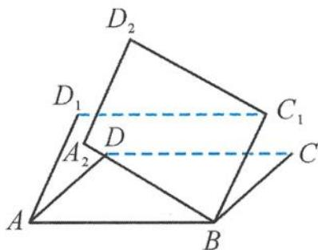

<!-- question-source:start -->
例 3 如图 3.2-3, 将一个水平放置的正方形 ABCD 先绕直线 AB 向上旋转 $45^{\circ}$ , 得到正方形 $ABC_{1}D_{1}$ , 再将所得的正方形绕 $BC_{1}$ 向上旋转 $45^{\circ}$ , 得到正方形 $A_{2}BC_{1}D_{2}$ , 求平面 $A_{2}BC_{1}D_{2}$ 与平面 ABCD 所成二面角的正弦值.

图3.2-3
<!-- question-source:end -->

![[高中/总复习/专题/高考数学秘密/浙大优辅《高中数学新体系 立体几何的秘密》/第三章_立体几何问题中的借用___春风又绿江南岸/3_2_借用图形/3_2_1_正方体或长方体/questions/answers/Q00037973A1.md]]
