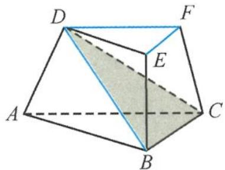
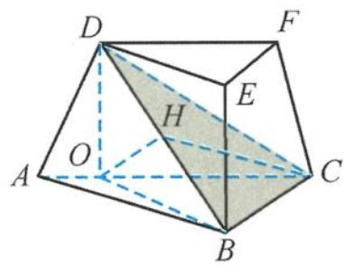

> [!faq]- 《高中数学新体系·立体几何的秘密》例题解析
>
> > [!success]- **【答案】** 详见解析
>
> > [!note]- **【分析】**
> > 本题未单列分析。
>
> > [!note]- **【解析】**
> > 解答 （Ⅰ）因为平面 $ADFC \perp$ 平面 ABC，所以 $\angle ACD$ 为 CD 与平面 ABC 所成的角，由三余弦定理得到
> > 
> > 图3.4-5
> > $$
> > \cos \angle B C D = \cos \angle A C B \cos \angle A C D = \frac {1}{2},
> > $$
> > 所以
> > $$
> > \angle B C D = \frac {\pi}{3}.
> > $$
> > 在 $\triangle BCD$ 中，设 $BC = t, DC = 2t$ ，由余弦定理得 $BD = \sqrt{3} t$ ，所以
> > $$
> > B D ^ {2} + B C ^ {2} = D C ^ {2}.
> > $$
> > 因此 $BD \perp BC$ . 又因为在三棱台 $ABC-DEF$ 中, $EF \parallel BC$ , 所以
> > $$
> > E F \perp D B.
> > $$
> > (II) 因为 $DF \parallel AC$ , 所以直线 $DF$ 与平面 $DBC$ 所成的角转化为 $AC$ 与平面 $DBC$ 所成的角.
> > 如图 3.4-6, 过点 D 作 AC 的垂线, 垂足为 O. 由于平面 ADFC ⊥ 平面 ABC, 所以 DO ⊥ 平面 ABC, 得 DO ⊥ BC.
> > 又 $BD \perp BC$ , 因此 $BC \perp$ 平面 $BDO$ , 故平面 $BCD \perp$ 平面 $BDO$ .
> > 
> > 过点 O 作 BD 的垂线, 垂足为 H, 则 $OH \perp$ 平面 BCD, 所以 $\angle OCH$ 为 AC 与平面 DBC 所成的角, 所以
> > 图3.4-6
> > $$
> > \sin \angle O C H = \frac {\sqrt {3}}{3}.
> > $$
