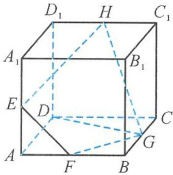

<!-- question-source:start -->
1. 如图, 已知点 $E, F, G, H$ 分别是正方体 $ABCD-A_{1}B_{1}C_{1}D_{1}$ 的棱 $AA_{1}, AB, BC, C_{1}D_{1}$ 点, 记二面角 $E-FG-D$ 的平面角为 $\alpha$ , 直线 $HG$ 与平面 $ABCD$ 所成的角为 $\beta$ , 直线 $HG$ 与直线 $DG$ 所成的角为 $\gamma$ , 则 ( ). A. $\alpha > \beta > \gamma$ B. $\beta > \alpha > \gamma$ C. $\beta = \alpha > \gamma$ D. $\gamma > \alpha = \beta$

第1题图
<!-- question-source:end -->

![[Q00037996A1]]
