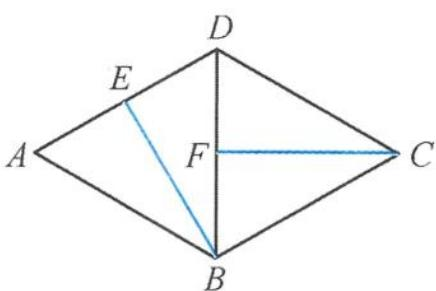

<!-- question-source:start -->
3. 如图, 在菱形 $ABCD$ 中, 已知 $\angle ABC = \frac{2\pi}{3}$ , 线段 $AD, BD$ 的中点分别为 $E, F$ . 现将 $\triangle ABD$ 沿对角线 $BD$ 翻折, 当二面角 $A-BD-C$ 的余弦值为 $\frac{1}{3}$ 时, 异面直线 $BE$ 与 $CF$ 所成角的正弦值是 ( ). A. $\frac{\sqrt{35}}{6}$ B. $\frac{1}{6}$ C. $\frac{2\sqrt{6}}{5}$ D. $\frac{1}{5}$

第3题图
<!-- question-source:end -->

![[Q00037998A1]]
