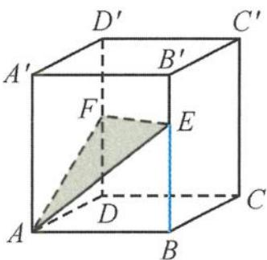
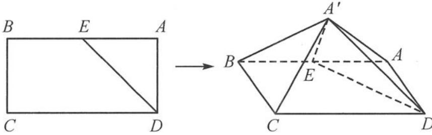

<!-- question-source:start -->
6. 如图, 在直四棱柱 $ABCD-A'B'C'D'$ 中, 已知 $AB \perp AD$ , $AB = AD = 1$ , $AA' > AB$ , $E$ , $F$ 分别是侧棱 $BB'$ , $DD'$ 上的动点, 且平面 $AEF$ 与平面 $ABC$ 所成的 (锐) 二面角为 $30^\circ$ , 则 $BE$ 的最大值为 ( ).

A. $\frac{\sqrt{6}}{6}$ B. $\frac{\sqrt{2}}{2}$ C. $\frac{\sqrt{3}}{3}$ D. 1

第6题图

第7题图
<!-- question-source:end -->

![[Q00038001A1]]
