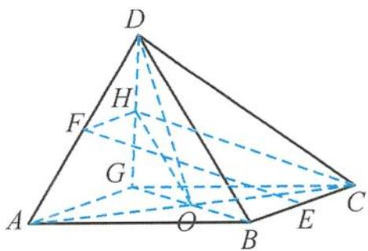

> [!faq]- 《高中数学新体系·立体几何的秘密》参考答案
>
> > [!success]- **【答案】** C
>
> > [!note]- **【分析】**
> > 本题未单列分析。
>
> > [!note]- **【解析】**
> > 解答 已知 AB = BC, $\angle ABC = 90^{\circ}$ ,
> > 将底面补全为正方形 ABCG, 得到四棱锥.
> > 如答图，O 为 ABCG 对角线的交点且 GB ⊥ AC.
> > 
> > 第2题答图
> > 又 $CD = DA$ ，有 $DO \perp AC, DO \cap GB = O,$ 所以 $AC \perp$ 平面 $GDB.$
> > 而 $AC \subset$ 平面 $ABCG$ , 故平面 $GDB \perp$ 平面 $ABCG$ .
> > 若 H 为 DG 的中点, 连接 FH,
> > 又 E, F 为棱 BC, DA 的中点，
> > 则 $FH \parallel AG$ 且 $AG = 2FH$ .
> > 而 $BC \parallel AG, BC = AG = 2EC$
> > 有 $EC$ 与 $FH$ 平行且相等, 即 $ECHF$ 为平行四边形.
> > 所以可将 $EF$ 平移至 $HC$ ，
> > 直线 $EF$ 与平面 $BOD$ 所成的角为 $\angle CHO = \theta \in$ $\left(0, \frac{\pi}{2}\right)$ , 在 Rt△CHO 中 $\angle COH = 90^\circ$ . 令 $AB = BC = CD = DA = 2, OC = \sqrt{2}$ , 即 $BD = 2OH = \frac{2OC}{\tan \theta} = \frac{2\sqrt{2}}{\tan \theta}$ , 在 $\triangle ABD$ 中, $AB^2 + AD^2 - 2AB \cdot AD \cdot \cos \angle DAB = BD^2$ , 即 $\cos \angle DAB = 1 - \frac{1}{\tan^2 \theta}$ . 因为 $\triangle DAB \cong \triangle DAG \cong \triangle DCB \cong \triangle DCG$ , 即 $\angle DAB \in \left(0, \frac{\pi}{2}\right)$ , 所以 $0 < 1 - \frac{1}{\tan^2 \theta} < 1$ , 解得 $\tan \theta > 1 (\tan \theta < -1$ 舍去). 综上, $\theta \in \left(\frac{\pi}{4}, \frac{\pi}{2}\right)$ ,
> >
> > 故选 **C**.
