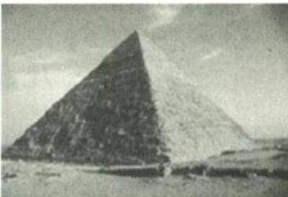

<!-- question-source:start -->
例 1 埃及胡夫金字塔是古代世界建筑奇迹之一,它的形状可视为一个正四棱锥,以该四棱锥的高为边长的正方形面积等于该四棱锥一个侧面三角形的面积,则其侧面三角形底边上的高与底面正方形的边长的比值为( ). A. $\frac{\sqrt{5}-1}{4}$ B. $\frac{\sqrt{5}-1}{2}$ C. $\frac{\sqrt{5}+1}{4}$ D. $\frac{\sqrt{5}+1}{2}$

<!-- question-source:end -->

![[高中/总复习/专题/高考数学秘密/浙大优辅《高中数学新体系 立体几何的秘密》/第五章_立体几何问题中的探究___天光云影共徘徊/5_1_以数学文化为情境的空间图形问题赏析/5_1_1_与世界文化遗产有关/questions/answers/Q00038040A1.md]]
