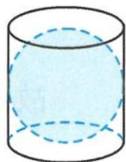

> [!faq]- 《高中数学新体系·立体几何的秘密》例题解析
>
> > [!success]- **【答案】** C
>
> > [!note]- **【分析】**
> > 本题未单列分析。
>
> > [!note]- **【解析】**
> > 解答 设该四棱锥的高为 h，其侧面三角形底边上的高为 $h'$ ，底面正方形的边长为 a，则有 $h^{2} = \frac{1}{2} ah'$ .
> > 因为
> > $$
> > h ^ {2} = h ^ {\prime 2} - \left(\frac {a}{2}\right) ^ {2},
> > $$
> > 所以得 $\left(\frac{h'}{a}\right)^2 -\frac{1}{2}\cdot \frac{h'}{a} = \frac{1}{4}$ ，即
> > $$
> > \frac {h ^ {\prime}}{a} = \frac {\sqrt {5} + 1}{4}.
> > $$
> > 故选C.
> > 引申 图5.1-1是古希腊数学家阿基米德的墓碑文示意图,墓碑上刻着一个圆柱,圆柱内有一个内切球,这个球的直径恰好与圆柱的高相等.相传这个图形表达了阿基米德引以为傲的发现.我们来重温这个伟大发现,圆柱的体积与球的体积之比为\_\_\_\_;圆柱的表面积与球的表面积之比为\_\_\_\_.
> > 
> > 图5.1-1
> > 解答 设圆柱的高为 h，底面半径为 r，则 h = 2r，所以
> > $$
> > V _ {\text {圆柱}} = (\pi r ^ {2}) 2 r = 2 \pi r ^ {3}, V _ {\text {球}} = \frac {4}{3} \pi r ^ {3},
> > $$
> > 从而
> > $$
> > \frac {V _ {\mathrm{圆柱}}}{V _ {\mathrm{球}}} = \frac {3}{2}.
> > $$
> > 因为 $S_{圆柱表面积} = 6\pi r^{2}, S_{球表面积} = 4\pi r^{2}$ ，所以
> > $$
> > \frac {S _ {\mathrm{圆柱}}}{S _ {\mathrm{球}}} = \frac {3}{2}.
> > $$
> > 点评 这两道试题既让我们领略了数学文化的魅力与价值,又在问题的解答过程中体会、感悟、欣赏数学之美,何乐而不为呢?
