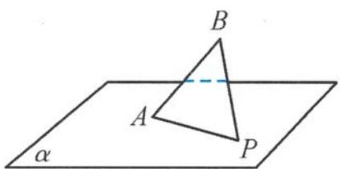

<!-- question-source:start -->
例 1 如图 5.2-1, AB 是平面 $\alpha$ 的斜线段, A 为斜足, 若点 P 在平面 $\alpha$ 内运动, 使得 $\triangle ABP$ 的面积为定值, 则动点 P 的轨迹是( ).
A. 圆
B. 椭圆
C. 一条直线
D. 两条平行直线

图5.2-1

图5.2-2
<!-- question-source:end -->

![[高中/总复习/专题/高考数学秘密/浙大优辅《高中数学新体系 立体几何的秘密》/第五章_立体几何问题中的探究___天光云影共徘徊/5_2_活跃在动态空间图形中的轨迹问题综述/5_2_1_判断动点轨迹类型的方法/questions/answers/Q00038047A1.md]]
