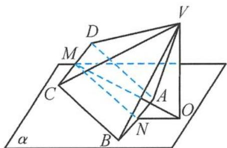

<!-- question-source:start -->
例 9 如图 5.3-35, 已知底面为正方形且各侧棱均相等的四棱锥 V-ABCD 可绕着 AB 任意旋转, $AB \subset$ 平面 $\alpha, M, N$ 分别是 CD, AB 的中点, AB = 2, $VA = \sqrt{5}$ , 点 V 在平面 $\alpha$ 上的射影为点 O. 当 $|OM|$ 最大时, 二面角 C-AB-O 的大小是().

图5.3-35

A. $105^{\circ}$ B. $90^{\circ}$ C. $60^{\circ}$ D. $45^{\circ}$
<!-- question-source:end -->

![[高中/总复习/专题/高考数学秘密/浙大优辅《高中数学新体系 立体几何的秘密》/第五章_立体几何问题中的探究___天光云影共徘徊/5_3_图形的翻折_旋转问题剖析/5_3_3_翻折_旋转问题中的最值/questions/answers/Q00038068A1.md]]
