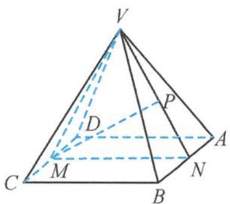
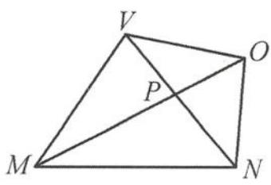

> [!faq]- 《高中数学新体系·立体几何的秘密》例题解析
>
> > [!success]- **【答案】** A
>
> > [!note]- **【分析】**
> > 本题未单列分析。
>
> > [!note]- **【解析】**
> > 解答 如图 5.3-36(a), 连接 $MV, NV$ , 易知 $\triangle MVN$ 为正三角形, 设 $VN$ 的中点为 $P$ , 则点 $O$ 在以 $VN$ 为直径的球面上运动, 当且仅当 $M, P, O$ 三点共线时 (图 5.3-36(b)),
> > 
> > (a)
> > 图5.3-36
> > 
> > (b)
> > $$
> > \mid O M \mid_ {\max} = \sqrt {3} + 1.
> > $$
> > 此时 $AB \perp$ 平面 $MNO$ , 所以 $\angle MNO$ 为二面角 $C-AB-O$ 的平面角, 因此 $\angle MNO = 60^{\circ} + 45^{\circ} = 105^{\circ}$ .
> >
> > 故选 **A**.
