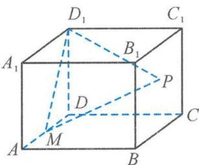

<!-- question-source:start -->
3. 如图, 设 $M$ 是长方体 $ABCD-A_{1}B_{1}C_{1}D_{1}$ 的棱 $AD$ 的中点, $AA_{1}=AD=4$ , $AB=5$ , 点 $P$ 在平面 $BCC_{1}B_{1}$ 上. 若平面 $D_{1}PM$ 分别与平面 $ABCD$ 和平面 $BCC_{1}B_{1}$ 所成的锐二面角相等, 则点 $P$ 的轨迹为 ( ).

A. 椭圆的一部分
B. 抛物线的一部分
C. 一条线段
D. 一段圆弧

第3题图
<!-- question-source:end -->

![[Q00038072A1]]
