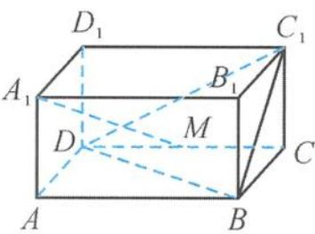

<!-- question-source:start -->
7. 如图, 在长方体 $ABCD-A_{1}B_{1}C_{1}D_{1}$ 中, 已知 $AA_{1}=1$ , $AB=BC=2$ , 若 $M$ 为四面体 $C_{1}BCD$ 内的点 (包含边界), 则直线 $A_{1}M$ 与平面 $ABCD$ 所成角的余弦值的最小值为 ( ).

A. $\frac{\sqrt{2}}{3}$ B. $\frac{\sqrt{2}}{2}$ C. $\frac{\sqrt{6}}{3}$ D. $\frac{2\sqrt{2}}{3}$

第6题图

第7题图
<!-- question-source:end -->

![[Q00038076A1]]
