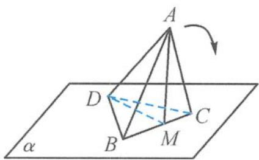
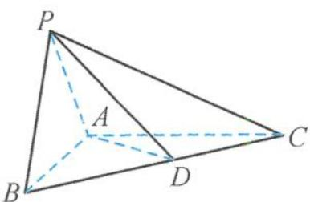

<!-- question-source:start -->
8. 如图, 四面体 $ABCD$ 中的面 $BCD$ 在平面 $\alpha$ 内, 平面 $ABC \perp \alpha, M \in BC$ , 且 $BC \perp$ 平面 $AMD$ , 已知 $AM = DM = \sqrt{3}$ . 若将四面体 $ABCD$ 以 $BC$ 为轴转动, 使点 $A$ 落到 $\alpha$ 内, 则 $A, D$ 两点所经过的路程之和等于(   ). A. $2 \sqrt{3} \pi$ B. $\sqrt{3} \pi$ C. $\frac{\sqrt{3}}{2} \pi$ D. $3 \pi$

第8题图

第9题图
<!-- question-source:end -->

![[Q00038077A1]]
