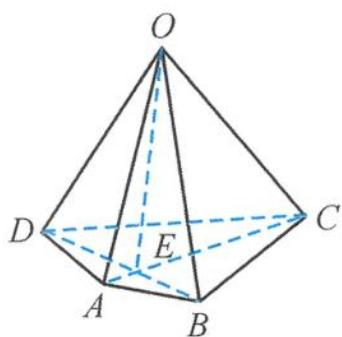

> [!faq]- 《高中数学新体系·立体几何的秘密》例题解析
>
> > [!success]- **【答案】** 详见解析
>
> > [!note]- **【分析】**
> > 本题未单列分析。
>
> > [!note]- **【解析】**
> > 解答 如图 4.2-2, 设 AC 交 BD 于点 E, 所以
> > $$
> > \begin{array}{r l} & (\overrightarrow {O A} + \overrightarrow {O C}) \cdot (\overrightarrow {O B} - \overrightarrow {O D}) = (2 \overrightarrow {O E} + \overrightarrow {E A} + \overrightarrow {E C}) \cdot \overrightarrow {D B} \\ & = 2 \overrightarrow {O E} \cdot \overrightarrow {D B} + (\overrightarrow {E A} + \overrightarrow {E C}) \cdot \overrightarrow {D B} \\ & = 2 \overrightarrow {O E} \cdot \overrightarrow {D B} = (\overrightarrow {O B} + \overrightarrow {O D}) \cdot \overrightarrow {D B} \\ & = (\overrightarrow {O B} + \overrightarrow {O D}) \cdot (\overrightarrow {O B} - \overrightarrow {O D}) \\ & = | \overrightarrow {O B} | ^ {2} - | \overrightarrow {O D} | ^ {2} = 3. \end{array}
> > $$
> > 
> > 图4.2-2
