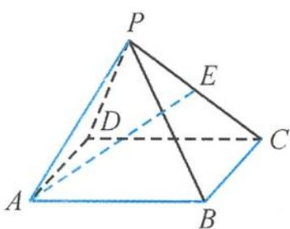

<!-- question-source:start -->
6. 如图, 在四棱锥 $P-ABCD$ 中, 已知底面 $ABCD$ 是平行四边形, $E$ 为棱 $PC$ 的中点. 若 $\overrightarrow{AE} = x\overrightarrow{AB} + 2y\overrightarrow{BC} + 3z\overrightarrow{AP}$ , 则 $x+y+z$ 等于 ( ). A. 1 B. $\frac{11}{12}$ C. $\frac{11}{6}$ D. 2

<!-- question-source:end -->

![[Q00038030A1]]
