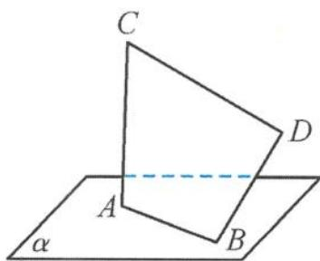

<!-- question-source:start -->
7. 如图, 已知线段 $AB$ 在平面 $\alpha$ 内, 线段 $AC \perp \alpha$ , 线段 $BD \perp AB$ , 且 $AB = 7$ , $AC = BD = 24$ , $CD = 25$ , 则直线 $CD$ 与平面 $\alpha$ 所成角的正弦值为 ( ).

A. $\frac{12\sqrt{3}}{25}$ B. $\frac{13}{25}$ C. $\frac{7}{25}$ D. $\frac{12}{25}$

第7题图
<!-- question-source:end -->

![[Q00038031A1]]
