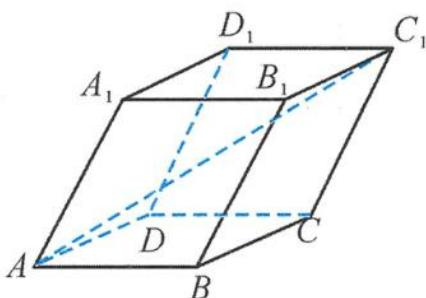

<!-- question-source:start -->
15. 如图, 一个晶体的形状为平行六面体, 其中以顶点 $A$ 为端点的三条棱长都为 1 , 且它们彼此的夹角都是 $60^{\circ}$ . 设 $AA_{1}$ 与平面 $ABCD$ 所成的角为 $\alpha$ , 二面角 $D_{1}-AD-B$ 的平面角为 $\beta, AC_{1}$ 的长度为 $a$ , 则 ( ).

A. $\alpha > \beta$ , 且 $a = \sqrt{3}$ B. $\alpha > \beta$ , 且 $a = \sqrt{6}$ C. $\beta > \alpha$ , 且 $a = \sqrt{3}$ D. $\beta > \alpha$ , 且 $a = \sqrt{6}$

第15题图
<!-- question-source:end -->

![[Q00038039A1]]
