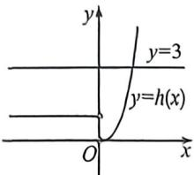
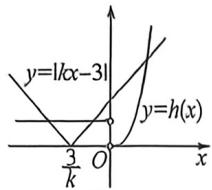
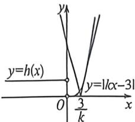

<!-- question-source:start -->
例4 (2026 届辽宁省实验第二次模拟 T8) 已知函数 $f(x) = \begin{cases} x^3, & x \geqslant 0 \\ -x, & x < 0 \end{cases}$ ，若函数 $g(x) = f(x)$ $|kx^2 - 3x| (k \in \mathbb{R})$ 恰有 4 个零点，则 $k$ 的取值范围为
A. $(-\infty, -\frac{1}{3}) \cup (2\sqrt{3}, +\infty)$ B. $(-\infty, -\frac{1}{3}) \cup (0, 2\sqrt{3})$ C. $(-\infty, 0) \cup (0, 2\sqrt{3})$ D. $(-\infty, 0) \cup (2\sqrt{3}, +\infty)$

图1

图2

图3
<!-- question-source:end -->

![[高中/总复习/二轮/2026版高中《MST新思路思维拓展》二轮复习专题/上册/函数与导数小题篇/考点一_函数图像与性质/questions/answers/Q00092832A1.md]]
