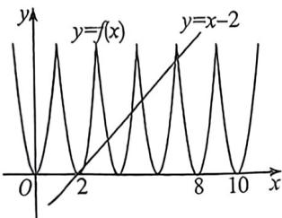

<!-- question-source:start -->
例14 (2026 届陕西西安新城一模 T8) 定义域为 $R$ 的函数 $f(x)$ 满足 $f(x) = 6(x - 2k)^2, x \in [2k - 1, 2k + 1), k \in \mathbb{Z}$ , 且函数 $g(x) = ax^2 + x + c$ 满足对任意 $x_1, x_2 \in \mathbb{R}$ , 都有 $g(x_1 + x_2) = g(x_1) + g(x_2) + 2$ , 则方程 $f(x) = g(x)$ 解的个数为

D. 9

<!-- question-source:end -->

![[高中/总复习/二轮/2026版高中《MST新思路思维拓展》二轮复习专题/上册/函数与导数小题篇/考点一_函数图像与性质/questions/answers/Q00092840A1.md]]
