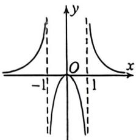

<!-- question-source:start -->
例1 (2025·天津)已知函数 $y = f(x)$ 的图象如图,则 $f(x)$ 的解析式可能为

A. $f(x) = \frac{x}{1 - |x|}$ B. $f(x) = \frac{x}{|x| - 1}$ C. $f(x) = \frac{|x|}{1 - x^2}$ D. $f(x) = \frac{|x|}{x^2 - 1}$
<!-- question-source:end -->

![[高中/总复习/二轮/2026版高中《MST新思路思维拓展》二轮复习专题/上册/函数与导数小题篇/考点一_函数图像与性质/questions/answers/Q00093213A1.md]]
