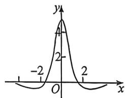

<!-- question-source:start -->
例2 (2026届北京月考)已知函数 $f(x)$ 的部分图象如下图所示,则 $f(x)$ 的解析式可能为()

A. $\frac{3e^{x} - 3e^{-x}}{x^{2} + 2}$ B. $\frac{5\sin x}{x^2 + 2}$ C. $\frac{3e^x + 3e^{-x}}{x^2 + 2}$ D. $\frac{5\cos x}{x^2 + 1}$

\- 层质 电已知， $f(x)$ 的图像关于 $y$ 轴对称，故 $f(x)$ 为偶函数，

对于A，设 $g(x) = \frac{3e^x - 3e^{-x}}{x^2 + 2}, g(-x) = \frac{3e^{-x} - 3e^x}{x^2 + 2} = -g(x)$ ，即 $g(x)$ 为奇函数，故 $A$ 不合题意；

对于B，设 $g(x) = \frac{5\sin x}{x^2 + 2}, g(-x) = \frac{5\sin(-x)}{x^2 + 2} = -g(x)$ ，即 $g(x)$ 为奇函数，故 $B$ 不合题意；

对于C，设 $g(x) = \frac{3e^x + 3e^{-x}}{x^2 + 2}$ ，函数的定义域为 $R$ ，因 $g(-x) = \frac{3e^{-x} + 3e^x}{x^2 + 2} = g(x)$ ，则 $g(x)$ 为偶函数，
<!-- question-source:end -->

![[高中/总复习/二轮/2026版高中《MST新思路思维拓展》二轮复习专题/上册/函数与导数小题篇/考点一_函数图像与性质/questions/answers/Q00093214A1.md]]
