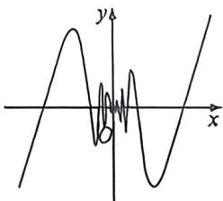

<!-- question-source:start -->
例 4 (2026 届安康月考) 下侧图象对应的函数解析式可能是

A. $y = x\sin \frac{1}{x}$ B. $y = x\cos \frac{1}{x}$ C. $y = \frac{1}{x}\sin \frac{1}{x}$ D. $y = \frac{1}{x}\cos \frac{1}{x}$
<!-- question-source:end -->

![[高中/总复习/二轮/2026版高中《MST新思路思维拓展》二轮复习专题/上册/函数与导数小题篇/考点一_函数图像与性质/questions/answers/Q00093286A1.md]]
