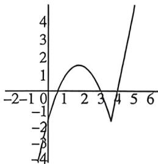

> [!faq]- 例题解析
>
> > [!success]- **【答案】** C
>
> > [!note]- **【解析】**
> > 解析 因为 $f(x) = x \mid x - 2a \mid -a = \begin{cases} x^2 - 2ax - a, & x \geqslant 2a \\ -x^2 + 2ax - a, & x < 2a \end{cases}$ ,
> >
> > 若 $a = 0$ 时， $f(x) = \begin{cases} x^2, & x \geqslant 0 \\ -x^2, & x < 0 \end{cases}$ ，则 $f(x)$ 有且仅有一个零点 $x = 0$ ，符合题意；
> >
> > 若 $a > 0$ 时，则 $2a > a$ ，当 $x \geqslant 2a$ 时， $f(x) = x^2 - 2ax - a = (x - a)^2 - a - a^2$ ，如图所示：
> >
> > $$
> > [ 2 a, + \infty)
> > $$
> >
> > $$
> > x = 2 a
> > $$
> >
> > $$
> > f (2 a) = - a
> > $$
> >
> > $$
> > x <   2 a
> > $$
> >
> > $$
> > f (x) = - x ^ {2} + 2 a x - a = -
> > $$
> >
> > $(x - a)^{2} - a + a^{2}$ , 则 $f(x)$ 在 $(- \infty, a)$ 上单调递增, 在 $(a, 2a)$ 上单调递减, 即 $x = a$ 时, 取得最大值 $f(a) = -a + a^{2}$ , 因为函数 $f(x)$ 有且只有一个零点, 所以 $\left\{ \begin{array}{l} a > 0 \\ -a < 0 \\ -a + a^{2} < 0 \end{array} \right.$ , 解得 $0 < a < 1$ ; 若 $a < 0$ 时, 则 $2a < a$ , 当 $x \geqslant 2a$ 时, $f(x) = x^{2} - 2ax - a = (x - a)^{2} - a - a^{2}$ ,
> >
> > 
> >
> > 则 $f(x)$ 在 $[a, +\infty)$ 上单调递增，在 $(2a, a)$ 上单调递减，即 $x = a$ 时，取得最小值 $f(a) = -a - a^2$
> >
> > 当 $x < 2a$ 时， $f(x) = -x^2 + 2ax - a = -(x - a)^2 - a + a^2$ ，则 $f(x)$ 在 $(- \infty, 2a]$ 上单调递增，
> >
> > 即 $x = 2a$ 时，取得最大值 $f(2a) = -a$ ，因为函数 $f(x)$ 有且只有一个零点，所以 $\left\{ \begin{array}{l} a < 0 \\ -a - a^2 > 0, \text{解得} -1 < a < 0; \text{即实数} \\ -a > 0 \end{array} \right.$ $a$ 的取值范围是 $(-1, 1)$ .
> >
> > 故选 **C**.
