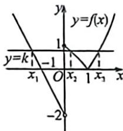

> [!faq]- 例题解析
>
> > [!success]- **【答案】** B
>
> > [!note]- **【解析】**
> > \- 作出函数 $f(x)$ 的图象, 如图所示, 由图可得: 设 $f(x_{1}) = f(x_{2}) = f(x_{3}) = k (0 < k \leqslant 1)$ , 所以 $-2x_{1} - 2 = k$ , 解得: $x_{1} = -\frac{k + 2}{2}, 2 - 2^{x_{1}} = 2^{x_{1}} - 2 = k$ , 解得: $x_{2} = \log_{2}(2 - k), x_{3} = \log_{2}(2 + k)$ , 所以 $x_{1}f(x_{1}) = -\frac{k(k + 2)}{2}, x_{3} - x_{2} = \log_{2}(2 + k) - \log_{2}(2 - k)$ , 令 $g(k) = -\frac{k(k + 2)}{2}$ ,
> >
> > 
> >
> > 则 $g(k)$ 在 $(0,1]$ 上单调递减，则 $g(1) \leqslant g(k) < g(0)$ ，即 $-\frac{3}{2} \leqslant g(k) < 0$ ，令 $h(k) = \log_2(2 + k) - \log_2(2 - k)$ ，则 $h(k)$ 在 $(0,1]$ 上单调递增，则 $h(0) < h(k) \leqslant h(1)$ ，所以 $0 < h(k) \leqslant \log_23$ ，则 $0 < \log_3 2 \leqslant \frac{1}{h(k)}$ 所以 $\frac{x_1 f(x_1)}{x_3 - x_2} = \frac{g(k)}{h(k)}$ ，则 $-\frac{3}{2} \log_3 2 \leqslant \frac{x_1 f(x_1)}{x_3 - x_2} = \frac{g(k)}{h(k)} < 0$ ，故选：B.
> >
> > 分段函数通常与等高线组合，常见的等高线由对数绝对值等高线，两个解的乘积为极值点的平方，二次函数与绝对值等高线，两个解的和为极值点的两倍，对于常见零点关系，通常采用设参思想，构建零点之间的关系.
