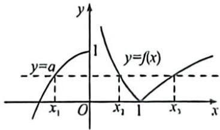

> [!faq]- 例题解析
>
> > [!success]- **【答案】** A
>
> > [!note]- **【解析】**
> > 解析 函数 $f(x)$ 在 $(-∞,0]$ 上单调递增，在(0,1]上单调递减，在(1,+∞)上单调递增，其图象如图，方程 $f(x)=a$ 有三个不同的实数根，即直线y=a与 $y=f(x)$ 的图象有三个公共点，则 $0<a\leqslant1$ ，由 $\left|\ln x_{2}\right|=\left|\ln x_{3}\right|$ ， $x_{2}\neq x_{3}$ 得： $\ln x_{2}+\ln x_{3}=0$ ，即 $x_{2}x_{3}=1$ ，
> >
> > 
> >
> > $$
> > - x _ {1} ^ {2} + 1 = a, x _ {1} \leqslant 0
> > $$
> >
> > $$
> > x _ {1} = - \sqrt {1 - a}
> > $$
> >
> > $$
> > a x _ {1} x _ {2} x _ {3} = a x _ {1} = a (- \sqrt {1 - a}) = - \sqrt {a ^ {2} - a ^ {3}}
> > $$
> >
> > 记 $g(a) = a^2 - a^2, a \in (0,1]$ ，则 $g'(a) = 2a - 3a^2 = a(2 - 3a)$ ，
> >
> > 当 $0 < a < \frac{2}{3}$ 时， $g'(a) > 0$ ，当 $\frac{2}{3} < a \leqslant 1$ 时， $g'(a) < 0$
> >
> > 所以函数 $g(a)$ 在 $\left(0, \frac{2}{3}\right)$ 上单调递增，在 $\left(\frac{2}{3}, 1\right]$ 上单调递减，所以 $g(a) \in \left[0, \frac{4}{27}\right]$ ，
> >
> > 又函数 $y = -\sqrt{t}$ 在定义域上单调递减，所以 $ax_{1}x_{2}x_{3} = -\sqrt{a^{2} - a^{3}} \in \left[-\frac{2\sqrt{3}}{9}, 0\right]$ .
> >
> > 故选 **A**.
