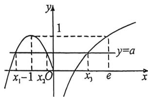

> [!faq]- 例题解析
>
> > [!success]- **【答案】** D
>
> > [!note]- **【解析】**
> > 解析 作出函数 $f(x) = \begin{cases} -x^2 - 2x, & x \leqslant 0 \\ \ln x, & x > 0 \end{cases}$ 的图象，如图所示：
> >
> > 又因为函数 $g(x)=f(x)-a$ 有三个零点 $x_{1},x_{2},x_{3}$ ，即 $f(x)=a$ 有三个零点 $x_{1},x_{2},x_{3}$ ，所以 $y=f(x)$ 的图象与直线y=a有三个交点，且交点的横坐标分别为 $x_{1},x_{2},x_{3}$ ，由图象可得 $0\leqslant a<1$ ，不妨设 $x_{1}<x_{2}<x_{3}$ ，由二次函数的性质可知：
> >
> > $$
> > x \leqslant 0
> > $$
> >
> > $$
> > 1, x _ {1}, x _ {2}
> > $$
> >
> > $$
> > - x ^ {2} - 2 x - a = 0
> > $$
> >
> > $$
> > x ^ {2} + 2 x + a = 0
> > $$
> >
> > 
> >
> > 且 $x_{1} + x_{2} = -2, x_{1}x_{2} = a$ ，令 $\ln x = 1$ ，解得 $x = e$ ，所以 $0 < x_{3} < e$ ，又因为 $\ln x_{3} = a$ ，所以 $x_{3} = e^{a}$ ，所以 $x_{1} \cdot x_{3} \cdot x_{3} = ax_{3} = ae^{a}, a \in [0,1)$ ，令 $g(x) = xe^{x}, x \in [0,1)$ ，则 $g'(x) = e^{x} + xe^{x} = (x + 1)e^{x} > 0$
> >
> > 所以 $g(x)$ 在 $[0,1)$ 上单调递增，所以 $g(x)\in[0,e)$ ，所以 $x_{1}\cdot x_{2}\cdot x_{3}\in[0,e)$ 。
> >
> > 故选 **D**.
