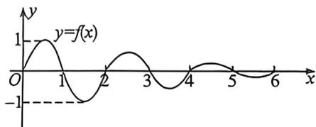
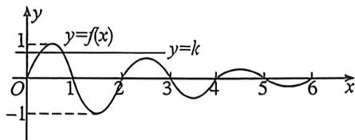

> [!faq]- 例题解析
>
> > [!success]- **【答案】** B
>
> > [!note]- **【解析】**
> > 解析 作出函数 $f(x)=\left\{\begin{aligned}\sin\pi x,0&\leqslant x\leqslant2\\ \frac{1}{2}f(x-2),x&>2\end{aligned}\right.$ 的图象如图所示，所以 $f(x)_{\max}=1,f(x)_{\min}=-1$
> >
> > 
> >
> > 
> >
> > 对于 A, 如图所示, 在 $x \in [1, +\infty)$ 时, $f(x)_{\max} = \frac{1}{2}$ , $f(x)_{\min} = -1$ , 任取 $x_1, x_2 \in [1, +\infty)$ , 都有 $|f(x_1) - f(x_2)| \leqslant f(x)_{\max} - f(x)_{\min} = \frac{1}{2} - (-1) = \frac{3}{2}$ , 故 A 正确;
> >
> > 对于 B, 因为 $f\left(\frac{1}{2}\right)=1$ , $f\left(\frac{5}{2}\right)=\frac{1}{2}, \cdots, f\left(\frac{1}{2}+2k\right)=\left(\frac{1}{2}\right)^{k}$ ，所以 $f\left(\frac{1}{2}\right)+f\left(\frac{5}{2}\right)+\cdots+f\left(\frac{1}{2}+2k\right)=$ $\frac{1\cdot\left[1-\left(\frac{1}{2}\right)^{k+1}\right]}{1-\frac{1}{2}}=2-\frac{1}{2^{k}}$ ，故 B 错误；
> >
> > 对于 C, 由 $f(x)=\frac{1}{2}f(x-2)$ , 得到 $f(x+2k)=\left(\frac{1}{2}\right)^{k}f(x)$ , 即 $f(x)=2^{k}f(x+2k)$ , 故 C 正确;
> >
> > 对于 D, 函数 $f(x)=k(k>0)$ 有两个相异实根 $x_{1}, x_{2}$ , 如图所示,
> >
> > 则 $\frac{1}{2} < k < 1$ 且 $x_{1} + x_{2} = 1, x_{1} \in \left(0, \frac{1}{2}\right), x_{2} \in \left(\frac{1}{2}, 1\right)$ ,
> >
> > 当 $k = \frac{1}{2}$ 时， $f(x) = \frac{1}{2}$ 还有 $x = \frac{5}{2}$ 一个根，共三个根，此时 $x_{1}$ 满足 $f(x_{1}) = \sin \pi x_{1} = \frac{1}{2}$ ，解得 $x_{1} = \frac{1}{6}$ ，
> >
> > 当 $k = 1$ 时， $f(x) = 1$ 只有一个根，此时 $x_{1}$ 满足 $f(x_{1}) = \sin \pi x_{1} = 1$ ，解得 $x_{1} = \frac{1}{2}$ ，
> >
> > 所以当有两个根时, $x_{1}$ 满足 $x_{1}\in\left(\frac{1}{6},\frac{1}{2}\right)$ ,
> >
> > 所以 $x_{1}x_{2} = x_{1}(1 - x_{1}) = -\left(x_{1} - \frac{1}{2}\right)^{2} + \frac{1}{4}$ ，当 $\frac{1}{6} < x_{1} < \frac{1}{2}$ 时，函数为增函数，所以 $\frac{5}{36} < x_{1}x_{2} < \frac{1}{4}$ ，故D正确，
> >
> > 故选 **B**.
