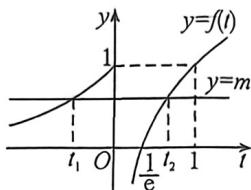

> [!faq]- 例题解析
>
> > [!success]- **【答案】** ACD
>
> > [!note]- **【解析】**
> > 解析 $t=f(x)$ ，考虑 $f(t)=m$ 的解. $f(t)$ 的图象如图所示：
> >
> > 对于 A, 因为 $f[f(x)] = m$ 有 3 个不同的解, 故 $f(t) = m$ 有两个不同的解 $t_{1}, t_{2}$ , 且 $t_{1} \leqslant 0, 0 < t_{2} \leqslant 1$ , 故 A 正确.
> >
> > 
> >
> > 对于 B, 由 A 的分析可得 $0 < m \leqslant 1$ , 故 B 错误.
> >
> > 对于C,由A的分析结合图象可得: $m=e^{t_{1}}=\ln t_{2}+1$ 有两个不同的解,故 $m-1=\ln t_{2}\leqslant0$ 且 $m-1=e^{t_{1}}-1\leqslant0$ ,故 $f(f(m-1))=f(e^{m-1})=1+\ln e^{m-1}=m$ ,故m-1是方程 $f(f(x))=m$ 的一个根,故C正确.
> >
> > 对于D,由A的分析可得 $f(x)=t_{2}$ 有两个不同的解,不妨设为 $x_{1},x_{2},f(x)=t_{1}$ 有唯一解,不妨设为 $x_{3}$ ,则 $e^{x_{1}}=\ln x_{2}+1=t_{2},\ln x_{3}+1=t_{1}$ ,故 $x_{1}=\ln t_{2},x_{2}=e^{t_{1}-1},x_{3}=e^{t_{1}-1}$ ,故 $x_{1}+x_{2}+x_{3}=\ln t_{2}+e^{t_{1}-1}+e^{t_{1}-1}$ ,而 $m=e^{t_{1}}=\ln t_{2}+1$ 即 $t_{1}=\ln m,t_{2}=e^{m-1}$ ,所以 $x_{1}+x_{2}+x_{3}=m-1+e^{t_{1}-1}-1+e^{\ln m-1}=m-1+e^{t_{1}-1}-1+\frac{m}{e}$ ,
> >
> > 记 $g(m) = m - 1 + e^{r^{-1} - 1} + \frac{m}{e}$ ，显然单调递增，故 $g(m) \leqslant g(1) = e^{-1} + 1 < e^{-1} + e$ ，D 正确。
> >
> > 故选 **ACD**.
