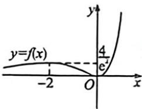

> [!faq]- 例题解析
>
> > [!success]- **【答案】** B
>
> > [!note]- **【解析】**
> > 解析 由 $f(x)-x^{2}e^{x}$ 得 $f'(x)=x(x+2)e^{x}$ ，当 $x\in(-\infty,-2)$ 时， $f'(x)>0,f(x)$ 单调递增，当 $x\in(-2,0)$ 时， $f'(x)<0,f(x)$ 单调递减，当 $x\in(0,+\infty)$ 时， $f'(x)>0,f(x)$ 单调递增，当x<0时， $f(x)>0,f(-2)=\frac{4}{e^{2}}$ ，当x>0时， $f(x)>0$ ，画出其大致图象如图.
> > 方程 $[f(x)]^{2}-(a+3+\cos x)f(x)+a\cos x+3a=0$ ，即 $[f(x)-\cos x-3][f(x)-a]=0$ ，所以 $f(x)=\cos x+3$ 或 $f(x)=a$ 。因为 $f(x)$ 的极大值为 $f(-2)=\frac{4}{e^{2}}<2$ ，而 $2\leqslant\cos x+3\leqslant4$ ，由图可知 $f(x)$ 与 $y=\cos x+3$ 的图象仅有一个交点。要使原方程有4个不同的实数根，需 $f(x)$ 的图象与直线y=a有3个交点，由图可知此时a的取值范围为 $\left(0,\frac{4}{e^{2}}\right)$ 。故选：B.
> >
> > 
