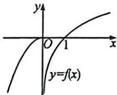
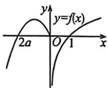

> [!faq]- 例题解析
>
> > [!success]- **【答案】** D
>
> > [!note]- **【解析】**
> > 解析 当 $a \geqslant 0, x \leqslant 0$ 时， $f(x) = -x^2 + 2ax$ ，对称轴为 $x = a \geqslant 0$ ，所以 $f(x)$ 在 $(- \infty, 0)$ 单调递增，函数图象如下：令 $f(x) = t, y = f(f(x)) = f(t) = 0$ ，解得 $t = 0$ 或 $t = 1$ ，
> >
> > 
> >
> > 
> >
> > 即 $f(x)=t=0$ 或 $f(x)=t=1$ ，根据图象 $f(x)=t=0$ 有2个解， $f(x)=t=1$ 有1个解，所以此时 $y=f(f(x))$ 有3个零点，不符合题意；当 $a<0, x\leqslant0$ 时， $f(x)=-x^{2}+2ax$ ，对称轴为 $x=a<0$ ，
> >
> > 所以 $f(x)$ 在 $(-\infty, a)$ 单调递增，在 $(a, 0)$ 单调递减，函数图像如下：令 $f(x) = t, y = f(f(x)) = f(t) = 0$ ，解得 $t = 2a$ 或 $t = 0$ 或 $t = 1$ ，根据图象 $f(x) = t = 2a < 0$ 有 2 个解， $f(x) = t = 0$ 有 3 个解，又 $y = f(f(x))$ 有 6 个零点，所以 $f(x) = t = 1$ 有 1 个解，即 $\left\{ \begin{array}{l} a < 0 \\ f(a) = a^2 < 1 \end{array} \right.$ ，解得 $-1 < a < 0$ ，
> >
> > 故选 **D**.
