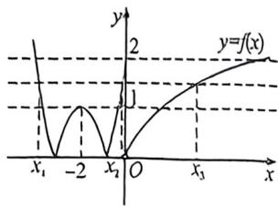

> [!faq]- 例题解析
>
> > [!success]- **【答案】** D
>
> > [!note]- **【解析】**
> > 解析 出 $f(x)$ 的图象,如图所示,
> >
> > 因为 $\frac{3}{4} x^2 + 3x + 2 = \frac{3}{4}(x + 2)^2 - 1$ ，所以函数 $y = \frac{3}{4} x^2 + 3x + 2$ 的图象关于直线 $x = -2$ 对称，
> >
> > 
> >
> > 当 $x \leqslant 0$ 时， $f(x) = \left|\frac{3}{4} x^2 + 3x + 2\right| = \begin{cases} \frac{3}{4} x^2 + 3x + 2, & x \leqslant -2 - \frac{2\sqrt{3}}{3} \\ -\frac{3}{4} x^2 - 3x - 2, & -2 - \frac{2\sqrt{3}}{3} < x < -2 + \frac{2\sqrt{3}}{3}, \end{cases}$ 则函数 $f(x)$ 在 $\left(-\infty, -2 - \frac{2\sqrt{3}}{3}\right)$ 和 $\frac{3}{4} x^2 + 3x + 2, -2 + \frac{2\sqrt{3}}{3} \leqslant x \leqslant 0$
> >
> > $\left(-2, -2 + \frac{2\sqrt{3}}{3}\right)$ 上单调递减，在 $\left(-2 - \frac{2\sqrt{3}}{3}, -2\right), \left(-2 + \frac{2\sqrt{3}}{3}, 0\right)$ 和 $(0, +\infty)$ 上单调递增，且 $f(-2) = 1, f(0) = 2$ ，则若 $g(x) = f(x) - a$ 有三个零点，则函数 $y = f(x)$ 与 $y = a$ 有三个交点，则 $a \in (1, 2]$ ，令 $x_1 < x_2 < x_3$ ，可知 $x_1 + x_2 = -4, x_3 > 0$ ，且 $1 < f(x_3) \leqslant 2$ ，得 $e - 1 < x_3 \leqslant e^2 - 1$ ，
> >
> > 则 $e - 5 < x_{1} + x_{2} + x_{3} \leqslant e^{2} - 5$ ，
> >
> > 故选 **D**.
