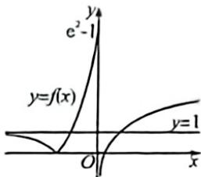

> [!faq]- 例题解析
>
> > [!success]- **【答案】** D
>
> > [!note]- **【解析】**
> > (1) 令 $(t_{2})=t$ ，有 $3-m^{2}+2mt=t^{2}$ ，即 $\left[t-(m-\sqrt{3})\right]\left[t-(m+\sqrt{3})\right]=0$ ，即 $t_{1}=m-\sqrt{3}$ 或 $t_{2}=m+\sqrt{3}$ 。
> >
> > 作出 $f(x)$ 的图象，如图，因为方程 $3-m^{2}+2m f(x)=f^{2}(x)$ 有且仅有5个不同实数根，则由图得 $\left\{\begin{aligned}0<m-\sqrt{3}<1\\1&\leqslant m+\sqrt{3}\leqslant e^{2}-1\end{aligned}\right.$ 或 $\left\{\begin{aligned}m-\sqrt{3}=0\\0<m+\sqrt{3}<1\end{aligned}\right.$ ，解得 $\left\{\begin{aligned}\sqrt{3}<m<1+\sqrt{3}\\1-\sqrt{3}\leqslant m\leqslant e^{2}-\sqrt{3}-1\end{aligned}\right.$ 或 $\left\{\begin{aligned}m=\sqrt{3}\\-\sqrt{3}<m<1-\sqrt{3}\end{aligned}\right.$ ，所以 $\sqrt{3}<m<1+\sqrt{3}$ 故选：D.
> >
> > 
