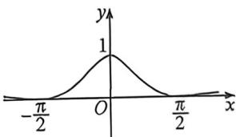

> [!faq]- 例题解析
>
> > [!success]- **【答案】** D
>
> > [!note]- **【解析】**
> > 因为 $g(2) = \frac{e^2 + e^{-2}}{2} > 0$ ，与图象不符，故 $C$ 不合题意；
> >
> > 对于D, 设 $g(x)=\frac{5\cos x}{x^{2}+1}$ ，函数的定义域为R，因 $g(-x)=\frac{5\cos(-x)}{x^{2}+1}=g(x)$ ，则 $g(x)$ 为偶函数，
> >
> > 且当 $x \in \left(\frac{\pi}{2}, \frac{3\pi}{2}\right)$ 时， $g(x) < 0$ ，结合图象可知 $D$ 符合题意。故选：D.
> >
> > 例 (2026 届焦作模拟) 已知函数 $f(x)$ 的部分图象如下, 则 $f(x)$ 的解析式可能为
> >
> > 
> >
> > A. $\frac{\sin^7x}{x^2 + 1} +1$ B. $\frac{\sin x}{x^2 + 1} +1$ C. $\frac{\cos^2x}{x^0 + 1}$ D. $\frac{\cos x}{1}$
> >
> > 解析 $f(x)$ 的图象关于 $y$ 轴对称，所以 $f(x)$ 是偶函数，则 $f(-x) = f(x)$ ，且函数 $f(x)$ 过点 $\left(\frac{\pi}{2}, 0\right)$
> >
> > 对于 B, $f(-x)=\frac{\sin(-x)}{(-x)^{2}+1}+1=-\frac{\sin x}{x^{2}+1}+1\neq f(x)$ ，不为偶函数，不符合题意，
> >
> > 对于 A, $f\left(\frac{\pi}{2}\right)=\frac{\sin^{2}\frac{\pi}{2}}{\left(\frac{\pi}{2}\right)^{2}+1}+1=\frac{4}{\pi^{2}+4}+1\neq0$ , 不符合题意,
> >
> > 对于 D, 当 $\frac{\pi}{2}<x<\frac{3\pi}{2}$ 时, $f(x)=\frac{\cos x}{x^{2}+1}<0$ , 不符合题意,
> >
> > 对于 C, 满足 $f(-x)=f(x)$ , $f\left(\frac{\pi}{2}\right)=0$ , 以及 $\frac{\pi}{2}<x<\frac{3\pi}{2}$ 时, $f(x)>0$ , 符合图象特征.
> >
> > 故选 **C**.
