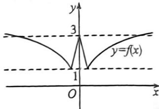

> [!faq]- 例题解析
>
> > [!success]- **【答案】** D
>
> > [!note]- **【解析】**
> > 因为 $f^1 (x) - (a + 8)f(x) + 8a = 0\Rightarrow [f(x) - 8]\cdot [f(x) - a] = 0.$
> >
> > $$
> > f (x) = 8
> > $$
> >
> > $$
> > 0 \leqslant x <   1
> > $$
> >
> > $$
> > 3 - 2 x \in (1, 3 ]
> > $$
> >
> > 当 $x \geqslant 1$ 时， $f(x) = 8 \Rightarrow 1 + \ln x = 8 \Rightarrow x = e^7$ 。因为 $f(x)$ 为偶函数，所以 $f(x) = 8$ 有两解，分别为 $e^7$ 和 $-e^7$ 。
> >
> > 又方程 $f^{2}(x) - (a + 8)f(x) + 8a = 0$ 恰有4个不同的实根，所以 $f(x) = a$ 也有两个异于 $e^7$ 和 $-e^7$ 的两根.
> > 作出函数 $f(x)$ 的草图如下：
> > 要使 $f(x) = a$ 有两个不同于 $e^7$ 和 $-e^7$ 的两根，则 $a = 1$ 或 $a > 3$ 且 $a \neq 8$ . 故选：D.
> >
> > 
