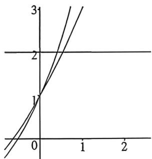

<!-- question-source:start -->
例34 (2026 届湖北部分名校九月月含 T8) 已知 $a + 2^{a} = 2, b + 3^{b} = 2$ ，则 $a^{b}$ 与 $b^{a}$ 的大小关系为 (A. $a^{b} < b^{a}$ B. $a^{b} = b^{a}$ C. $a^{b} > b^{a}$ D. 不确定

<!-- question-source:end -->

![[高中/总复习/二轮/2026版高中《MST新思路思维拓展》二轮复习专题/上册/函数与导数小题篇/考点三_比大小问题/questions/answers/Q00092861A1.md]]
