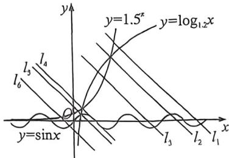

> [!faq]- 例题解析
>
> > [!success]- **【答案】** C
>
> > [!note]- **【解析】**
> > 解析 分函数 $f(x) = x + 2^x - 2, g(x) = x + 3^x - 2$ ，如图：函数 $y = x - 2, y = 2^x$ 在 $\mathbf{R}$ 上都单调递增，则函数 $f(x)$ 在 $\mathbf{R}$ 上单调递增，同理函数 $g(x)$ 在 $\mathbf{R}$ 上单调递增，而 $f\left(\frac{1}{2}\right) = \sqrt{2} - \frac{3}{2} < 0, f(1) = 1 > 0, f(a) = 0$ ，
> >
> > 则 $\frac{1}{2} < a < 1; g(0) = -1 < 0, g\left(\frac{1}{2}\right) = \sqrt{3} - \frac{3}{2} > 0, g(b) = 0$ ，则 $0 < b < \frac{1}{2}$ ，即 $0 < b < \frac{1}{2} < a < 1$ ，所以 $a^b > a^a > b^a$ 。故选：C.
> >
> > 例.5 (2026 届浙南名校十月联考 T8) 已知实数 $a, b, c$ 满足 $1.5^{a} + a = \log_{1.7} b + b = \sin c + c$ ，则下列关系不可能成立的是
> > A. $a < b < c$ B. $a = b < c$ C. $b < a = c$ D. $b < a < c$
> >
> > 解析 使题意, 令 $1.5^{a} + a = \log_{1.2} b + b = \sin c + c = k$ , 则 $1.5^{a} = -a + k, \log_{1.2} b = -b + k, \sin c = -c + k$ , 则 $a, b, c$ 可分别视为函数 $y = 1.5^{x}, y = \log_{1.2} x, y = \sin x$ 的图象与直线 $y = -x + k$ 交点的横坐标,
> >
> > 在同一坐标系中画出函数 $y = 1.5^x, y = \log_{1.2} x, y = \sin x$ 和 $y = -x + k$ 的图象，如图当直线 $y = -x + k$ 为 $l_1$ 时， $a < b < c$ ；当直线 $y = -x + k$ 为 $l_2$ 或 $l_4$ 时， $a = b < c$ ；当直线 $y = -x + k$ 为 $l_3$ 时， $b < a < c$ ；当直线 $y = -x + k$ 为 $l_4$ 时， $a < b = c$ ；当直线 $y = -x + k$ 为 $l_5$ 时， $a < c < b$ ；当直线 $y = -x + k$ 为移动到 $l_6$ 左端的直线时，始终有 $a < b, c < b$ 。综上所述， $a < b < c, a = b < c, b < a < c$ 都有可能成立，而 $b < a = c$ 不可能成立。故选：C.
> >
> > 
