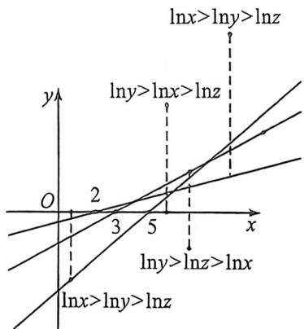
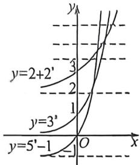

> [!faq]- 例题解析
>
> > [!success]- **【答案】** B
>
> > [!note]- **【解析】**
> > 解析 +一:(赋值法)令 x=2, 则 $3=2+\log_{2}2=3+\log_{3}y=5+\log_{5}z$ ,
> >
> > 可得 $y=1, z=\frac{1}{25}$ ，所以 x>y>z. A 可能正确；当 z=1 时，y=9, x=8，所以 y>x>z，所以 C 可能正确；z=125 时，y=243，此时 x=64，满足 y>z>x，所以 D 可能正确。故选：B.
> >
> > 法二(数形结合): $2 + \log_{2}x = 3 + \log_{3}y = 5 + \log_{5}z$ ，所以 $\frac{\ln x}{\ln 2} = \frac{\ln y}{\ln 3} + 1 = \frac{\ln z}{\ln 5} + 3 = k - 2$ ，所以 $\left\{\begin{aligned}\ln x &= (k - 2)\ln 2 \\ \ln y &= (k - 3)\ln 3 \\ \ln z &= (k - 5)\ln 5\end{aligned}\right.$ ，故仅需比
> >
> > 较 $\ln x, \ln y$ 以及 $\ln z$ 的大小, 作图,
> >
> > 
> >
> > 易知, 只有 B 不可能, 故本题选 B.
> >
> > 例好 (2026 届安徽江南十校十月联考 T8) 已知 $1 + 2^{z} = 3^{y} - 1 = 5^{z} - 2$ , 则下列不等关系一定不成立的是 A. $x > y > z$ B. $y > x > z$ C. $x > z > y$ D. $y > z > x$
> >
> > 解析 由题意得, $2+2^{x}=3^{y}=5^{c}-1$ ,令 $5^{x}-1=t$ ,
> >
> > 法一: 则由 $y=2+2^{2}$ , $y=3^{2}$ , $y=5^{2}-1$ 的图象与直线 y=t 的交点用排除法得 C 不成立.
> >
> >
> > 
> >
> > 法二：则 $x = \log_2(t - 2),y = \log_1t,z = \log_5(t + 1),t > 2.$ 令 $f(t) = x - y = \log_2(t - 2) - \log_3t,$
> >
> > $f^{\prime}(t) = \frac{1}{(t - 2)\ln 2} -\frac{1}{t\ln 3} = \frac{t\ln 3 - (t - 2)\ln 2}{t(t - 2)\ln 2\ln 3} = \frac{t(\ln 3 - \ln 2) + 2\ln 2}{t(t - 2)\ln 2\ln 3} >0$ ，所以 $f(t)$ 在区间 $(2, + \infty)$ 上单调递增.令 $g(t) = y - x,h(t) = x - x,$ 同理 $g(t),h(t)$ 在区间 $(2, + \infty)$ 上都单调递增，因为 $g(2) = \log_32 - \log_53 = \log_32 - \frac{2}{3} +$ $\frac{2}{3} -\log_53 <   0,g(3) = 1 - \log_54 > 0,$ 所以存在 $t_1\in (2,3)$ ，使得 $g(t_{1}) = 0,t\in (2,t_{1})$ 时 $g(t) = y - z <   0,t\in$ $(t_1, + \infty)$ 时， $g(t) = y - z > 0;$ 显然 $h(4) = 0,t\in (2,4)$ 时， $h(t) = x - z <   0;t\in (4, + \infty)$ 时， $h(t) = x - z > 0;$ 因为 $f(4) = 1 - \log_54 <   0,f(6) = 2 - \log_36 = \log_39 - \log_36 > 0,$
> >
> > $$
> > t _ {2} \in (4, 6), f (t _ {2}) = 0, t \in (2, t _ {2}), f (t) = x - y <   0; t \in (t _ {2}, + \infty) \text {时}, f (t) = x - y > 0.
> > $$
> >
> > 综上， $t\in(2,t_{1})$ 时， $x<y<x;t=t_{1}$ 时， $x<y=z,t\in(t_{1},4)$ 时， $x<z<y;t=4$ 时， $x=z<y;t\in(4,t_{2})$ 时， $z<x<y;t=t_{2}$ 时， $z<x=y;t\in(t_{2},+\infty)$ 时， $z<y<x$ ，所以C不可能成立。
> >
> > 故选 **C**.
